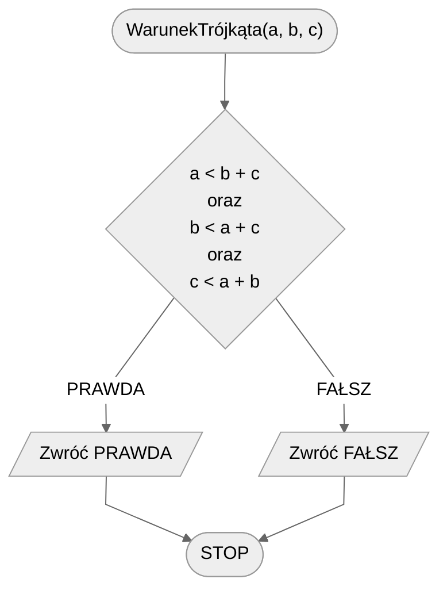

# Warunek trójkąta

## Opis problemu

### Specyfikacja

#### Dane

- $a, b, c$ - liczby naturalne, długości odcinków, $a>0$, $b>0$, $c>0$.

#### Wynik

- **PRAWDA** jeżeli z podanych odcinków można zbudować trójkąt,
- **FAŁSZ** w przeciwnym przypadku.

## Rozwiązanie

Aby z trzech odcinków można było zbudować trójkąt, musi być spełniony następujący warunek: długość każdego odcinka jest mniejsza od sumy dwóch pozostałych. Z tego wynika, że mamy do sprawdzenia trzy nierówności.

### Pseudokod

```
funkcja WarunekTrójkąta(a, b, c):
    1. Jeżeli a < b + c oraz b < a + c oraz c < a + b, to:
        2. Zwróć PRAWDA
    3. w przeciwnym przypadku:
        4. Zwróć FAŁSZ
```

### Schemat blokowy



## Implementacja

### C++


[triangle-condition.md](../../programming/c++/algorithms/2d-geometry/triangle-condition.md)


### Python


[triangle-condition.md](../../programming/python/algorithms/2d-geometry/triangle-condition.md)

