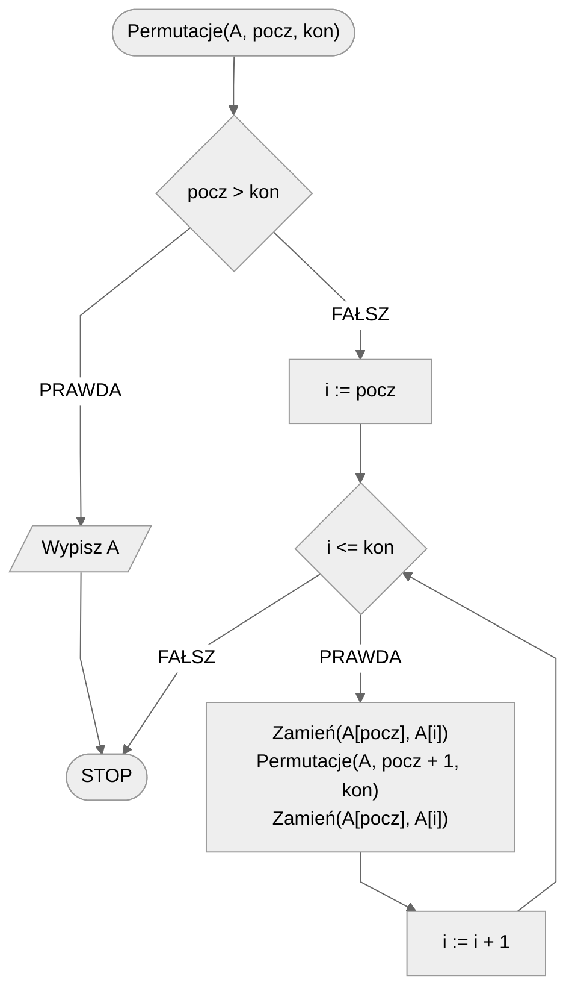

# Permutacje

Permutacja tablicy określa jeden ze sposobów ułożenia elementów tej tablicy. Czasami w algorytmice potrzebujemy wszystkich permutacji tablicy, a więc wszystkich możliwych sposobów na ułożenie jej elementów.

## Specyfikacja

### Dane

* $n$ — liczba naturalna, liczba elementów tablicy, $n>0$
* $A[1..n]$ - $n$-elementowa tablica 
* $pocz$, $kon$ - liczby naturalne określające początek i koniec permutowanego zakresu elementów tablicy, $1<=pocz<=kon<=n$

### Wynik

* Wszystkie permutacje tablicy $tab$

## Rozwiązanie

Stworzymy algorytm rekurencyjny. Standardowo zaczynamy od warunku stopu rekurencji. Tworzenie obecnej permutacji zakończymy, gdy przedział zdefiniowany przez zmienne *pocz* oraz *kon* nie będzie prawidłowy, tzn. gdy początek będzie **większy** od końca. Będzie to oznaczało, że mamy skończoną jedną permutację, więc możemy ją wypisać na ekran i zakończyć obecne wywołanie funkcji.

Gdy warunek stopu nie będzie spełniony, to przejdziemy pętlą od początku do końca zdefiniowanego zakresu. Licznik pętli będzie nas informował o tym, na jakiej pozycji mamy umieścić element tablicy z początku sprawdzanego zakresu. W pętli będziemy więc zamieniać miejscami element tablicy pod obecną pozycją z elementem z początku zakresu. Następnie skorzystamy z wywołania rekurencyjnego ze zwiększoną o jeden wartością początku zakresu. Po wywołaniu rekurencyjnym zamienimy ponownie miejscami element na obecnej pozycji z elementem z początku przedziału, tak by przywrócić poprzedni układ elementów w tablicy.

### Pseudokod

```
procedura Permutacje(A, pocz, kon):
    1. Jeżeli pocz > kon, to:
        2. Wypisz A
        3. Zakończ
    4. Dla i := pocz do kon, wykonuj:
        5. Zamień(A[pocz], A[i])
        6. Permutacje(A, pocz + 1, kon)
        7. Zamień(A[pocz], A[i])
```

### Schemat blokowy



## Implementacja

### [Python](../../programming/python/algorithms/backtracking/permutations.md)

### [Kotlin](../../programming/kotlin/algorithms/backtracking/permutations.md)
