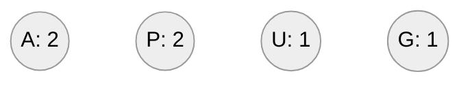
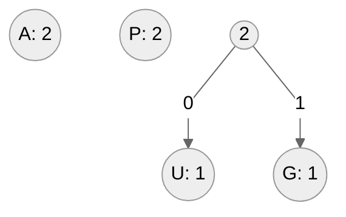
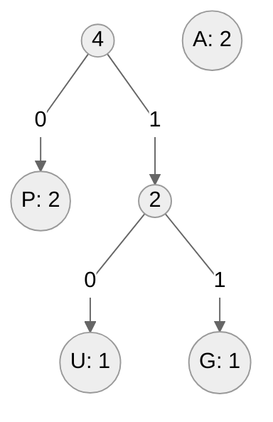
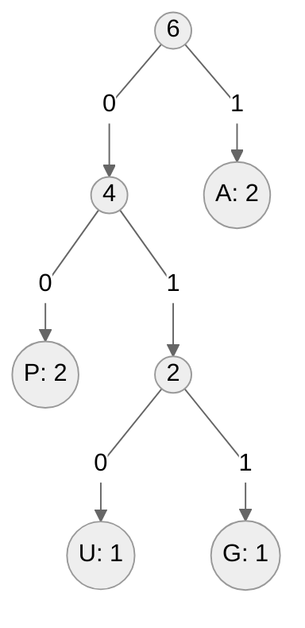

# Kody Huffmana

Kody Huffmana to jeden z algorytmów kompresji, który polega na wygenerowaniu kodów dla poszczególnych znaków bazując na częstotliwości występowania tych znaków w kompresowanych danych. W ramach algorytmu tworzymy **drzewo binarne jednoznacznych kodów**. Co to znaczy, że powstałe kody są jednoznaczne? Oznacza to, że skompresowane dane możemy odkodować tylko na jeden sposób.

## Przykład

Pokażemy proces tworzenia drzewa kodów dla wyrazu **papuga**.

Zaczynamy od zliczenia liczby wystąpień każdej litery. Następnie dla każdej litery tworzymy węzeł zawierający literę oraz liczbę jej wystąpień. Węzły sortujemy malejąco po liczbie wystąpień.

Bierzemy dwa węzły o najmniejszych wartościach i łączymy je tworząc nowy węzeł rodzica, który zawiera wartość równą sumie liczebności swoich dzieci. Nowy węzeł wrzucamy do listy, a dzieci z niej usuwamy. Pamiętamy o zachowaniu malejącego porzędku w liście węzłów.

Ponownie bierzemy dwa węzły o najmniejszych wartościach i łączymy je.

Pozostaje nam połączyć ze sobą dwa pozostałe węzły.

Teraz możemy odczytać powstałe w ten sposób kody.

| Znak | Kod |
| :-:  | :-: |
| A    | 1   |
| P    | 00  |
| U    | 010 |
| G    | 011 |

Za pomocą tabeli kodów kodujemy wyraz **papuga**: 

$001000100111$

Wyrazy został zakodowany na trzynastu bitach. Gdybyśmy użyli kodowania ASCII to wyraz zostałby zakodowany na czterdziestu ośmiu bitach (każdy znak na ośmiu bitach).

## Implementacja

### C++

[huffman-coding.md](../../programming/c++/algorithms/coding-and-compression/huffman-coding.md)

### Python

[huffman-coding.md](../../programming/python/algorithms/coding-and-compression/huffman-coding.md)

