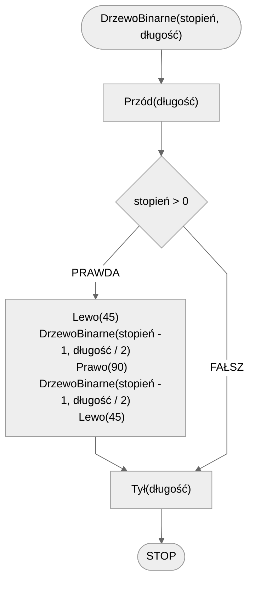

# Drzewo binarne

Drzewo binarne to rodzaj fraktala, który jest generowany przez rekurencyjne rysowanie dwóch mniejszych gałęzi pod kątem od każdej gałęzi początkowej. Każda z tych gałęzi jest mniejsza od poprzedniej i jest rysowana pod określonym kątem, tworząc strukturę przypominającą drzewo. Proces ten jest powtarzany dla każdej nowej gałęzi, aż do osiągnięcia zadanego stopnia rekurencji. Drzewa binarne są często używane do wizualizacji struktur danych oraz w grafice komputerowej do generowania realistycznych obrazów roślin.

## Specyfikacja

### Dane

* $stopień$ - stopień drzewa binarnego
* $długość$ - początkowa długość gałęzi (pnia)

### Wynik

* Drzewo binarne stopnia $stopień$ i początkowej długości $długość$.

## Prezentacja

[:fontawesome-solid-file-pdf: Drzewo binarne - wprowadzenie](../../assets/Drzewo Binarne (1).pdf){ .md-button }

## Rozwiązanie

### Prezentacja

[:fontawesome-solid-file-pdf: Drzewo binarne - algorytm](../../assets/Drzewo Binarne - algorytm (1).pdf){ .md-button }

### Pseudokod

```
funkcja DrzewoBinarne(stopień, długość):
    1. Przód(długość)
    2. Jeżeli stopień > 0, to:
        3. Lewo(45)
        4. DrzewoBinarne(stopień - 1, długość / 2)
        5. Prawo(90)
        6. DrzewoBinarne(stopień - 1, długość / 2)
        7. Lewo(45)
    8. Tył(długość)
```

### Schemat blokowy



## Implementacja

### [:simple-cplusplus: C++](../../programming/c++/algorithms/fractals/binary-tree.md){ .md-button }

### [:simple-python: Python](../../programming/python/algorithms/fractals/binary-tree.md){ .md-button }

### [Blockly](../../programming/blockly/algorithms/fractals/binary-tree.md){ .md-button }
