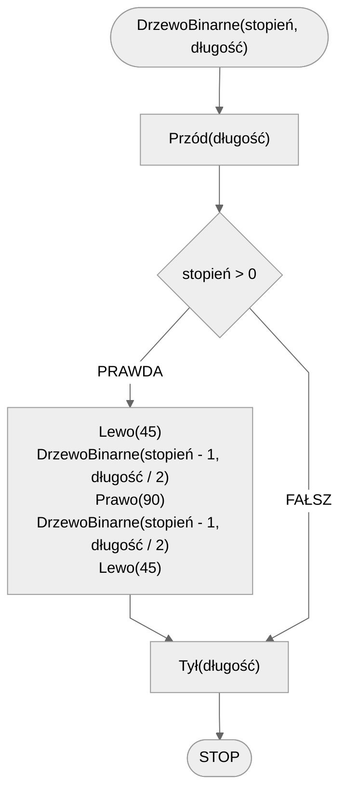

# Drzewo binarne

## Opis problemu

### Specyfikacja

#### Dane

* $stopień$ - stopień drzewa binarnego
* $długość$ - początkowa długość gałęzi (pnia)

#### Wynik

* Drzewo binarne stopnia $stopień$ i początkowej długości $długość$.

### Prezentacja

[:fontawesome-solid-file-pdf: Drzewo binarne - wprowadzenie](../../assets/Drzewo Binarne (1).pdf)

## Rozwiązanie

### Prezentacja

[:fontawesome-solid-file-pdf: Drzewo binarne - algorytm](../../assets/Drzewo Binarne - algorytm (1).pdf)

### Pseudokod

```
funkcja DrzewoBinarne(stopień, długość):
    1. Przód(długość)
    2. Jeżeli stopień > 0, to:
        3. Lewo(45)
        4. DrzewoBinarne(stopień - 1, długość / 2)
        5. Prawo(90)
        6. DrzewoBinarne(stopień - 1, długość / 2)
        7. Lewo(45)
    8. Tył(długość)
```

### Schemat blokowy



## Implementacja

### [C++](../../programming/c++/algorithms/fractals/binary-tree.md)

### [Python](../../programming/python/algorithms/fractals/binary-tree.md)

### [Blockly](../../programming/blockly/algorithms/fractals/binary-tree.md)
