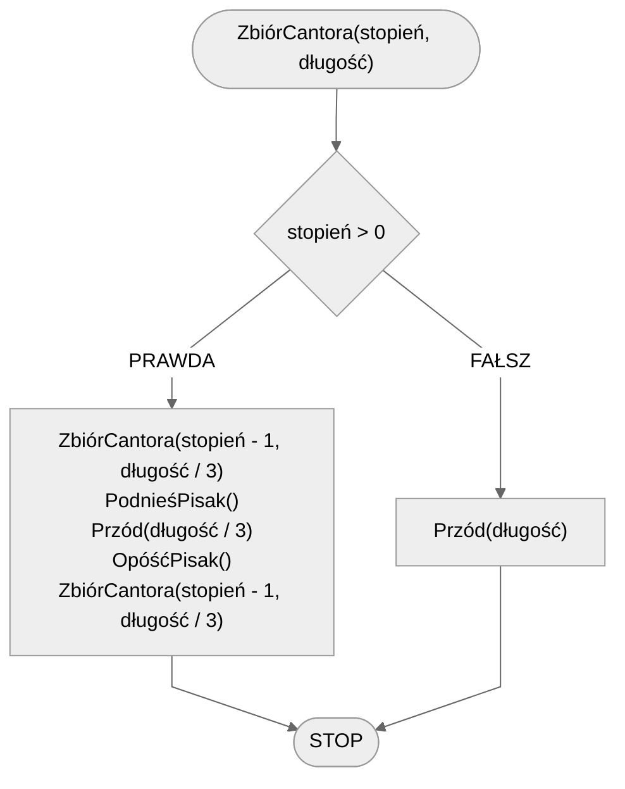

# Zbiór Cantora

## Opis problemu

### Specyfikacja

#### Dane

* $$stopień$$ - stopień
* $$długość$$ - początkowa długość

## Rozwiązanie

### Pseudokod

```
funkcja ZbiórCantora(stopień, długość):
    1. Jeżeli stopień > 0, to:
        2. ZbiórCantora(stopień - 1, długość / 3)
        3. PodnieśPisak()
        4. Przód(długość / 3)
        5. OpóśćPisak()
        6. ZbiórCantora(stopień - 1, długość / 3)
    7. w przeciwnym przypadku:
        8. Przód(długość)
```

### Schemat blokowy


## Implementacja

### C++


[cantor-dust.md](../../programming/c++/algorithms/fractals/cantor-dust.md)


### Python


[cantor-dust.md](../../programming/python/algorithms/fractals/cantor-dust.md)


### Blockly


[cantor-dust.md](../../programming/blockly/algorithms/fractals/cantor-dust.md)

