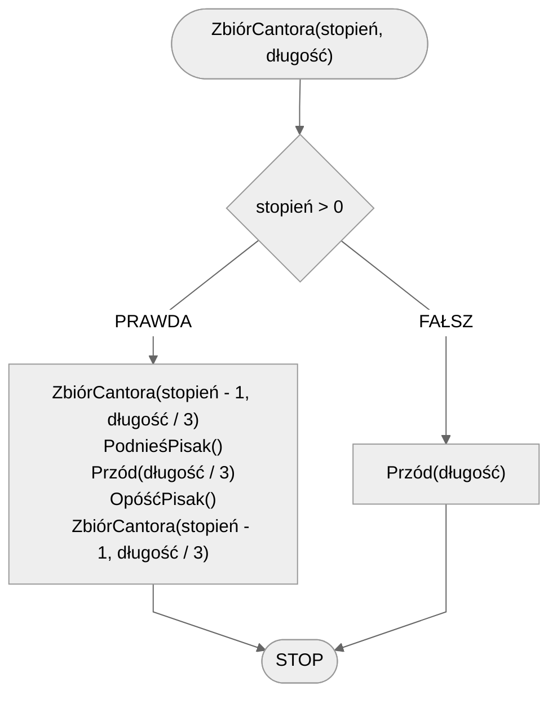

# Zbiór Cantora

Zbiór Cantora to jeden z najprostszych fraktali, który jest tworzony przez wielokrotne usuwanie środkowej trzeciej części odcinka. Proces ten zaczyna się od pojedynczego odcinka, który jest dzielony na trzy równe części, a środkowa część jest usuwana. Następnie ten sam proces jest powtarzany dla pozostałych dwóch odcinków, i tak dalej, w nieskończoność. W rezultacie powstaje zbiór punktów, który ma interesujące właściwości matematyczne, takie jak nieskończona liczba punktów i zerowa miara Lebesgue'a.

## Specyfikacja

### Dane

* $stopień$ - stopień
* $długość$ - początkowa długość

## Rozwiązanie

### Pseudokod

```
funkcja ZbiórCantora(stopień, długość):
    1. Jeżeli stopień > 0, to:
        2. ZbiórCantora(stopień - 1, długość / 3)
        3. PodnieśPisak()
        4. Przód(długość / 3)
        5. OpóśćPisak()
        6. ZbiórCantora(stopień - 1, długość / 3)
    7. w przeciwnym przypadku:
        8. Przód(długość)
```

### Schemat blokowy


## Implementacja

### [:simple-cplusplus: C++](../../programming/c++/algorithms/fractals/cantor-dust.md){ .md-button }

### [:simple-python: Python](../../programming/python/algorithms/fractals/cantor-dust.md){ .md-button }

### [Blockly](../../programming/blockly/algorithms/fractals/cantor-dust.md){ .md-button }
