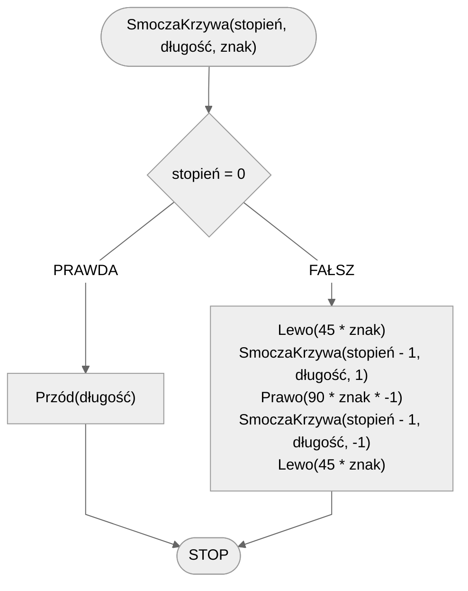

# Smocza Krzywa

## Opis problemu

Smocza krzywa to ciekawy fraktal, który wygląda bardzo efektownie.

### Specyfikacja

#### Dane

- **stopień** - stopień fraktala
- **długość** - długość linii
- **znak** - wartość $$1$$ lub $$-1$$ oznaczająca, w którą stronę należy skręcić

## Rozwiązanie

### Pseudokod

```
procedura SmoczaKrzywa(stopień, długość, znak):
    1. Jeżeli stopień = 0, to:
        2. Przód(długość)
        3. Zakończ
    4. Lewo(45 * znak)
    5. SmoczaKrzywa(stopień - 1, długość, 1)
    6. Prawo(90 * znak * -1)
    7. SmoczaKrzywa(stopień - 1, długość, -1)
    8. Lewo(45 * znak)
```

### Schemat blokowy



## Implementacja

### C++


[dragon-curve.md](../../programming/c++/algorithms/fractals/dragon-curve.md)


### Python


[dragon-curve.md](../../programming/python/algorithms/fractals/dragon-curve.md)


### Blockly


[dragon-curve.md](../../programming/blockly/algorithms/fractals/dragon-curve.md)

