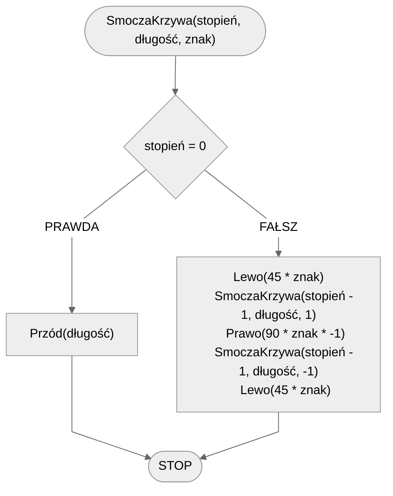

# Smocza Krzywa

Smocza Krzywa, znana również jako krzywa Heighwaya, jest fraktalem, który powstaje poprzez wielokrotne składanie linii pod kątem prostym. Każde zgięcie tworzy nowy segment, który jest obrócony o 90 stopni w lewo lub w prawo, w zależności od iteracji. W rezultacie powstaje złożony wzór, który przypomina smoka, stąd nazwa. Fraktal ten jest interesujący ze względu na swoją samopodobność i złożoność, mimo że jest generowany przez prosty algorytm.

## Specyfikacja

### Dane

- **stopień** - stopień fraktala
- **długość** - długość linii
- **znak** - wartość $1$ lub $-1$ oznaczająca, w którą stronę należy skręcić

## Rozwiązanie

### Pseudokod

```
procedura SmoczaKrzywa(stopień, długość, znak):
    1. Jeżeli stopień = 0, to:
        2. Przód(długość)
        3. Zakończ
    4. Lewo(45 * znak)
    5. SmoczaKrzywa(stopień - 1, długość, 1)
    6. Prawo(90 * znak * -1)
    7. SmoczaKrzywa(stopień - 1, długość, -1)
    8. Lewo(45 * znak)
```

### Schemat blokowy



## Implementacja

### [:simple-cplusplus: C++](../../programming/c++/algorithms/fractals/dragon-curve.md){ .md-button }

### [:simple-python: Python](../../programming/python/algorithms/fractals/dragon-curve.md){ .md-button }

### [Blockly](../../programming/blockly/algorithms/fractals/dragon-curve.md){ .md-button }
