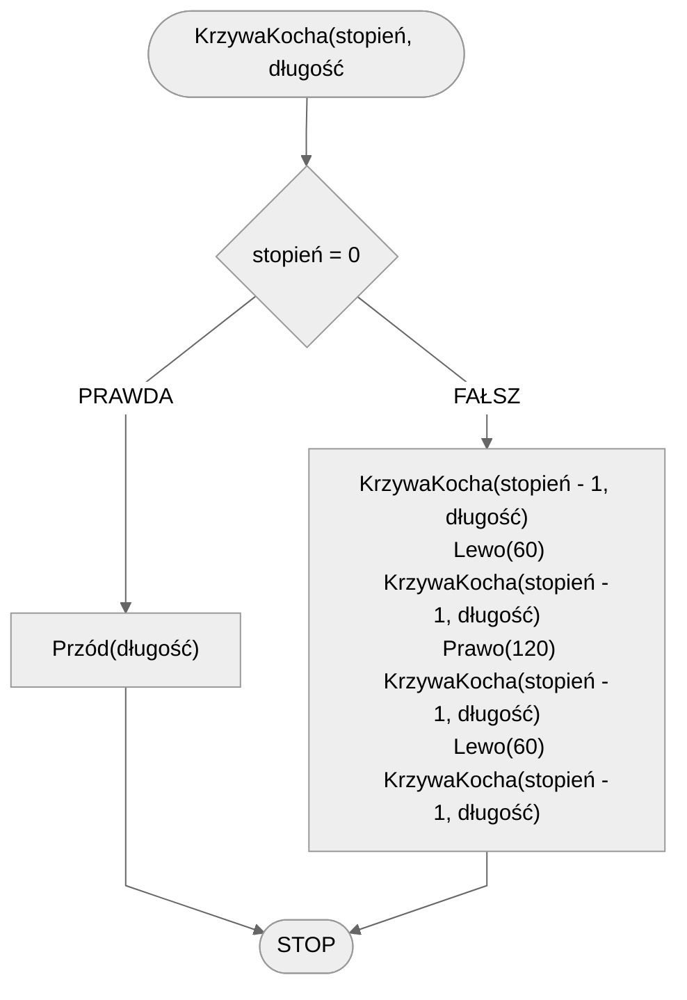

# Krzywa Kocha

## Opis problemu

Krzywa Kocha jest jednym z popularniejszych fraktali.

### Specyfikacja

#### Dane

* $stopień$ - stopień krzywej
* $długość$ - długość linii

#### Wynik

* Krzywa Kocha stopnia $stopień$ i początkowej długości $długość$.

## Rozwiązanie

### Pseudokod

```
procedura KrzywaKocha(stopień, długość):
    1. Jeżeli stopień = 0, to:
        2. Przód(długość)
        3. Zakończ
    4. KrzywaKocha(stopień - 1, długość)
    5. Lewo(60)
    6. KrzywaKocha(stopień - 1, długość)
    7. Prawo(120)
    8. KrzywaKocha(stopień - 1, długość)
    9. Lewo(60)
    10. KrzywaKocha(stopień - 1, długość)
```

### Schemat blokowy



## Implementacja

### [C++](../../programming/c++/algorithms/fractals/koch-curve.md)

### [Python](../../programming/python/algorithms/fractals/koch-curve.md)

### [Blockly](../../programming/blockly/algorithms/fractals/koch-curve.md)
