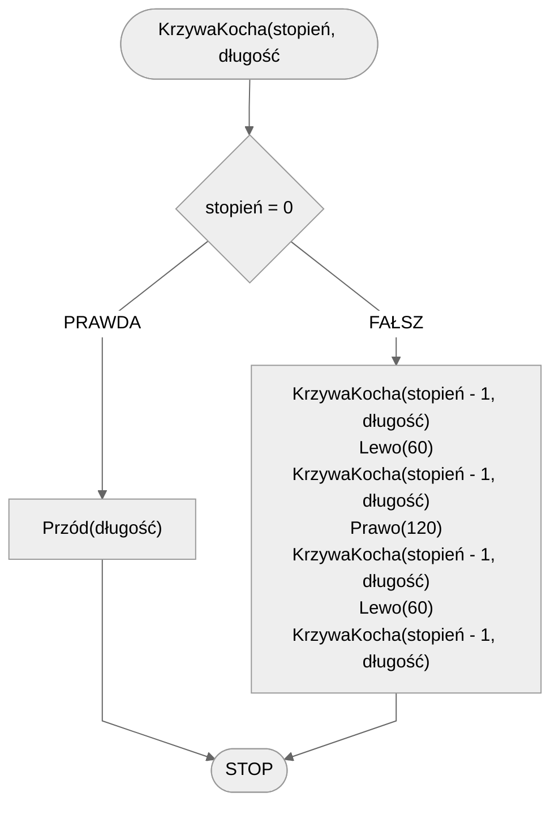
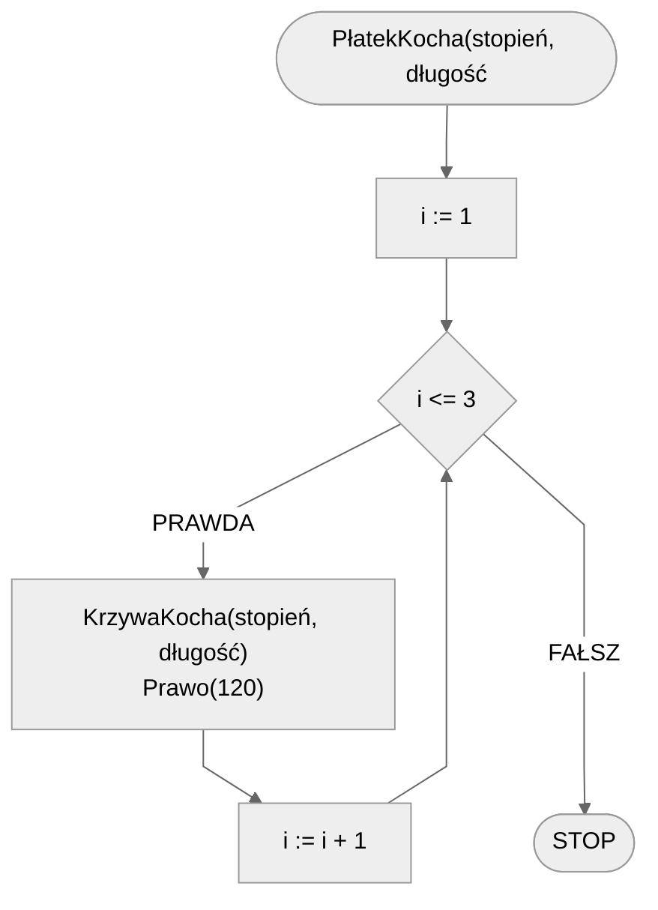

# Płatek Kocha

## Opis problemu

Płatek Kocha to fraktal stworzony poprzez złożenie ze sobą trzech krzywych Kocha, tak że razem tworzą strukturę przypominającą płatek śniegu.

### Specyfikacja

#### Dane

* $$stopień$$ - stopień fraktala
* $$długość$$ - długość linii

#### Wynik

* Płatek Kocha stopnia $$stopień$ i długości $$długość$$.

## Rozwiązanie

### Pseudokod

```
procedura KrzywaKocha(stopień, długość):
    1. Jeżeli stopień = 0, to:
        2. Przód(długość)
        3. Zakończ
    4. KrzywaKocha(stopień - 1, długość)
    5. Lewo(60)
    6. KrzywaKocha(stopień - 1, długość)
    7. Prawo(120)
    8. KrzywaKocha(stopień - 1, długość)
    9. Lewo(60)
    10. KrzywaKocha(stopień - 1, długość)
```

```
procedura PłatekKocha(stopień, długość):
    1. Dla i := 1 do 3, wykonuj:
        2. KrzywaKocha(stopień, długość)
        3. Prawo(120)
```

### Schemat blokowy





## Implementacja

### C++


[koch-snowflake.md](../../programming/c++/algorithms/fractals/koch-snowflake.md)


### Python


[koch-snowflake.md](../../programming/python/algorithms/fractals/koch-snowflake.md)


### Blockly


[koch-snowflake.md](../../programming/blockly/algorithms/fractals/koch-snowflake.md)

