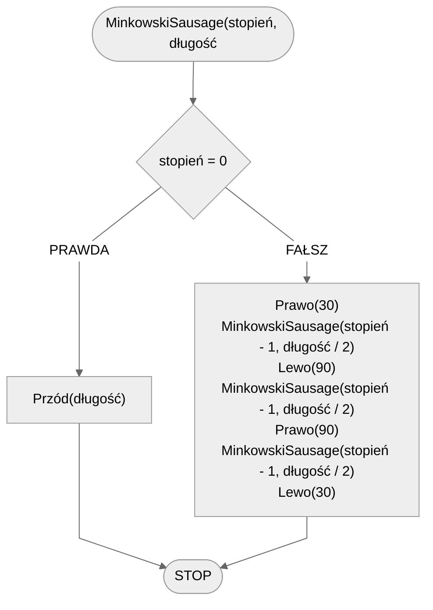

# Minkowski Sausage

## Opis problemu

### Specyfikacja

#### Dane

- **stopień** - stopień fraktala
- **długość** - początkowa długość linii

## Rozwiązanie

### Pseudokod

```
procedura MinkowskiSausage(stopień, długość):
    1. Jeżeli stopień = 0, to:
        2. Przód(długość)
        3. Zakończ
    4. Prawo(30)
    5. MinkowskiSausage(stopień - 1, długość / 2)
    6. Lewo(90)
    7. MinkowskiSausage(stopień - 1, długość / 2)
    8. Prawo(90)
    9. MinkowskiSausage(stopień - 1, długość / 2)
    10. Lewo(30)
```

### Schemat blokowy



## Implementacja

### C++


[minkowski-sausage.md](../../programming/c++/algorithms/fractals/minkowski-sausage.md)


### Python


[minkowski-sausage.md](../../programming/python/algorithms/fractals/minkowski-sausage.md)


### Blockly


[minkowski-sausage.md](../../programming/blockly/algorithms/fractals/minkowski-sausage.md)

