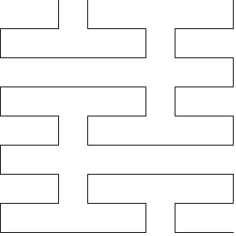

# Krzywa Peano

Krzywa Peano, znana również jako krzywa Peano-Gospera, jest przykładem fraktala, który wypełnia przestrzeń. Została odkryta przez włoskiego matematyka Giuseppe Peano w 1890 roku. Krzywa ta jest konstrukcją, która w sposób ciągły przechodzi przez każdy punkt w jednostkowym kwadracie, tworząc samopodobną strukturę. 
Jest to jeden z pierwszych przykładów krzywej, która wypełnia przestrzeń, co oznacza, że jej wymiar fraktalny wynosi 2.

## Specyfikacja

### Dane

- **stopień** - stopień fraktala
- **kąt** - kąt obrotu
- **długość** - długość linii

## Przykład 1

Krzywa Peano o stopniu $4$ i kącie $90\degree$.



## Przykład 2

Krzywa Peano o stopniu $4$ i kącie $60\degree$.


## Rozwiązanie

### Pseudokod

```
procedura KrzywaPeano(stopień, kąt, długość):
    1. Jeżeli stopień = 0, to:
        2. Zakończ
    3. Prawo(kąt)
    4. KrzywaPeano(stopień - 1, -kąt, długość)
    5. Przód(długość)
    6. KrzywaPeano(stopień - 1, kąt, długość)
    7. Przód(długość)
    8. KrzywaPeano(stopień - 1, -kąt, długość)
    9. Lewo(kąt)
```

### Schemat blokowy


## Implementacja

### [:simple-cplusplus: C++](../../programming/c++/algorithms/fractals/peano-curve.md){ .md-button }

### [:simple-python: Python](../../programming/python/algorithms/fractals/peano-curve.md){ .md-button }

### [Blockly](../../programming/blockly/algorithms/fractals/peano-curve.md){ .md-button }
