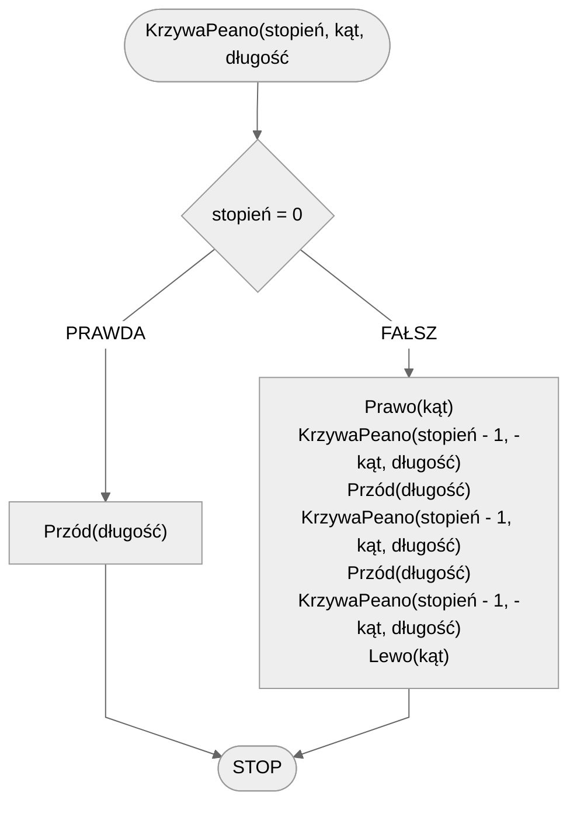

# Krzywa Peano

## Opis problemu

### Specyfikacja

#### Dane

- **stopień** - stopień fraktala
- **kąt** - kąt obrotu
- **długość** - długość linii

### Przykład 1

Krzywa Peano o stopniu $4$ i kącie $90\degree$.


### Przykład 2

Krzywa Peano o stopniu $4$ i kącie $60\degree$.


## Rozwiązanie

### Pseudokod

```
procedura KrzywaPeano(stopień, kąt, długość):
    1. Jeżeli stopień = 0, to:
        2. Zakończ
    3. Prawo(kąt)
    4. KrzywaPeano(stopień - 1, -kąt, długość)
    5. Przód(długość)
    6. KrzywaPeano(stopień - 1, kąt, długość)
    7. Przód(długość)
    8. KrzywaPeano(stopień - 1, -kąt, długość)
    9. Lewo(kąt)
```

### Schemat blokowy



## Implementacja

### C++


[peano-curve.md](../../programming/c++/algorithms/fractals/peano-curve.md)


### Python


[peano-curve.md](../../programming/python/algorithms/fractals/peano-curve.md)


### Blockly


[peano-curve.md](../../programming/blockly/algorithms/fractals/peano-curve.md)

