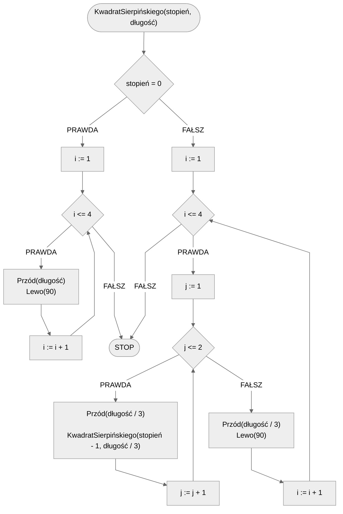

# Kwadrat Sierpińskiego

**Kwadrat Sierpińskiego** (inaczej **Dywan Sierpińskiego**), to fraktal podobny do Trójkąta Sierpińskiego. Główna różnica jest taka, że podstawową figurą jest kwadrat.

## Specyfikacja

### Dane

- **stopień** - stopień kwadratu Sierpińskiego
- **długość** - długość boku głównego kwadratu

## Rozwiązanie

### Pseudokod

```
procedura KwadratSierpińskiego(stopień, długość):
    1. Jeżeli stopień = 0, to:
        2. Dla i := 1 do 4, wykonuj:
            3. Przód(długość)
            4. Lewo(90)
        5. Zakończ
    6. Dla i := 1 do 4, wykonuj:
        7. Dla j := 1 do 2, wykonuj:
            8. Przód(długość / 3)
            9. KwadratSierpińskiego(stopień - 1, długość / 3)
        10. Przód(długość / 3)
        11. Lewo(90)
```

### Schemat blokowy



## Implementacja

### [:simple-cplusplus: C++](../../programming/c++/algorithms/fractals/sierpinski-square.md){ .md-button }

### [:simple-python: Python](../../programming/python/algorithms/fractals/sierpinski-square.md){ .md-button }

### [Blockly](../../programming/blockly/algorithms/fractals/sierpinski-square.md){ .md-button }
