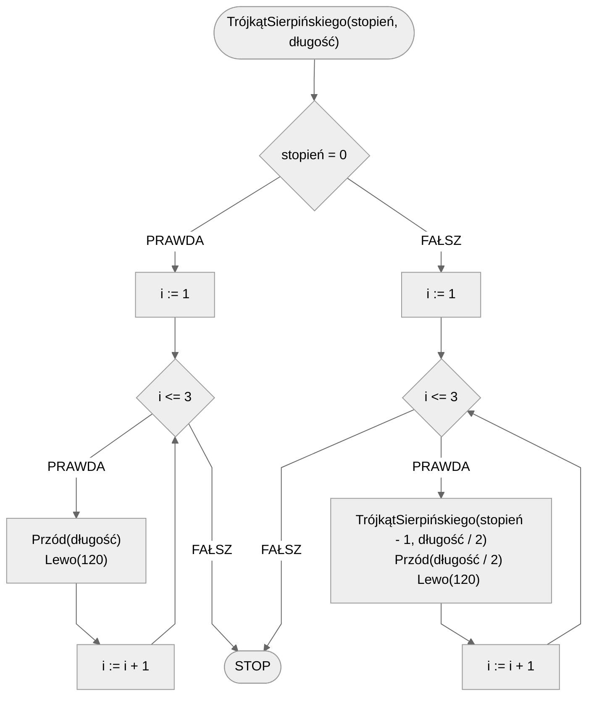

# Trójkąt Sierpińskiego

Trójkąt Sierpińskiego to jeden z popularniejszych fraktali, który jest stosunkowo prosty do wygenerowania, czy nawet do ręcznego narysowania na kartce papieru. Podstawową figurą w tym fraktalu jest, jak nazwa wskazuje, trójkąt. Fraktal powstaje poprzez narysowanie w każdym rogu trójkąta nowych, mniejszych trójkątów z bokiem o połowę krótszym. Procedurę powtarzamy, w każdym z tych trójkątów postępując w identyczny sposób. 

Przyjrzyj się poniższej prezentacji, by lepiej zrozumieć tę procedurę.

## Specyfikacja

### Dane

* $stopień$ - stopień trójkąta
* $długość$ - początkowa długość

### Wynik

* Trójkąt Sierpińskiego stopnia $stopień$ i początkowej długości $długość$.

## Prezentacja

[:fontawesome-solid-file-pdf: Trójkąt Sierpińskiego - wprowadzenie](../../assets/Trójkąt Sierpińskiego.pdf){ .md-button }

## Rozwiązanie

### Prezentacja

[:fontawesome-solid-file-pdf: Trójkąt Sierpińskiego - algorytm](../../assets/Trójkąt Sierpińskiego - algorytm.pdf){ .md-button }

### Pseudokod

```
procedura TrójkątSierpińskiego(stopień, długość):
    1. Jeżeli stopień = 0, to:
        2. Dla i := 1 do 3, wykonuj:
            3. Przód(długość)
            4. Lewo(120)
        5. Zakończ
    6. Dla i := 1 do 3, wykonuj:
        7. TrójkątSierpińskiego(stopień - 1, długość / 2)
        8. Przód(długość / 2)
        9. Lewo(120)
```

### Schemat blokowy



## Implementacja

### [:simple-cplusplus: C++](../../programming/c++/algorithms/fractals/sierpinski-triangle.md){ .md-button }

### [:simple-python: Python](../../programming/python/algorithms/fractals/sierpinski-triangle.md){ .md-button }

### [Blockly](../../programming/blockly/algorithms/fractals/sierpinski-triangle.md){ .md-button }
