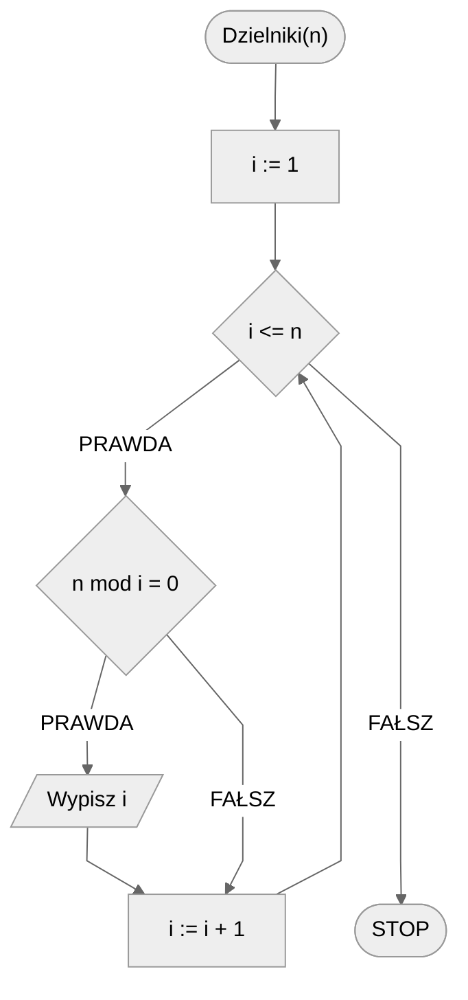
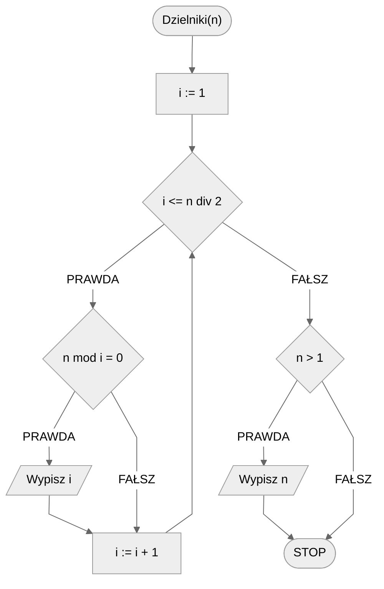
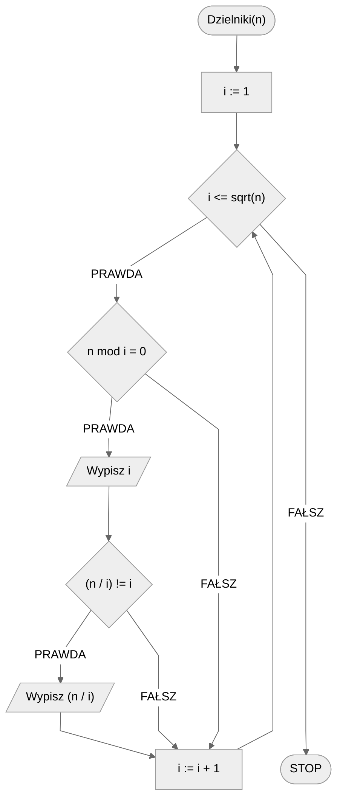

# Wszystkie dzielniki

## Opis problemu

Czasem bywa tak, że potrzebujemy poznać wszystkie **dzielniki** zadanej liczby. Dzielnik to wartość, przez którą liczba jest podzielna, czy też mówiąc inaczej, dzieli się bez reszty.

Zadanie to jest stosunkowo proste, należy jednak zadać sobie pytanie: **jakie liczby musimy sprawdzić, by znaleźć wszystkie dzielniki**? Jak zobaczymy, odpowiedź nie jest taka oczywista i do tego problemu można podejść na kilka sposobów. Zanim jednak przejdziemy do rozwiązań, zacznijmy od formalnej specyfikacji problemu i prostego przykładu.

### Specyfikacja

#### Dane

* $n$ — liczba naturalna, większa od zera

#### Wynik

* Wszystkie dzielniki liczby $n$ 

### Przykład

#### Dane

```
n := 12
```

**Wynik**: $1,2,3,4,6,12$ 

## Rozwiązanie zupełnie naiwne

Przejdźmy do próby rozwiązania problemu. Naszym zadaniem jest wypisać **wszystkie dzielniki** podanej wartości. Nie możemy żadnego pominąć. Spróbujmy więc odpowiedzieć na postawione wcześniej pytanie: **jakie liczby musimy sprawdzić**? Po pierwsze możemy łatwo zauważyć, że nie ma sensu sprawdzać wartości mniejszych niż $1$. Najmniejszy i zarazem pierwszy dzielnik to będzie zawsze liczba $1$. Od niej więc zaczynamy poszukiwanie dzielników. W którym miejscu jednak należy się zatrzymać? Cóż, na pewno nie ma sensu sprawdzać wartości większych od $n$. Liczba nie może być podzielna przez wartość od siebie większą!

Podsumowując wystarczy sprawdzić wszystkie liczby od $1$ do $n$, aby znaleźć dzielniki. W ten sposób otrzymaliśmy pierwsze, zgrubne ograniczenie naszego przeszukiwanego przedziału wartości. Dla każdej liczby z tego zakresu będziemy sprawdzać, czy jest ona dzielnikiem $n$.

Pozostaje jeszcze bardzo ważna kwestia: jak sprawdzić, czy jedna liczba jest dzielnikiem drugiej? Cóż, wystarczy sprawdzić, czy **dzielą się bez reszty**. Czy też, bardziej formalnie, **reszta z dzielenia wynosi** $0$.

Spróbujmy teraz to wszystko zapisać w formie algorytmu.

### Pseudokod

```
funkcja Dzielniki(n):
    1. Od i := 1 do n, wykonuj:
        2. Jeżeli n mod i = 0, to:
            3. Wypisz i
```

!!! info
	 **mod** oznacza resztę z dzielenia

### Schemat blokowy



### Złożoność

W naszym rozwiązaniu przechodzimy przez wszystkie kolejne wartości od $1$ do $n$. Dla zadanego $n$ mamy więc do sprawdzenia $n$ potencjalnych dzielników. Stąd też otrzymujemy złożoność:

$O(n)$ — liniowa

## Rozwiązanie naiwne

Mamy już pierwsze rozwiązanie naszego problemu. Zastanówmy się teraz, jak możemy je **zoptymalizować**, czyli usprawnić. Szczególnym fragmentem naszego rozwiązania, który aż prosi się o optymalizację, jest przeglądanie liczb od $1$ do $n$. Pomyślmy, jak możemy zawęzić ten zakres?

Zauważmy, że od pewnej wartości możemy mieć już **gwarancję**, że nie znajdziemy kolejnych dzielników, poza samym $n$. Gdy sprawdzana liczba jest **większa** od połowy $n$, to nie może być już dzielnikiem $n$. W związku z tym wystarczy, że będziemy sprawdzać potencjalne dzielniki do $n/2$, a dokładniej do części całkowitej z tegoż dzielenia. Musimy tylko pamiętać o tym, by wypisać także wartość $n$, jeżeli jest większe od jedynki.

### Pseudokod

```
funkcja Dzielniki(n):
    1. Od i := 1 do n div 2, wykonuj:
        2. Jeżeli n mod i = 0, to:
            3. Wypisz i
    4. Jeżeli n > 1, to:
        5. Wypisz n
```

!!! info
	 **div** oznacza dzielenie całkowite

### Schemat blokowy



### Złożoność

W naszym rozwiązaniu przechodzimy przez wszystkie kolejne wartości od $1$ do $n/2$. Dla zadanego $n$ mamy więc do sprawdzenia $n/2$ potencjalnych dzielników. Stąd też otrzymujemy złożoność:

$O(\frac{n}{2})$

## Rozwiązanie optymalne

Możemy jeszcze bardziej skrócić zakres przeszukiwania potencjalnych dzielników. Podobnie jak przy teście pierwszości, wystarczy że sprawdzimy dzielniki do pierwiastka z zadanej liczby. W ten sposób jednak nie znajdziemy wszystkich dzielników, a co najwyżej ich połowę. Dlatego dla każdego znalezionego w ten sposób dzielnika musimy wypisać jeszcze ten drugi z pary.

### Pseudokod

```
funkcja Dzielniki(n):
    1. Od i := 1 do sqrt(n), wykonuj:
        2. Jeżeli n mod i = 0, to:
            3. Wypisz i
            4. Jeżeli (n / i) != i, to:
                5. Wypisz (n / i)
```

!!! info
	 **sqrt** oznacza pierwiastek

### Schemat blokowy



### Złożoność

W naszym rozwiązaniu przechodzimy przez wszystkie kolejne wartości od $1$ do $\sqrt{n}$. Dla zadanego $n$ mamy więc do sprawdzenia $\sqrt{n}$ potencjalnych dzielników. Stąd też otrzymujemy złożoność:

$O(\sqrt{n})$

## Implementacja

### [:simple-cplusplus: C++](../../programming/c++/algorithms/integers/divisors.md){ .md-button }

### [:simple-python: Python](../../programming/python/algorithms/integers/divisors.md){ .md-button }

## Implementacja - pozostałe

### [:simple-haskell: Haskell](../../programming/haskell/algorithms/integers/divisors.md){ .md-button }
