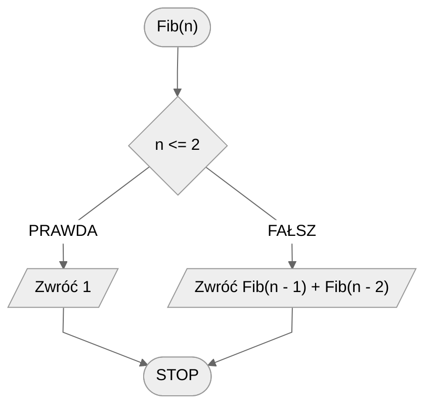
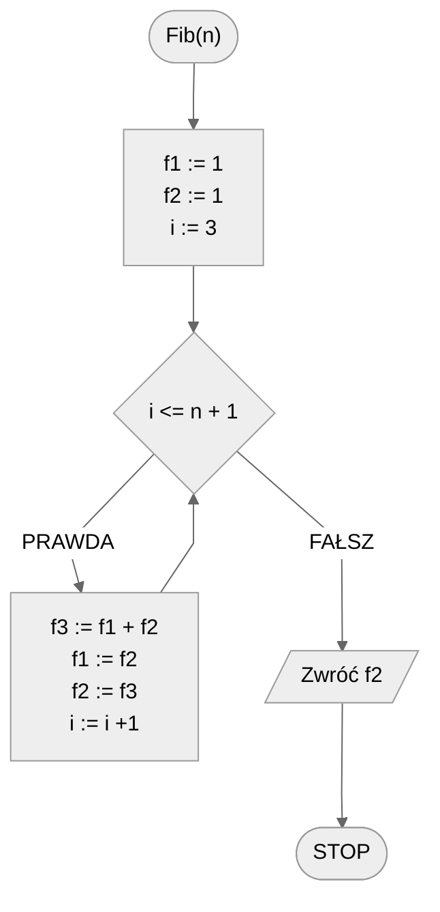

# Liczby Fibonacciego

Ciąg Fibonacciego to ciąg, w którym dwa pierwsze elementy mają wartość $1$, a każdy kolejny element stanowi sumę dwóch poprzednich.

Pierwszych dziesięć kolejnych liczb Fibonacciego to: $1, 1, 2, 3, 5, 8, 13, 21, 34, 55$.

## Specyfikacja

### Dane

* $n$ - liczba naturalna, $n>0$.

### Wynik

* $n$-ta liczba Fibonacciego.

## Przykład

### Dane

```
n := 10
```

**Wynik**: $55$ 

## Rozwiązanie rekurencyjne

$$
Fib(n) =  \begin{cases} 
      1 & n \leq 2 \\
      Fib(n - 1) + Fib(n - 2) & n > 2 \\
   \end{cases}
$$

### Pseudokod

```
funkcja Fib(n):
    1. Jeżeli n <= 2, to:
        2. Zwróć 1
    3. Zwróć Fib(n - 1) + Fib(n - 2)
```

### Schemat blokowy



## Rozwiązanie iteracyjne

### Pseudokod

```
funkcja Fib(n):
    1. f1 := 1
    2. f2 := 1
    3. Od i := 3 do n + 1, wykonuj:
        4. f3 := f1 + f2
        5. f1 := f2
        6. f2 := f3
    7. Zwróć f2
```

### Schemat blokowy



## Implementacja

### [:simple-cplusplus: C++](../../programming/c++/algorithms/integers/fibonacci-numbers.md){ .md-button }

### [:simple-python: Python](../../programming/python/algorithms/integers/fibonacci-numbers.md){ .md-button }

## Implementacja - pozostałe

### [:simple-haskell: Haskell](../../programming/haskell/algorithms/integers/fibonacci-numbers.md){ .md-button }
