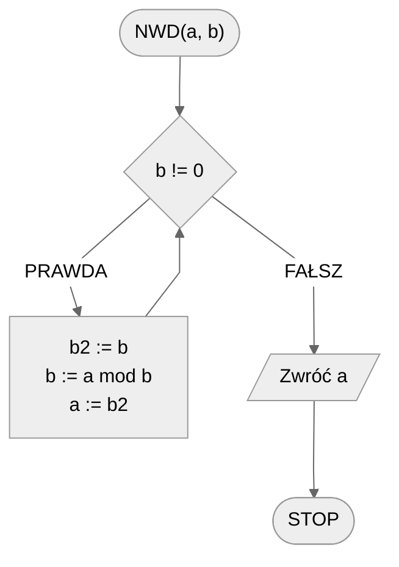
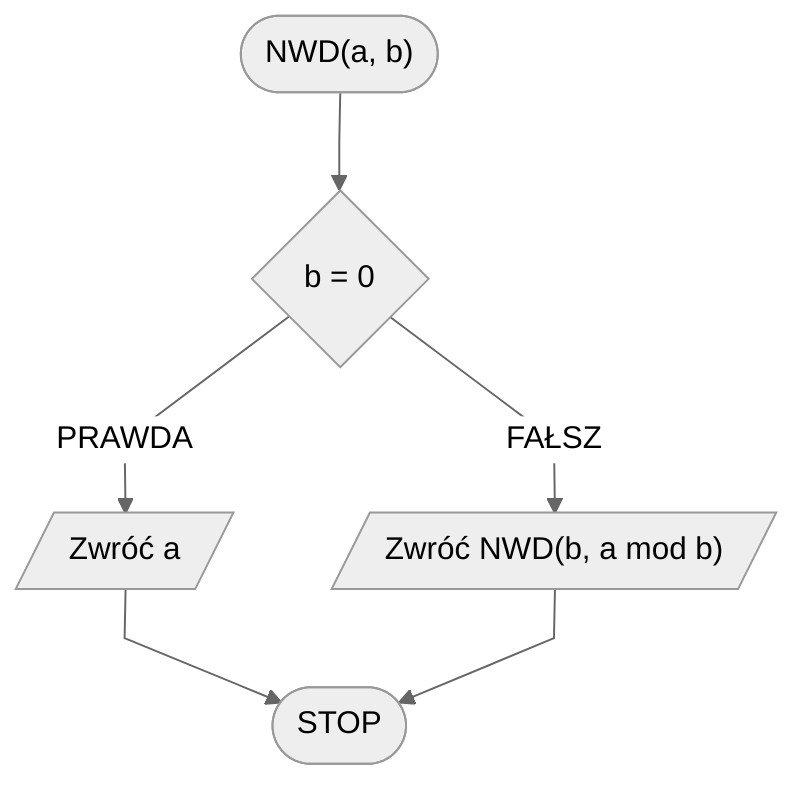

# Algorytm Euklidesa

Algorytm Euklidesa to jeden z najstarszych znanych algorytmów, który został opisany przez starożytnego greckiego matematyka Euklidesa w jego dziele "Elementy" około 300 roku p.n.e. Algorytm ten służy do znajdowania największego wspólnego dzielnika (NWD) dwóch liczb naturalnych. Jest on oparty na prostej obserwacji, że NWD dwóch liczb nie zmienia się, jeśli większą z tych liczb zastąpimy różnicą tych liczb. Dzięki temu możemy iteracyjnie zmniejszać wartości liczb, aż do momentu, gdy staną się one równe, co oznacza, że znaleźliśmy NWD.

Algorytm Euklidesa znajduje zastosowanie w wielu dziedzinach matematyki i informatyki, m.in. w kryptografii (np. w algorytmie RSA), w teorii liczb, a także w problemach związanych z obliczeniami na wielkich liczbach. Jego prostota i efektywność sprawiają, że jest to jedno z podstawowych narzędzi w arsenale każdego matematyka i programisty.

## Specyfikacja

### Dane

* $a, b$ — liczby naturalne, większe od zera, tzn. $a,b\in\N$, $a>0,b>0$

### Wynik

* $NWD(a, b)$ — największy wspólny dzielnik liczb $a$ i $b$ 

## Przykład

### Dane

```
a := 32
b := 12
```

### Wynik

$NWD(32, 12) = 4$ 

!!! info
	**Wyjaśnienie**
	
	Dzielnikami liczby $32$ są: $1, 2, 4, 8, 16, 32$
	
	Dzielnikami liczby $12$ są: 1, 2, 3, 4, 6, 12
	
	Wspólnymi dzielnikami są więc: $1, 2, 4$ 
	
	Największy z nich to właśnie $4$.

## Wersja z odejmowaniem

Zasada jest prosta: od większej liczby odejmujemy mniejszą i tak w kółko, aż uzyskamy dwie takie same wartości, które będą naszym wynikiem. Proces ten można opisać następująco:

1. Porównujemy dwie liczby, $a$ i $b$.
2. Jeśli $a$ jest większe od $b$, odejmujemy $b$ od $a$.
3. Jeśli $b$ jest większe od $a$, odejmujemy $a$ od $b$.
4. Powtarzamy kroki 1-3, aż obie liczby będą równe.
5. Gdy obie liczby są równe, osiągnęliśmy największy wspólny dzielnik (NWD).

### Przykład 1

| a        | b      |
| -------- | ------ |
| 28       | 12     |
| 28-12=16 | 12     |
| 16-12=4  | 12     |
| 4        | 12-4=8 |
| 4        | 8-4=4  |

NWD$(28, 12)=4$

### Przykład 2

| a    | b    |
| ---- | ---- |
| 3    | 16   |
| 3    | 13   |
| 3    | 10   |
| 3    | 7    |
| 3    | 4    |
| 3    | 1    |
| 2    | 1    |
| 1    | 1    |

NWD$(3, 16) = 1$

### Przykład 3

| a    | b    |
| ---- | ---- |
| 6    | 18   |
| 6    | 12   |
| 6    | 6    |

NWD$(6,18)=6$

### Pseudokod

```
funkcja NWD(a, b):
    1. Dopóki a != b, wykonuj:
        2. Jeżeli a > b, to:
            3. a := a - b
        4. W przeciwnym przypadku:
            5. b := b - a
    6. Zwróć a
```

### Schemat blokowy


## Wersja z modulo — iteracyjna

Odejmowanie możemy zastąpić operacją reszty z dzielenia, która jest dużo wydajniejsza w tym przypadku.

### Przykład 1

| a                         | b                     |
| ------------------------- | --------------------- |
| 28                        | 12                    |
| 12 (b z wiersza wyżej)    | 28 mod 12 (a % b) = 4 |
| **4** (b z wiersza wyżej) | 12 mod 4 (a % b) = 0  |

NWD$(28, 12)=4$

### Przykład 2

| a     | b            |
| ----- | ------------ |
| 3     | 16           |
| 16    | 3 mod 16 = 3 |
| 3     | 16 mod 3 = 1 |
| **1** | 3 mod 1 = 0  |

NWD$(3, 16) = 1$

### Przykład 3

| a     | b    |
| ----- | ---- |
| 6     | 18   |
| 18    | 6    |
| **6** | 0    |

NWD$(6,18)=6$

### Przykład 4

| a     | b    |
| ----- | ---- |
| 100   | 2    |
| **2** | 0    |

NWD$(100, 2) = 2$

### Pseudokod

```
funkcja NWD(a, b):
    1. Dopóki b != 0, wykonuj:
        2. b2 := b
        3. b := a mod b
        4. a := b2
    5. Zwróc a
```

!!! info
	 **mod** oznacza resztę z dzielenia

### Schemat blokowy



## Wersja z modulo — rekurencyjna

Opisaną wyżej metodę możemy również zdefiniować rekurencyjnie.

$$
NWD(a, b) =
\begin{cases} 
a & b=0 \\
NWD(b, a \mod b) & b\not =0 \\    
\end{cases}
$$ 

### Pseudokod

```
funkcja NWD(a, b):
    1. Jeżeli b = 0, to:
        2. Zwróć a i zakończ
    3. Zwróć NWD(b, a mod b) i zakończ
```

### Schemat blokowy



## Implementacja

### [:simple-cplusplus: C++](../../programming/c++/algorithms/integers/gcd.md){ .md-button }

### [:simple-python: Python](../../programming/python/algorithms/integers/gcd.md){ .md-button }

### [Blockly](../../programming/blockly/algorithms/integers/gcd.md){ .md-button }

## Implementacja - pozostałe

### [:simple-haskell: Haskell](../../programming/haskell/algorithms/integers/gcd.md){ .md-button }
