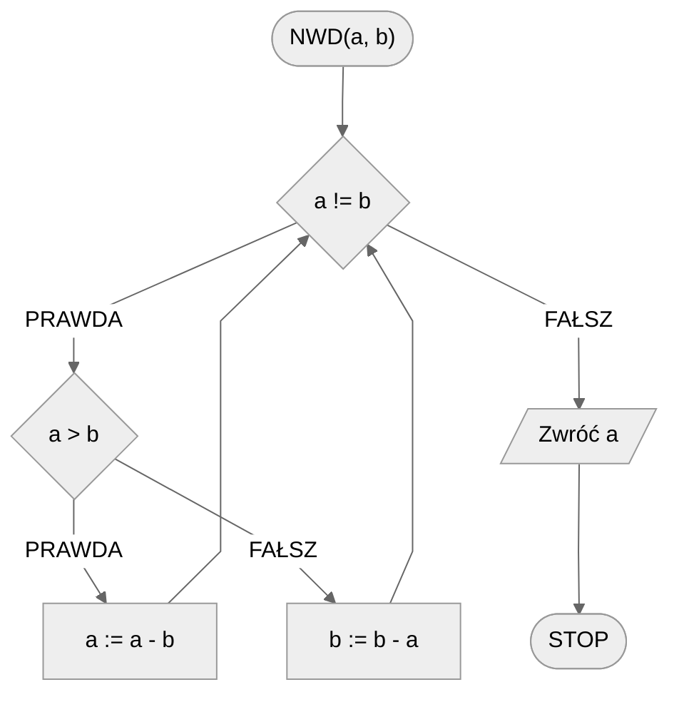

# Algorytm Euklidesa

Największy wspólny dzielnik dwóch liczb naturalnych wykorzystywane jest w wielu obliczeniach i własnościach matematycznych. M. in. z tego względu warto wiedzieć, jak w sposób wydajny możemy go policzyć. Do tego posłuży nam algorytm Euklidesa.

## Specyfikacja

### Dane

* $a, b$ — liczby naturalne, większe od zera

### Wynik

* $NWD(a, b)$ — największy wspólny dzielnik liczb $a$ i $b$ 

## Przykład

### Dane

```
a := 32
b := 12
```

### Wynik

$NWD(32, 12) = 4$ 

!!! info
	**Wyjaśnienie**
	
	Dzielnikami liczby $32$ są: $1, 2, 4, 8, 16, 32$
	
	Dzielnikami liczby $12$ są: 1, 2, 3, 4, 6, 12
	
	Wspólnymi dzielnikami są więc: $1, 2, 4$ 
	
	Największy z nich to właśnie $4$.

## Wersja z odejmowaniem

Zasada jest prosta: od większej liczby odejmujemy mniejszą i tak w kółko, aż uzyskamy dwie takie same wartości, które będą naszym wynikiem.

### Pseudokod

```
funkcja NWD(a, b):
    1. Dopóki a != b, wykonuj:
        2. Jeżeli a > b, to:
            3. a := a - b
        4. W przeciwnym przypadku:
            5. b := b - a
    6. Zwróć a
```

### Schemat blokowy



## Wersja z modulo — iteracyjna

Odejmowanie możemy zastąpić operacją reszty z dzielenia, która jest dużo wydajniejsza w tym przypadku.

### Pseudokod

```
funkcja NWD(a, b):
    1. Dopóki b != 0, wykonuj:
        2. b2 := b
        3. b := a mod b
        4. a := b2
    5. Zwróc a
```

!!! info
	 **mod** oznacza resztę z dzielenia

### Schemat blokowy


## Wersja z modulo — rekurencyjna

### Pseudokod

```
funkcja NWD(a, b):
    1. Jeżeli b = 0, to:
        2. Zwróć a i zakończ
    3. Zwróć NWD(b, a mod b) i zakończ
```

### Schemat blokowy


## Implementacja

### [:simple-cplusplus: C++](../../programming/c++/algorithms/integers/gcd.md){ .md-button }

### [:simple-python: Python](../../programming/python/algorithms/integers/gcd.md){ .md-button }

### [Blockly](../../programming/blockly/algorithms/integers/gcd.md){ .md-button }

## Implementacja - pozostałe

### [:simple-haskell: Haskell](../../programming/haskell/algorithms/integers/gcd.md){ .md-button }
