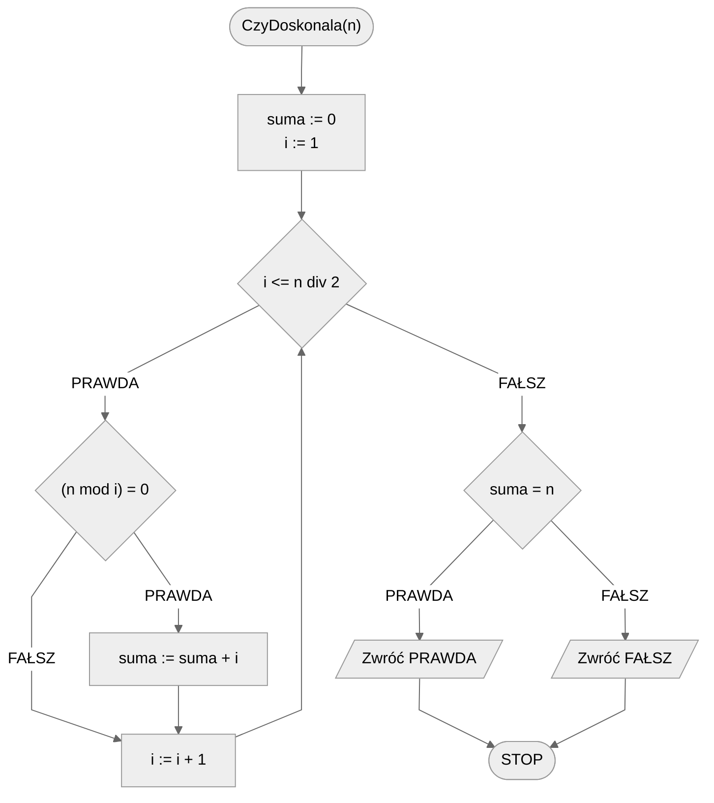
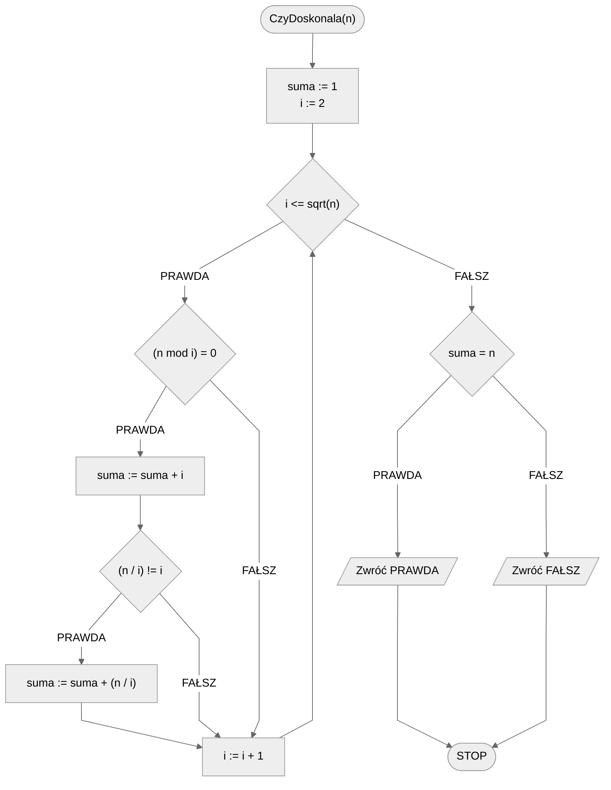

# Test doskonałości

Czym jest liczba doskonała? Zacznijmy od dwóch definicji.

!!! info
	**Liczba doskonała**
	
	Liczba doskonała to taka, która jest równa sumie wszystkich swoich **dzielników właściwych**.

!!! info
	**Dzielnik właściwy**
	
	Dzielnik liczby **różny** od niej samej.

Podobnie jak w przypadku testu pierwszości, problem doskonałości liczby jest podobny do problemu znalezienia wszystkich dzielników liczby, opisanego tutaj: [Wszystkie dzielniki](divisors.md)

Zaczynamy od formalnej specyfikacji i przykładu.

## Specyfikacja

### Dane

* $n$ - liczba naturalna

### Wynik

* **PRAWDA** - jeżeli $n$ jest liczbą doskonałą
* **FAŁSZ** - jeżeli $n$ nie jest liczbą doskonałą

## Przykład 1

### Dane

```
n := 6
```

**Wynik**: PRAWDA

!!! info
	**Wyjaśnienie**
	
	Dzielnikami właściwymi liczby $6$ są: $1, 2, 3$ 
	
	Po ich zsumowaniu otrzymamy z powrotem liczbę $6$:
	
	$6=1+2+3$ 

## Przykład 2

### Dane

```
n := 8
```

**Wynik**: FAŁSZ

!!! info
	**Wyjaśnienie**
	
	Dzielnikami właściwymi liczby 8 są: $1, 2,4$ 
	
	Po ich zsumowaniu otrzymamy liczbę $7$:
	
	$8\not=1+2+4$ 

## Rozwiązanie naiwne

Tym razem pominiemy rozwiązanie zupełnie naiwne i zaczniemy od naiwnego. Będziemy więc przechodzić przez kolejne wartości od $1$ do połowy naszej liczby. Tym razem nie chcemy ich wypisywać, tylko zsumować. Potrzebna więc nam będzie dodatkowa zmienna, do której będziemy dodawać kolejne dzielniki. Oczywiście taką zmienną musimy utworzyć **przed pętlą**. Jaką wartość początkową należy jej nadać? Jak to zwykle bywa, sumowanie zaczynamy od zera.

W pętli, gdy znajdziemy kolejny dzielnik, to dodajemy go do sumy. Na końcu, gdy już zsumujemy wszystkie dzielniki, czyli po wyjściu z pętli, należy sprawdzić, jaki wynik powinniśmy zwrócić. W tym celu porównujemy obliczoną sumę ze sprawdzaną liczbą. Jeżeli są sobie równe, to znaczy, że mamy do czynienia z liczbą doskonałą, więc zwracamy wynik PRAWDA. Jeżeli są od siebie różne, to liczba nie jest doskonała, więc zwracamy FAŁSZ.

Teraz możemy zapisać nasz algorytm.

### Pseudokod

```
funkcja CzyDoskonala(n):
    1. suma := 0
    2. Od i := 1 do n div 2, wykonuj:
        3. Jeżeli (n mod i) = 0, to:
            4. suma := suma + i
      
    5. Jeżeli suma = n, to:
        6. Zwróć PRAWDA, zakończ
   
    7. w przeciwnym przypadku:
        8. Zwróć FAŁSZ, zakończ
```

### Schemat blokowy



### Złożoność

$O(\frac{n}{2})$

## Rozwiązanie optymalne

Podobnie jak w przypadku testu pierwszości, również i tutaj możemy sprawdzić dzielniki przechodząc wyłącznie do pierwiastka z zadanej liczby włącznie. Nie wystarczy jednak, że zsumujemy dzielniki do pierwiastka, musimy także uwzględnić te *z pary*. Dla przykładu, jeżeli wiemy że 6 dzieli się przez 2, to oznacza także, że dzieli się przez 3, ponieważ $6/2=3$. Musimy jeszcze uważać, by dwukrotnie nie dodać tego samego dzielnika (np. $4/2=2$).

### Pseudokod

```
funkcja CzyDoskonala(n)
    1. suma := 1
    2. Od i := 2 do sqrt(n), wykonuj:
        3. Jeżeli (n mod i) = 0, to:
            4. suma := suma + i
            5. Jeżeli (n / i) != i, to:
                6. suma := suma + (n / i)
            
    7. Jeżeli suma = n, to:
        8. Zwróć PRAWDA
    
    9. w przeciwnym przypadku:
        10. Zwróć FAŁSZ
```

!!! info
	 **sqrt** oznacza pierwiastek drugiego stopnia

### Schemat blokowy



### Złożoność

$O(\sqrt{n})$ 

## Implementacja

### [C++](../../programming/c++/algorithms/integers/perfect-test.md)

### [Python](../../programming/python/algorithms/integers/perfect-test.md)

## Implementacja - pozostałe

### [Haskell](../../programming/haskell/algorithms/integers/perfect-test.md)

## Powiązane zagadnienia

* Znajdowanie wszystkich liczb doskonałych mniejszych od zadanej wartości $n$.
* Sprawdzanie, czy w podanym zakresie znajduje się liczba doskonała.
* Sprawdzanie, czy suma cyfr liczby doskonałej też jest liczbą doskonałą.
