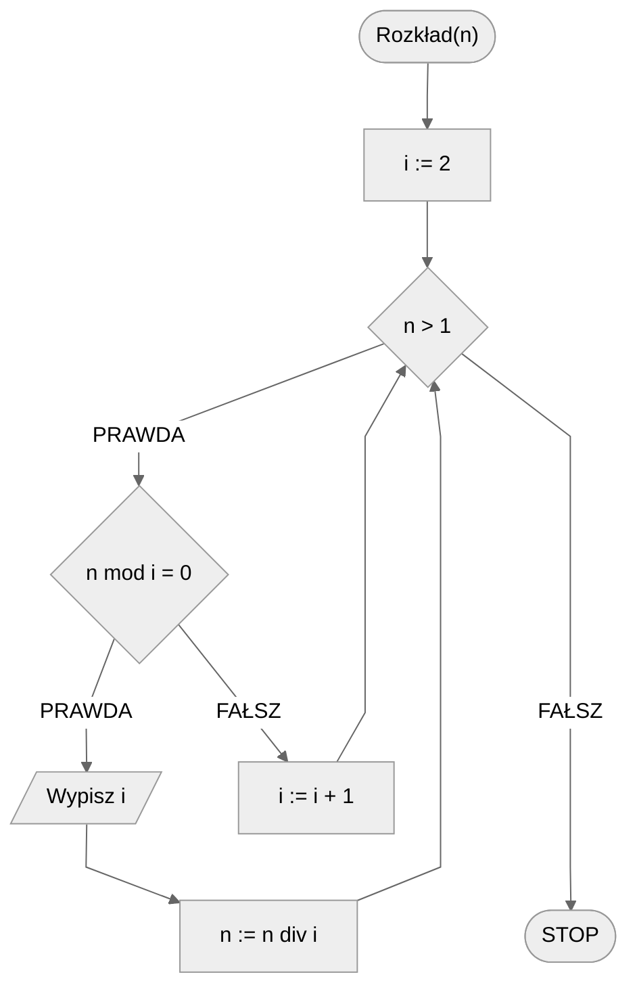

# Rozkład na czynniki pierwsze

## Opis problemu

Każdą liczbę naturalną większą od $1$ możemy rozłożyć na czynniki pierwsze, czyli przedstawić w postaci iloczynu liczb pierwszych. Tym problemem się właśnie zajmiemy.

### Specyfikacja

#### Dane

* $n$ - liczba naturalna, $n>1$.

#### Wynik

* Rozkład liczby $n$ na czynniki pierwsze .

### Przykład

#### Dane

```
n := 124
```

**Wynik**: $2, 2, 31$ 

## Rozwiązanie

Idea rozwiązania jest prosta. Zaczynamy od najmniejszej liczby pierwszej, czyli od liczby $2$. Dzielimy naszą liczbę $n$ przez naszą liczbę pierwszą, tak długo, jak się da, czyli jak długo jest podzielna. Następnie przechodzimy do kolejnej liczby pierwszej i powtarzamy operacje dzielenia. Całość powtarzamy, aż wynikiem dzielenia będzie wartość $1$.

### Pseudokod

```
funkcja Rozkład(n):
    1. i := 2
    2. Dopóki n > 1, wykonuj:
        3. Jeżeli n mod i = 0, to:
            4. Wypisz i
            5. n := n div i
        6. W przeciwnym przypadku:
            7. i := i + 1
```

!!! info
	**mod** oznacza resztę z dzielenia
	
	**div** oznacza dzielenie całkowite

### Schemat blokowy



## Implementacja

### C++


[prime-factors.md](../../programming/c++/algorithms/integers/prime-factors.md)


### Python


[prime-factors.md](../../programming/python/algorithms/integers/prime-factors.md)


## Implementacja - pozostałe

### Haskell


[prime-factors.md](../../programming/haskell/algorithms/integers/prime-factors.md)


## Powiązane zagadnienia

- Znajdowanie wszystkich unikalnych czynników pierwszych zadanej liczby naturalnej.
- Obliczanie największego wspólnego dzielnika (NWD) dwóch liczb naturalnych.
- Obliczanie najmniejszej wspólnej wielokrotności (NWW) dwóch liczb naturalnych.
