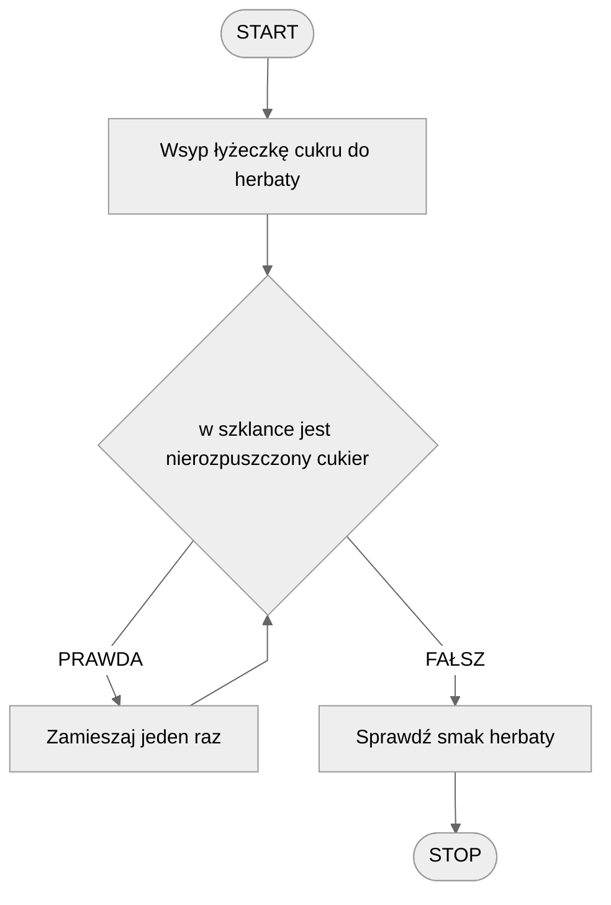
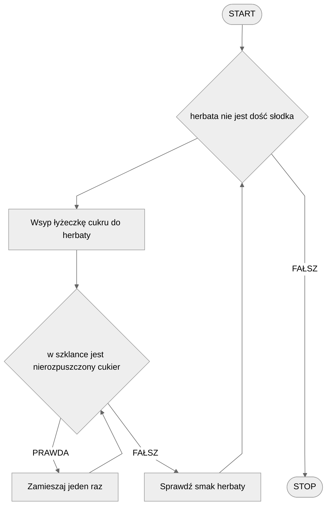

# Pętla warunkowa

Bardzo często zdarza się, że pewne operacje musimy wielokrotnie powtórzyć. Spójrzmy na przykład ze światłami z wprowadzenia do instrukcji warunkowej. W algorytmie określiliśmy, że gdy światło jest czerwone, to mamy stać i czekać. Wszystko ładnie i pięknie, ale co gdy światło zmieni się na zielone? Czy wtedy powinniśmy ponownie uruchomić algorytm? Możemy tak właśnie postąpić. Jest jednak też inne rozwiązanie. Wiemy, że na światłach należy czekać, aż światło nie zmieni się na zielone. Moglibyśmy więc powiedzieć: stój, **dopóki światło jest czerwone**. Albo też: **dopóki światło jest czerwone to stój**. To jest właśnie pętla warunkowa. Kluczowe jest tutaj słowo **dopóki**, z angielskiego **while**.

## Pętla prosta

Zacznijmy od pętli prostej - pojedynczej pętli warunkowej, wewnątrz której znajdują się pewne operacje do powtórzenia. W celu lepszego zrozumienia, jak działa pętla, rozważmy pewien przykład.

### Przykład - algorytm słodzenia herbaty

Rozważmy następujący problem: przed nami stoi gorzka herbata. Naszym zadaniem jest ją posłodzić łyżeczką cukru, a następnie zamieszać, żeby cukier się rozpuścił. Zauważmy jednak że nie wiemy z góry jak długo będzie trzeba mieszać herbatę. Może wystarczy zamieszać kilka razy, gdy herbata jest gorąca, a może trzeba będzie mieszać dłużej. Dlatego pomocna będzie tutaj pętla warunkowa.

Zastanówmy się: jaki jest warunek mieszania herbaty? Kiedy musimy herbatę jeszcze raz zamieszać? Wtedy, gdy w szklance mamy nierozpuszczony cukier. Spróbujmy więc skonstruować algorytm słodzenia herbaty.

#### Lista kroków

```
1. Wsyp łyżeczkę cukru do herbaty
2. Dopóki w szklance jest nierozpuszczony cukier, wykonuj:
    3. Zamieszaj jeden raz
4. Sprawdź smak herbaty
```

Zwróć uwagę na wcięcie w powyższym przykładzie algorytmu. Tak często określamy, że instrukcja znajduje się wewnątrz pętli, podobnie jak to było z instrukcją warunkową.

#### Schemat blokowy



Przyjrzyj się uważnie powyższemu schematowi blokowemu. Zauważ, że nie mamy osobnego bloku do pętli warunkowej. W celu zrealizowania pętli wykorzystujemy instrukcję warunkową, a następnie prowadzimy odpowiednią strzałkę tuż przed tę instrukcję, tym samym _**zapętlając**_ nasz schemat.

## Pętla zagnieżdżona

Wiemy już jak wygląda prosta pętla warunkowa. Czasem jednak jedna pętla to za mało. Czasem musimy zagnieździć wewnątrz siebie dwie (lub więcej) pętli, tym samym uzyskując wielokrotne powtórzenia. Zobaczmy jak to wygląda na przykładzie.

### Przykład - wielokrotne słodzenie herbaty

Ponownie rozważymy problem słodzenia herbaty. Zauważmy, że w poprzednim przykładzie słodziliśmy herbatę jedną łyżeczką cukru. A co w przypadku, gdy ktoś lubi herbatę słodzoną dwiema, trzema, a może nawet czterema łyżeczkami cukru? Potrzebujemy **drugiej pętli**, by posłodzić herbatę wielokrotnie.

Jak rozpuścić cukier w herbacie już wiemy. Pytanie teraz brzmi: jak długo słodzić herbatę? Odpowiedź wydaje się prosta: dopóki herbata nie jest dla nas wystarczająco słodka to będziemy ją słodzić. Spróbujmy więc skonstruować algorytm.

#### Lista kroków

```
1. Dopóki herbata nie jest dość słodka, wykonaj:
    2. Wsyp łyżeczkę cukru do herbaty
    3. Dopóki w szklance jest nierozpuszczony cukier, wykonuj:
        4. Zamieszaj jeden raz
    5. Sprawdź smak herbaty
```

Zwróć uwagę na podwójne wcięcie w powyższym zapisie. Instrukcja 4 Znajduje się wewnątrz dwóch pętli. 

#### Schemat blokowy


