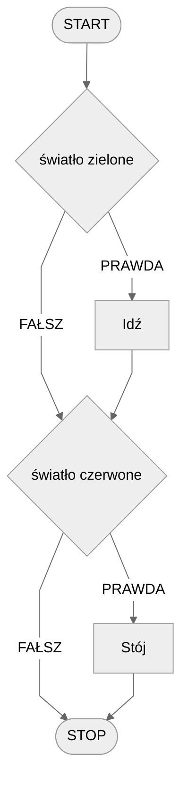
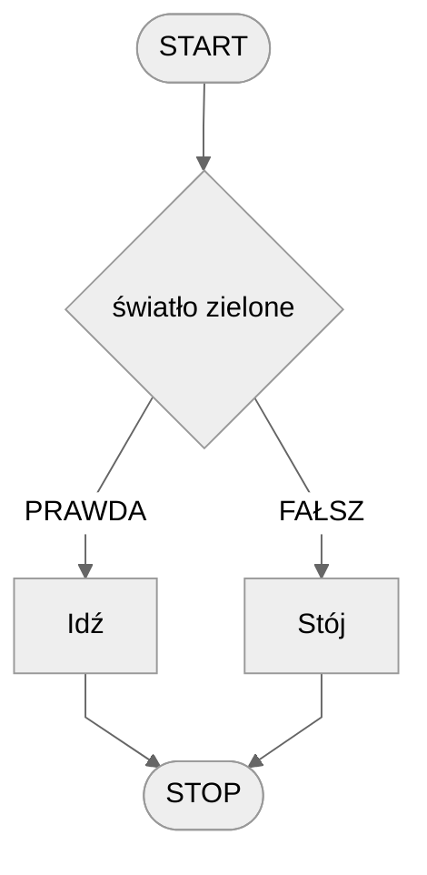
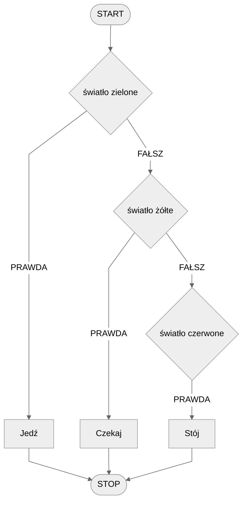
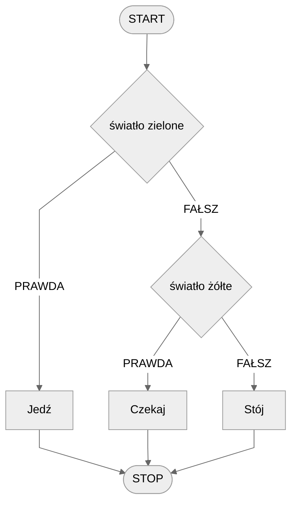
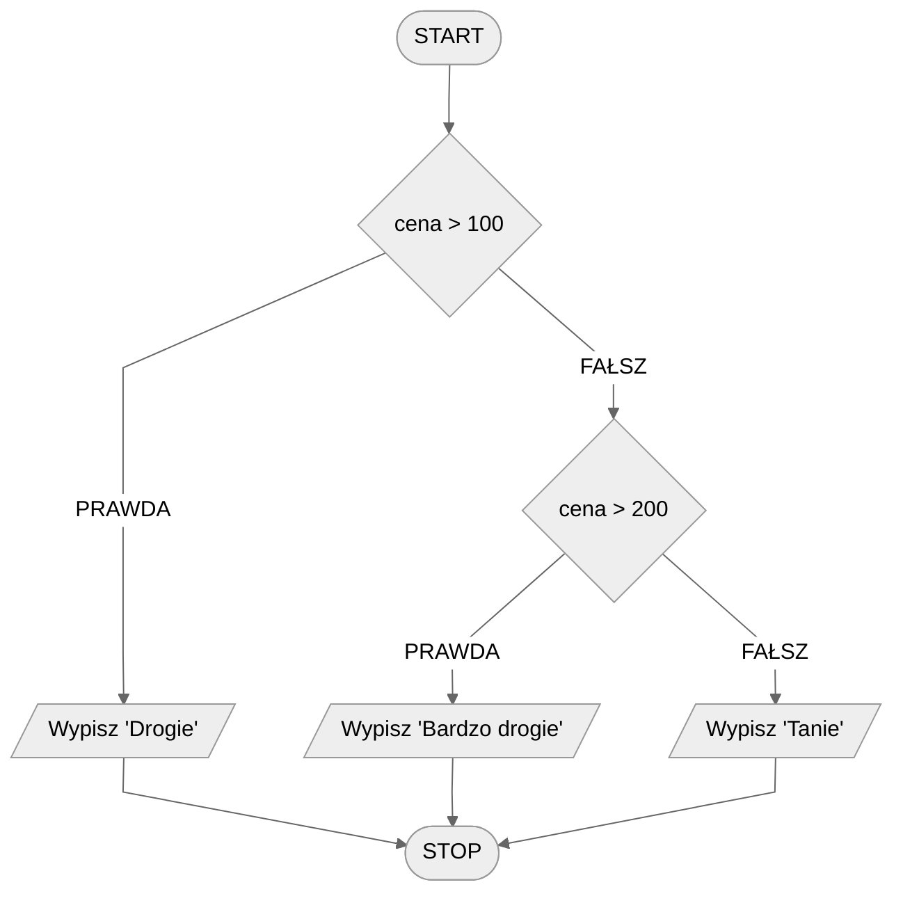
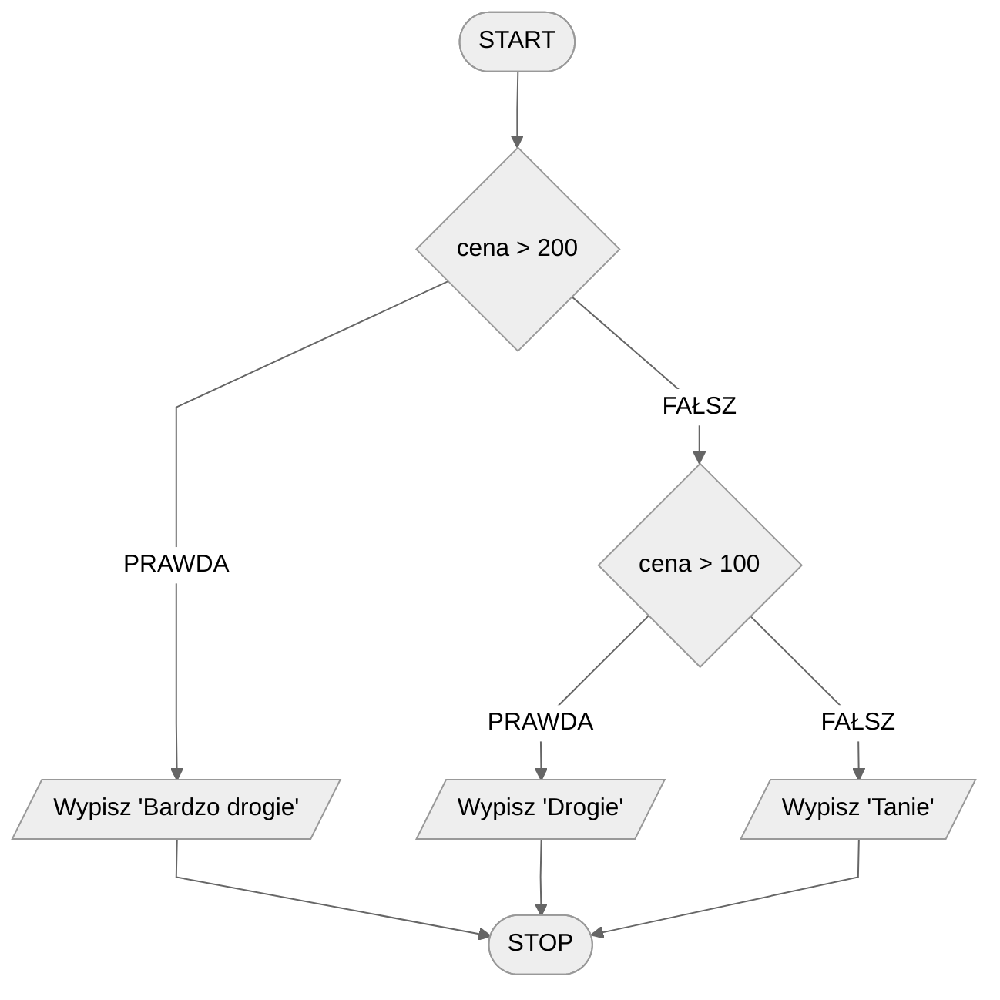

# Instrukcja warunkowa

Korzystając jedynie z algorytmów liniowych nie bylibyśmy w stanie rozwiązać wielu problemów. Dlaczego? Konstrukcja algorytmów liniowych jest zbyt... liniowa. Czasem musimy podejmować różne decyzje w zależności od zastanej sytuacji. Wyobraźmy sobie problem przechodzenia przez ulicę. Czy potrafisz skonstruować algorytm liniowy bezpiecznego przechodzenia przez przejście dla pieszych? Nie możemy napisać po prostu "przejdź przez pasy", ponieważ może jechać jakiś samochód! Należy najpierw rozejrzeć się na boki i dopiero potem, **jeżeli** nic nie jedzie, przejść na drugą stronę ulicy.

Kluczowe jest tutaj słowo: **jeżeli**. W zależności od tego, czy samochody jadą, czy też nie, będziemy wykonywać różne akcje. Jeżeli samochody jadą, to będziemy czekać. A jak nic nie będzie jechało, to możemy przejść. Taką konstrukcję nazwiemy **instrukcją warunkową**.

Zastosowanie instrukcji warunkowej sprawia, że wykonanie naszego programu może mieć różne przebiegi, tzn. różne instrukcje mogą zostać wykonane w zależności od określonych warunków.

## Prosta instrukcja warunkowa

Zacznijmy od prostego przykładu. Ponownie wyobraźmy sobie przejście dla pieszych, ale tym razem są na nim światła drogowe. Jak przechodzić przez przejście na światłach każdy powinien wiedzieć. Spróbujmy skonstruować algorytm dla tej operacji.

### Przykład 1

Zastanówmy się najpierw nad tym, jak wygląda przechodzenie przez przejście na światłach. Najpierw patrzymy na światła i, w zależności od ich koloru, przechodzimy przez ulicę albo czekamy. W takim razie nasza decyzja, czy też operacja, jaką wykonujemy, zależna jest od koloru świateł. Kolory te mogą być dwa: zielony lub czerwony. Zastosujemy więc dwie instrukcje warunkowe.

#### Lista kroków

```
1. Jeśli światło zielone to:
    2. Idź
    
3. Jeśli światło czerwone to:
    4. Stój
```

Zwróć uwagę na wcięcia w powyższym zapisie. Zazwyczaj, aby zasygnalizować, że instrukcja znajduje się wewnątrz instrukcji warunkowej, używamy wcięcia.

#### Schemat blokowy



### Przykład 2

Ten sam algorytm możemy także skonstruować w nieco odmienny sposób. Zauważmy, że rozważamy tylko dwa możliwe kolory świateł. Moglibyśmy więc także powiedzieć, że jeżeli światło jest zielone, to przechodzimy przez ulicę, a **w** **każdym innym przypadku** stoimy i czekamy. Spróbujmy to zapisać w formie algorytmu.

#### Lista kroków

```
1. Jeśli światło zielone to:
    2. Idź
3. W przeciwnym przypadku:
    4. Stój
```

#### Schemat blokowy



## Złożona instrukcja warunkowa

Rozważmy teraz kolejny przykład: światła drogowe dla kierowców. W przeciwieństwie do świateł dla pieszych mamy tutaj trzy różne kolory: zielony, żółty i czerwony. Spróbujmy więc skonstruować odpowiedni algorytm.

### Przykład 1

#### Lista kroków

```
1. Jeśli światło zielone to:
    2. Jedź
3. W przeciwnym przypadku, jeśli światło żółte to:
    4. Czekaj
5. W przeciwnym przypadku, jeśli światło czerwone to:
    6. Stój
```

#### Schemat blokowy



### Przykład 2

Podobnie jak poprzednio, nie musimy dokładnie określać wszystkich przypadków. Tym razem wystarczy określić pierwsze dwa, ponieważ wiemy, że jeżeli światło nie jest zielone ani żółte, to musimy stać i czekać.

#### Lista kroków

```
1. Jeśli światło zielone to: 
    2. Jedź
3. W przeciwnym przypadku, jeśli światło żółte to: 
    4. Czekaj
5. W przeciwnym przypadku: 
    6. Stój
```

#### Schemat blokowy



## Konstrukcja warunków musi być przemyślana

W poprzednich przykładach nie miało znaczenia, w jakiej kolejności rozważamy kolejne warunki. Moglibyśmy zamienić kolejność instrukcji warunkowych (oczywiście wraz z operacjami) i wciąż mielibyśmy poprawnie działający algorytm. Nie zawsze jednak życie jest takie proste...

### Przykład 1

#### Lista kroków

```
1. Jeśli cena > 100 to:
    2. Wypisz "Drogie"
3. W przeciwnym przypadku, jeśli cena > 200 to:
    4. Wypisz "Bardzo drogie"
5. W przeciwnym przypadku:
    6. Wypisz "Tanie"
```

#### Schemat blokowy



Czy potrafisz stwierdzić, co jest nie tak z powyższą instrukcją warunkową? Sama jej konstrukcja jest poprawna, ale nie do końca przemyślana i może wprowadzać czytelnika w błąd. Spróbuj _zasymulować_ działanie algorytmu dla różnych wartości ceny. Zastanów się, jaka musi być cena, żeby każdy z komunikatów został wypisany, tzn. dla jakich wartości zostanie wypisany komunikat "drogie", dla jakich "bardzo drogie", a dla jakich komunikat "tanie". Poświęć chwilę na samodzielne wykonanie tego ćwiczenia, zanim przejdziesz dalej.

Zauważ, że komunikat "bardzo drogie" nie zostanie nigdy wypisany. Dlaczego tak się dzieje? Wystarczy przyjrzeć się dokładnie konstrukcji warunków. Pierwszy warunek określa, co ma się wydarzyć dla cen większych od 100. Drugi natomiast określa, co ma się wydarzyć dla cen większych od 200. Wydawałoby się zatem, że np. dla wartości 300 zostanie spełniony drugi warunek i wypisany komunikat "bardzo drogie". Tak się jednak nie stanie. Dlaczego?

Dzieje się tak, ponieważ dla takiej ceny **pierwszy warunek jest już spełniony**. A skoro pierwszy warunek jest już spełniony, to kolejne nie będą już sprawdzane i wykonywane.

Oczywiście powyższy algorytm można łatwo poprawić zamieniając kolejność warunków, tak jak pokazuje poniższy przykład.

### Przykład 2

#### Lista kroków

```
1. Jeśli cena > 200 to:
    2. Wypisz "Bardzo drogie"
3. W przeciwnym przypadku, jeśli cena > 100 to: 
    4. Wypisz "Drogie"
5. W przeciwnym przypadku:
    6. Wypisz "Tanie"
```

#### Schemat blokowy


