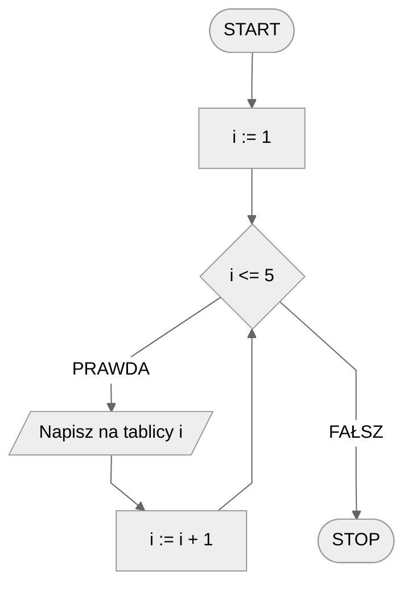

# Pętla iteracyjna

## Pętla prosta

Czasem chcemy coś powtórzyć kilka razy. Nie mamy żadnego konkretnego warunku do spełnienia, po prostu musimy powtórzyć pewną operację wielokrotnie. Moglibyśmy wówczas daną operację napisać kilka razy, jedna pod drugą, ale znacznie wygodniej jest użyć pętli.

### Przykład

#### Bez pętli

```
1. Zgłoś się na ochotnika do tablicy
2. Zgłoś się na ochotnika do tablicy
3. Zgłoś się na ochotnika do tablicy
```

#### Z zastosowaniem pętli

```
1. Powtórz 3 razy poniższe:
    2. Zgłoś się na ochotnika do tablicy
```

## Zmienna liczba powtórzeń

Może także zdarzyć się tak, że nie wiemy z góry ile razy będziemy musieli powtórzyć pewną operację. Być może jest to zależne od innych obliczeń, a może od danych wejściowych. Wówczas nie moglibyśmy napisać kilku powtórzeń zadanej operacji jedna pod drugą, bo nie wiemy, ile musiałoby ich być! Możemy to jednak zrealizować łatwo za pomocą pętli.

### Przykład

```
1. Wczytaj n
2. Powtórz n-razy poniższe:
    3. Zgłoś się na ochotnika do tablicy
```

## Pętla z licznikiem

Czasem nie wystarczy nam powtórzyć pewną operację wielokrotnie. Czasem potrzebujemy jednocześnie coś **zliczać** np. powtórzenia pętli właśnie. Wówczas przyda nam się **licznik pętli**.

Używając pętli z licznikiem powinniśmy podać **zakres**, z którego licznik będzie przyjmował kolejne wartości. To trochę tak, jakbyśmy sami coś liczyli, np. od $1$ do $5$. Punktem startowym, czyli początkową wartością licznika będzie $1$, a ostatnią wartością, jaką osiągnie licznik, będzie $5$. W kolejnych **przebiegach** (**powtórzeniach**) **pętli** licznik będzie przyjmował kolejne wartości z zadanego zakresu, czyli dla przykładu będą to wartości: $1,2,3,4,5$.

### Przykład

#### Bez pętli

```
1. Napisz na tablicy 1
2. Napisz na tablicy 2
3. Napisz na tablicy 3
4. Napisz na tablicy 4
5. Napisz na tablicy 5
```

#### Z zastosowaniem pętli z licznikiem

```
1. Od i := 1 do 5, wykonuj:
    2. Napisz na tablicy i
```

#### Schemat blokowy



Zwróć uwagę, że podobnie jak w przypadku pętli warunkowej, dla pętli iteracyjnej także nie mamy specjalnego bloku. Tak naprawdę w schemacie blokowym pętlę iteracyjną realizujemy jako pętlę warunkową, ponieważ każdą pętlę iteracyjną można zrealizować za pomocą pętli warunkowej.

## Krok pętli

Krok pętli określa, o ile zmienia się wartość licznika pętli w każdym jej przebiegu. Domyślnym krokiem pętli iteracyjnej jest $1$. Jeżeli korzystamy z wartości domyślnej, to zazwyczaj nie piszemy kroku pętli. Możemy go jednak z łatwością zmodyfikować, jak pokazują poniższe przykłady.

### Przykład - liczby parzyste

Powiedzmy, że naszym zadaniem jest wypisać na tablicy kolejne liczby parzyste od $2$ do $10$ włącznie. Moglibyśmy przechodzić przez kolejne wartości z tego zakresu i, jeżeli liczba jest parzysta, wypisać ją na tablicy. Możemy też zmodyfikować krok pętli tak, by przechodzić **tylko** przez kolejne liczby parzyste.

```
1. Od i := 2 do 10, z krokiem 2, wykonuj:
    2. Napisz na tablicy i
```

Bez pętli:

```
1. Napisz na tablicy 2
2. Napisz na tablicy 4
3. Napisz na tablicy 6
4. Napisz na tablicy 8
5. Napisz na tablicy 10
```

### Przykład - odliczanie w dół

Co w przypadku, gdy chcemy policzyć od $5$ do $1$? Tutaj także możemy skorzystać z pętli iteracyjnej z odpowiednim krokiem.

```
1. Od i := 5 do 1, z krokiem -1, wykonuj:
    2. Napisz na tablicy i
```

Bez pętli:

```
1. Napisz na tablicy 5
2. Napisz na tablicy 4
3. Napisz na tablicy 3
4. Napisz na tablicy 2
5. Napisz na tablicy 1
```
