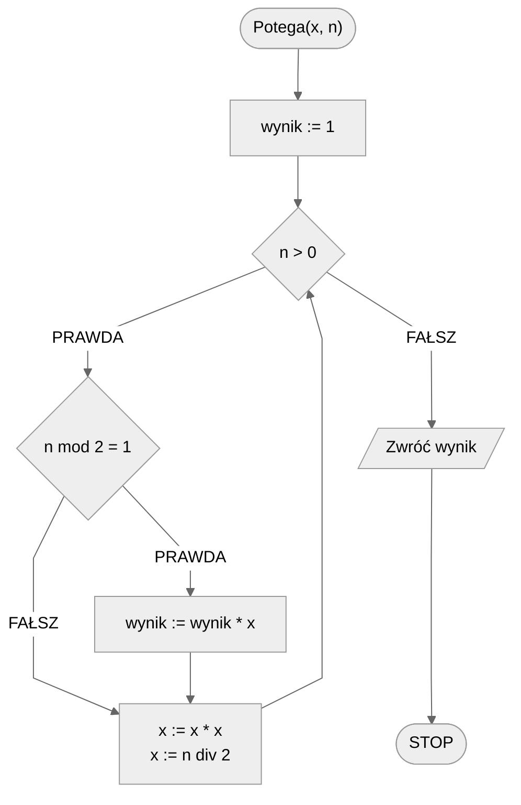
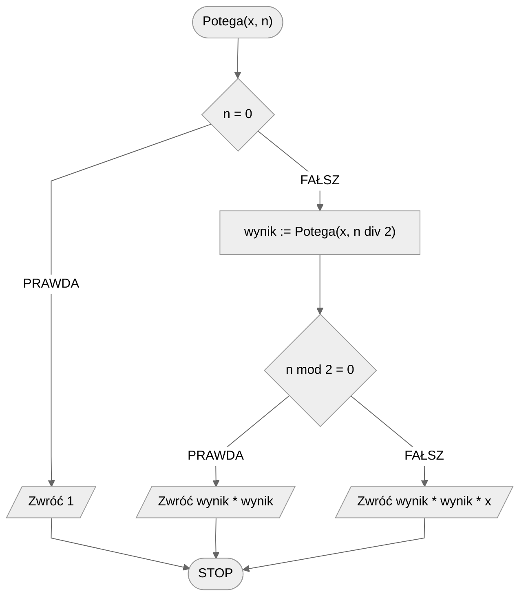

# Szybkie potęgowanie

Zadanie jest proste: mamy podnieść liczbę do zadanej potęgi. Jak to jednak zwykle bywa, można to zrobić na różne sposoby, spośród których jedne będą szybsze, a inne wolniejsze. Zacznijmy od przykładu.

$$
x^4=x*x*x*x
$$

Jak widać w powyższym przykładzie, aby podnieść $x$ do potęgi 4, musimy wykonać **3 mnożenia**.

Zauważmy jednak, że pewne obliczenia będziemy wykonywać wielokrotnie:

$$
x^4=x^2*x^2
$$

Możemy najpierw obliczyć $x^2$ a następnie wynik podnieść do kwadratu:

$$
x^4=(x^2)^2
$$

Jak przeanalizujemy powyższy przykład to zobaczymy, że teraz wystarczy wykonać **2 mnożenia**!

Zobaczmy, że podobnie postępować możemy także z innymi potęgami, np.:

$$
x^8=(x^4)^2=((x^2)^2)^2
$$

Zamiast oryginalnych **7 mnożeń**, wystarczy wykonać **3 mnożenia**.

### Wykładnik nieparzysty

Co jednak w sytuacji, gdy wykładnik potęgi nie jest parzysty? Spójrzmy na poniższy przykład:

$$
x^5=(x^2)^2*x
$$

## Specyfikacja

### Dane:

* $x$ — liczba całkowita, podstawa potęgi
* $n$ — liczba naturalna, wykładnik potęgi

### Wynik:

* $x^n$

## Rozwiązanie iteracyjne

### Pseudokod

```
funkcja Potega(x, n)
    1. wynik := 1
    2. Dopóki n > 0, wykonuj:
        3. Jeżeli n mod 2 = 1, to:
            4. wynik := wynik * x
        
        5. x := x * x
        6. n := n div 2
    
    7. Zwróć wynik
```

### Schemat blokowy



### Złożoność

$O(\log{n})$ — logarytmiczna

## Rozwiązanie rekurencyjne

### Definicja rekurencyjna

$$
\mathrm{potega}(x,n) =
\begin{cases}
	1 & n=0 \\
	\mathrm{potega}(x,n\ \mathrm{div}\ 2)^2 & n\mod 2=0 \\
	\mathrm{potega}(x,n\ \mathrm{div}\ 2)^2*x & n\mod 2=1 \\
\end{cases}
$$

### Pseudokod

```
funkcja Potega(x, n)
    1. Jeżeli n = 0, to:
        2. Zwróć 1, zakończ
    
    3. wynik := Potega(x, n div 2)

    4. Jeżeli n mod 2 = 0, to:
        5. Zwróć wynik * wynik, zakończ
    
    6. W przeciwnym przypadku:
        7. Zwróć wynik * wynik * x, zakończ
```

### Schemat blokowy



### Złożoność

$O(\log{n})$ — logarytmiczna

## Implementacja

### [:simple-cplusplus: C++](../../programming/c++/algorithms/numerical-methods/fast-exp.md){ .md-button }

### [:simple-python: Python](../../programming/python/algorithms/numerical-methods/fast-exp.md){ .md-button }

### [:simple-julia: Julia](../../programming/julia/algorithms/numerical-methods/fast-exp.md){ .md-button }
