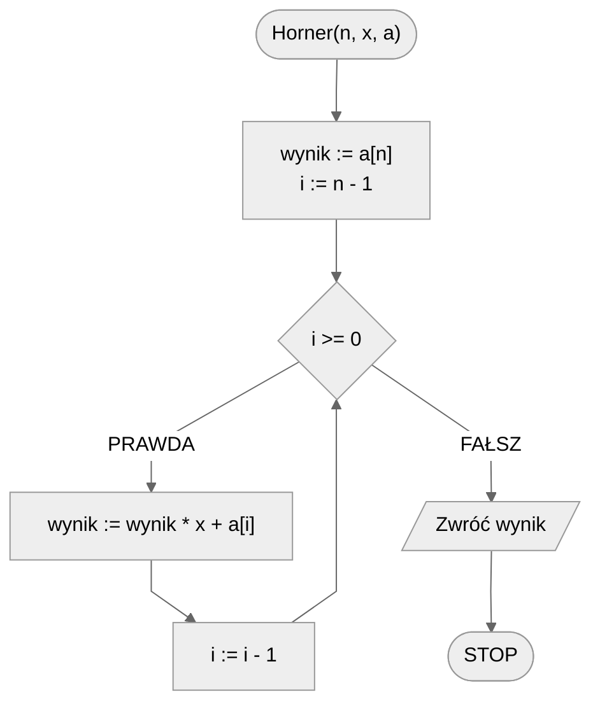

# Schemat Hornera

## Opis problemu

Jak wygląda wielomian pewnie każdy wie. Gdy mamy podany wzór, obliczenie jego wartości dla podanego $x$ jest rzeczą wręcz trywialną: wystarczy wykonać kilka mnożeń, podnieść parę razy do potęgi i wszystko zsumować. Tym bardziej dla komputera nie powinno to stanowić większego wyzwania i tak rzeczywiście jest. Nie oznacza to jednak, że nie należy szukać metod pozwalających na zminimalizowanie wykonywanych operacji. Spójrzmy na konkretny przykład:

$$
W(x) = 2x^3+3x^2+5x+1
$$

Zastanówmy się, ile dokładnie operacji dodawania i mnożenia musimy wykonać, żeby obliczyć wartość tego wielomianu dla podanego $x$. Spróbujmy to rozpisać:

$$
W(x)=2*x*x*x+3*x*x+5*x+1
$$

Teraz można łatwo policzyć, że mamy:

* **6** operacji mnożenia
* **3** operacje dodawania

Łącznie **9** operacji. Czy możemy jakoś zmniejszyć ilość wykonywanych operacji? Zauważmy, że niektóre potęgi $x$ obliczamy wielokrotnie. Np. obliczając wartość $x^3$ obliczamy "po drodze" także wartość $x^2$. Spróbujmy to wykorzystać. Gdybyśmy mieli wykonać obliczenia na komputerze, moglibyśmy utworzyć zmienne, w których zapamiętamy kolejne potęgi wartości $x$ , które później wykorzystamy do obliczeń. Możemy do tego jednak podejść także bardziej matematycznie. Spróbujmy wyciągnąć $x$ przed nawias.

$$
W(x)=(2*x*x+3*x+5)*x+1
$$

Policzmy, ile teraz wykonujemy operacji:

* **4** operacje mnożenia
* **3** operacje dodawania

Łącznie **7** operacji, czyli o **2** operacje mniej niż na początku! Pójdźmy więc o krok dalej.

$$
W(x)=((2*x+3)*x+5)*x+1
$$

Finalnie otrzymujemy:

* **3** operacje mnożenia
* **3** operacje dodawania

Łącznie **6** operacji, czyli o **3** operacje mniej niż na początku. Jak można łatwo zauważyć, ilość operacji dodawania nie zmienia się, jednak możemy w łatwy sposób zmniejszyć ilość wymaganych operacji mnożenia.

Zastosowany wyżej schemat postępowania nazywamy _**Schematem Hornera**_.

### Ogólny wzór

Zauważmy, że wartości współczynników wielomianu nie mają wpływu na zastosowanie _**Schematu Hornera**_. Możemy więc łatwo skonstruować ogólny wzór dla wielomianu 3 stopnia:

$$
W(x)=a_3x^3+a_2x^2+a_1x+a_0=((a_3x+a_2)x+a_1)x+a_0
$$

A także ogólny wzór dla wielomianu n-tego stopnia:

$$
W(x)=a_nx^n+a_{n-1}x^{x-1}+...+a_1x+a_0=(...(a_nx+a_{n-1})x+...+a_1)x+a_0
$$

### Liczba operacji mnożenia

Spróbujmy policzyć, ile operacji mnożenia musimy wykonać przy zastosowaniu standardowej metody, dla wielomianu:

* 1-szego stopnia: $1$ mnożenie
* 2-giego stopnia: $1+2=3$ mnożenia
* 3-go stopnia: $1+2+3=6$ mnożeń
* n-tego stopnia: $1+2+3+...+(n-1)+n=\frac{n(n+1)}{2}$ mnożeń

Gdy jednak zastosujemy _**Schemat Hornera**_, to ilość potrzebnych operacji mnożenia znacząco zmaleje:

* 1-szego stopnia: $1$ mnożenie
* 2-giego stopnia: $2$ mnożenia
* 3-go stopnia: $3$ mnożenia
* n-tego stopnia: $n$ mnożeń

### Zastosowania

_**Schemat Hornera**_ ma także zastosowanie przy przeliczaniu liczby z zadanego systemu liczbowego na system dziesiętny.

### Specyfikacja

#### Dane

* $n$ — stopień wielomianu, liczba naturalna
* $x$ — wartość, dla której należy obliczyć wielomian
* $a_{n}, a_{n-1}, ..., a_1, a_0$ — współczynniki wielomianu, podane w kolejności od największej potęgi do najmniejszej

#### Wynik

* Wartość podanego wielomianu w punkcie $x$

## Rozwiązanie

Zaprojektujmy funkcje Horner, zgodną z powyższą specyfikacją.
Będziemy postępować zgodnie ze schematem: w pętli mnożymy przez $x$ i dodajemy kolejny współczynnik.

### Pseudokod

```
funkcja Horner(n, x, a)
    1. wynik := a[n]
    2. Od i := n - 1 w dół do 0, wykonuj:
        3. wynik := wynik * x + a[i]
    4. Zwróć wynik
```

### Schemat blokowy



### Złożoność

$O(n)$ — liniowa

## Implementacja

### C++

[horner.md](../../programming/c++/algorithms/numerical-methods/horner.md)

### Python

[horner.md](../../programming/python/algorithms/numerical-methods/horner.md)
