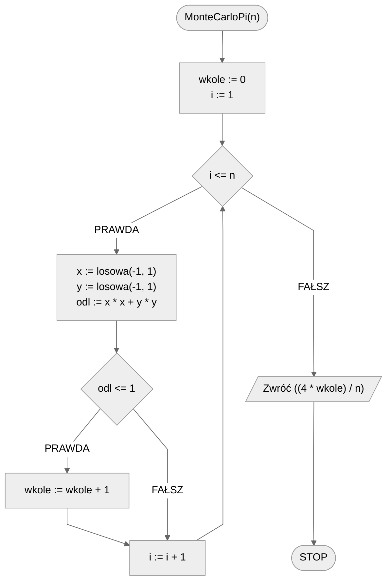

# Metoda Monte Carlo

Metoda Monte Carlo to technika matematyczna, która pozwala uzyskiwać numeryczne rozwiązania problemów przez dokonywanie losowych prób. Jest szeroko stosowana w matematyce, fizyce, finansach i innych dziedzinach nauki. Podstawą tej metody jest korzystanie z prawdopodobieństwa i próbek losowych w celu uzyskania przybliżonych wyników do różnych problemów. Innymi słowy, bazując praktycznie wyłącznie na losowości jesteśmy w stanie oszacować wynik postawionego problemu. Rzecz jasna słowo klucz to **oszacować**. Nie dostaniemy dokładnego, pełnego wyniku, ale czasem nam to wystarczy. W szczególności, gdy tak właściwie to nie wiemy, jak obliczyć dokładny wynik.

Metoda Monte Carlo, jak już wspomniałem, ma różne zastosowania. Poniżej omówię dwa z nich, skupiając się jednak na szacowaniu wartości liczby $\pi$. W kontekście całkowania numerycznego odwołuję zainteresowanych także do metody prostokątów i trapezów.

## Całkowanie numeryczne

Metoda Monte Carlo może być stosowana do szacowania wartości całek, zwłaszcza dla funkcji wielu zmiennych, gdzie tradycyjne techniki całkowania mogą być skomplikowane.

Kolejne kroki algorytmu wyglądają następująco:

1. Zakładamy pewien obszar $D$, w którym chcemy oszacować całkę.
2. Losujemy $N$ punktów wewnątrz obszaru $D$.
3. Obliczamy wartość funkcji dla każdego z tych punktów.
4. Średnia wartość funkcji dla tych punktów przemnożona przez rozmiar obszaru $D$ daje szacunkową wartość całki.

Przy dużych wartościach $N$ wynik zbliża się do prawdziwej wartości całki. Trzeba jednak pamiętać, że metoda Monte Carlo opiera się na losowości, a co za tym idzie ma pewną wariancję i jej dokładność zależy od liczby próbek. Zastosowanie większej liczby próbek zwiększa dokładność wyniku, ale również, co naturalne, zwiększa czas obliczeń. Coś za coś.

## Szacowanie wartości liczby $\pi$

Jednym z popularnych zastosowań metody Monte Carlo jest szacowanie wartości liczby $\pi$. Pomysł jest stosunkowo prosty i polega na losowaniu punktów w kwadracie, a następnie sprawdzaniu, ile z tych punktów trafia wewnątrz wpisanego w kwadrat koła.

Ogólne kroki algorytmu przedstawiają się następująco:

1. Zakładamy kwadrat o boku długości $2$, z wpisanym kołem o promieniu $1$.
2. Losujemy $N$ punktów wewnątrz kwadratu.
3. Liczymy, ile z tych punktów trafiło do wnętrza koła. Możemy to zrobić poprzez sprawdzenie, czy odległość wylosowanego punktu od środka kwadratu (będącego jednocześnie środkiem koła) jest mniejsza bądź równa $1$. Liczbę takich punktów oznaczymy przez $M$.
4. Stosunek punktów wewnątrz koła do wszystkich punktów jest przybliżeniem stosunku pola powierzchni koła do pola powierzchni kwadratu. Co za tym idzie:
   $$
   \pi\approx 4\times \frac{M}{N}
   $$

Dokładność oszacowania zależy od liczby wylosowanych punktów, ale ze względu na losowy charakter algorytmu ma pewną wariancję.

### Specyfikacja

#### Dane

* $n$ — liczba prób (im większa, tym w ogólności większa dokładność oszacowania)

#### Wynik

* $pi$ — przybliżona wartość liczby $\pi$

### Symulacja

[Symulacja Monte Carlo](https://academo.org/demos/estimating-pi-monte-carlo/)

### Pseudokod

```
funkcja MonteCarloPI(n)
    1. wkole := 0
    2. Dla i := 1 do n, wykonuj:
        3. x := losowa liczba rzeczywista z przedziału [-1, 1]
        4. y := losowa liczba rzeczywista z przedziału [-1, 1]
        5. odl := (x * x) + (y * y)
        6. Jeżeli odl <= 1, to:
            7. wkole := wkole + 1
    
    8. Zwróć (4 * wkole) / n
```

### Schemat blokowy



### Implementacja

#### [C++](../../programming/c++/algorithms/numerical-methods/monte-carlo.md)

#### [Python](../../programming/python/algorithms/numerical-methods/monte-carlo.md)

#### [Julia](../../programming/julia/algorithms/numerical-methods/monte-carlo.md)
