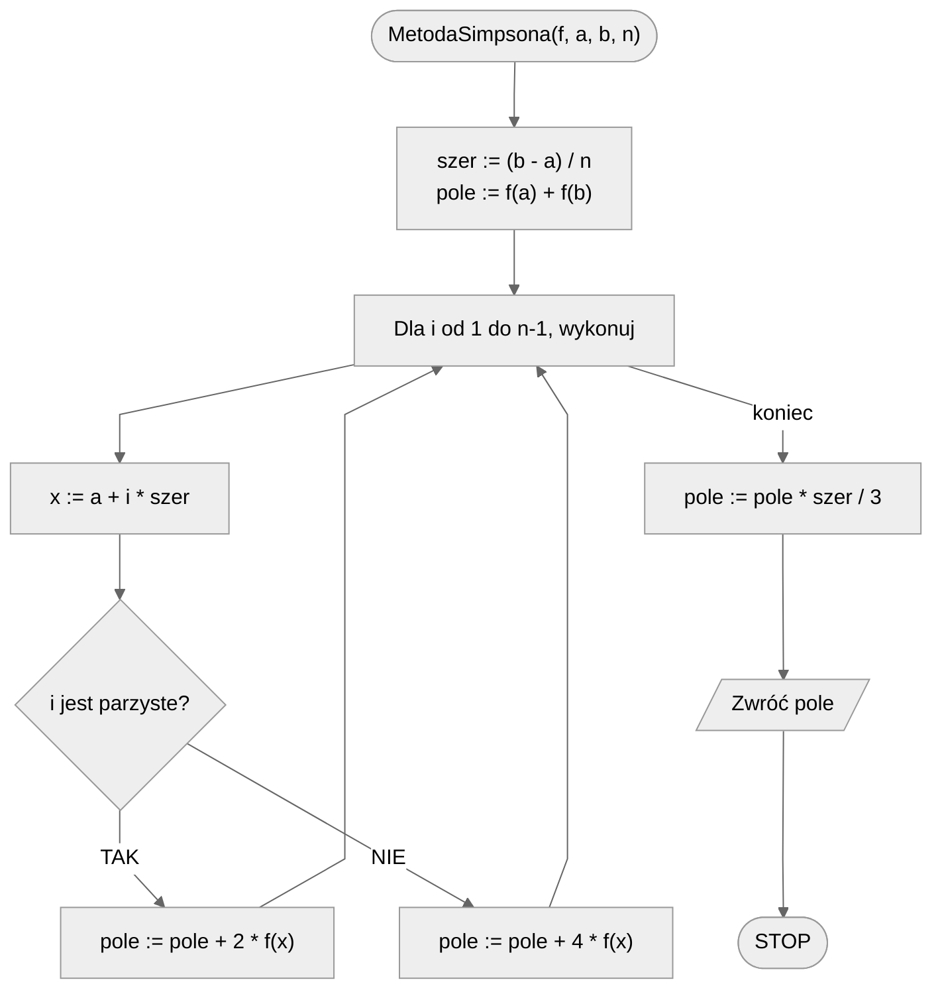

# Metoda Simpsona

Metoda Simpsona jest bardziej zaawansowaną techniką całkowania numerycznego, która pozwala na uzyskanie dokładniejszych wyników niż metody prostokątów i trapezów. Polega ona na przybliżeniu funkcji za pomocą parabol, a następnie obliczeniu pola pod tymi parabolami.

## Wzór

Wzór metody Simpsona dla przedziału $[a, b]$ z $n$ podprzedziałami (gdzie $n$ jest parzyste) jest następujący:

$$
\int_{a}^{b} f(x) \, dx \approx \frac{h}{3} \left[ f(a) + 4 \sum_{k=1}^{n/2} f(a + (2k-1)h) + 2 \sum_{k=1}^{n/2-1} f(a + 2kh) + f(b) \right]
$$

gdzie:

- $h = (b - a) / n$ jest szerokością podprzedziału,
- $\sum_{k=1}^{n/2}$ oznacza sumowanie dla $k$ od $1$ do $n/2$.

### Podział przedziału

1. Dzielimy przedział $[a, b]$ na $n$ równych podprzedziałów, gdzie $n$ jest parzyste.
2. Każdy podprzedział ma szerokość $h$.

### Obliczanie całek na kolejnych fragmentach

1. Obliczamy wartości funkcji $f(x)$ w punktach $a, a + h, a + 2h, \dots, b$.
2. Sumujemy wartości funkcji w punktach końcowych przedziału ($a$ i $b$), punktach środkowych ($a + (2k-1)h$) z wagą $4$ oraz punktach wewnętrznycha ($a+2kh$) z wagą $2$.

### Łączenie całego wyniku

Mnożymy sumę przez $h/3$, aby uzyskać przybliżoną wartość całki oznaczonej.

## Błąd dokładności

Błąd przybliżenia wartości całki metodą Simpsona jest rzędu $O(h^4)$. W praktyce oznacza to, że metoda Simpsona jest bardzo dokładna dla funkcji, które są dobrze przybliżane przez parabolę na małych przedziałach. Jednakże, dla funkcji o dużych zmianach krzywizny, błąd może być większy.

## Specyfikacja

### Dane

* $f(x)$ — funkcja, której wykres nas interesuje
* $a$ — początek przedziału, $a\in\mathbb{R}$
* $b$ — koniec przedziału, $b\in\mathbb{R}$
* $n$ — **parzysta** liczba podziałów (im większa, tym większa dokładność), $n\in\mathbb{N}$

### Wynik

* $pole$ — przybliżona wartość pola pod wykresem funkcji $f(x)$ w przedziale $[a,b]$ (tzn. przybliżona wartość $\int_{a}^{b} f(x) \, dx$)

## Rozwiązanie

Zaczynamy od obliczenia szerokości pojedynczego przedziału jako $\frac{b-a}{n}$. Jako początkową wartość przybliżonego pola przyjmujemy sumę wartości funkcji na krańcach przedziału, tzn. $f(a) + f(b)$. Następnie przechodzimy przez kolejne przedziały od $1$ do $n-1$. Obliczamy punkt $x$ jako początek zakresu plus numer przedziału przemnożony przez szerokość przedziału. Dodajemy do obliczanego pola wartość funkcji w punkcie $x$ z wagą $2$ lub $4$, w zależności od parzystości numeru przedziału ($2$ dla parzystego, $4$ dla nieparzystego). Po przejściu przez wszystkie przedziały zwracamy jako wynik wartość pola przemnożoną przez szerokość pojedynczego przedziału podzieloną przez trzy.

### Pseudokod

```
funkcja MetodaSimpsona(f, a, b, n):
    1. szer := (b - a) / n
    2. pole := f(a) + f(b)
    
    3. Dla i od 1 do n-1, wykonuj:
        4. x := a + i * szer
        5. jeżeli i jest parzyste, pole := pole + 2 * f(x)
        6. jeżeli i jest nieparzyste, pole := pole + 4 * f(x)
        
    7. pole := pole * szer / 3
    8. Zwróć pole
```

### Schemat blokowy


## Implementacja

### [:simple-cplusplus: C++](../../programming/c++/algorithms/numerical-methods/simpson-integration.md){ .md-button }

### [:simple-python: Python](../../programming/python/algorithms/numerical-methods/simpson-integration.md){ .md-button }
