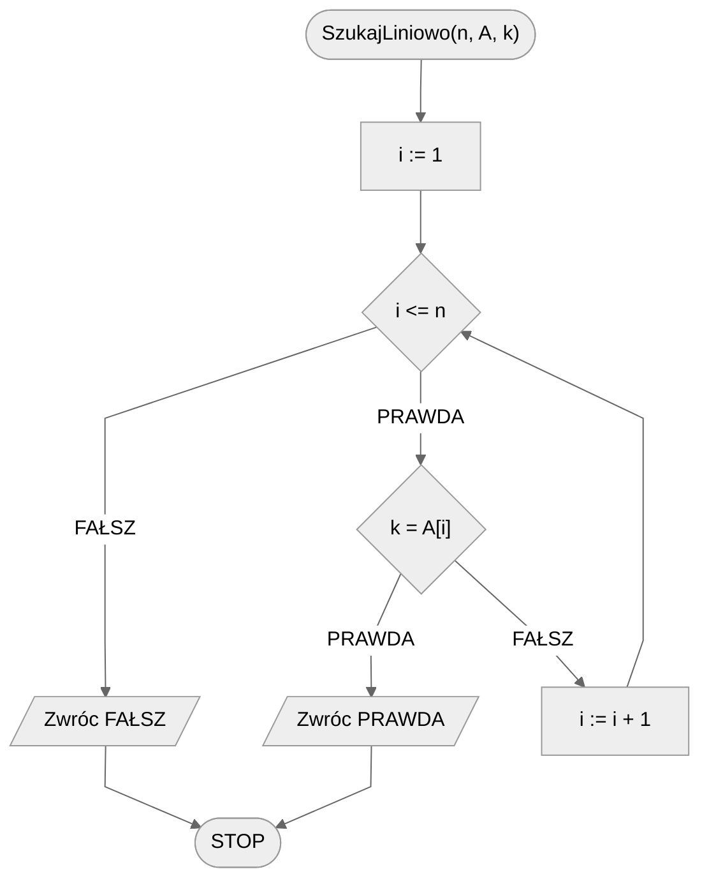
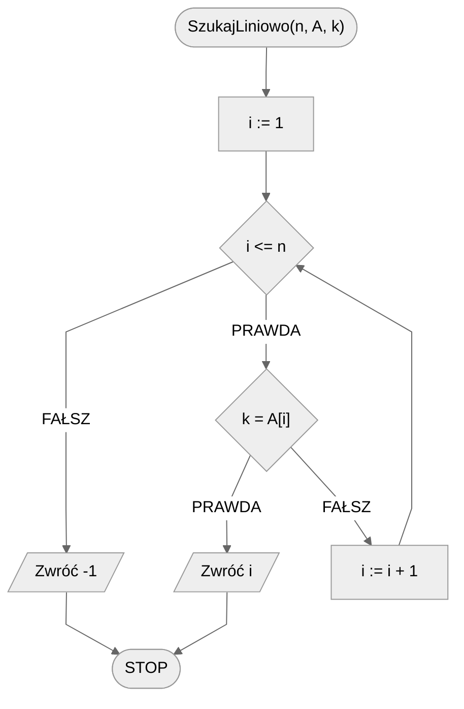
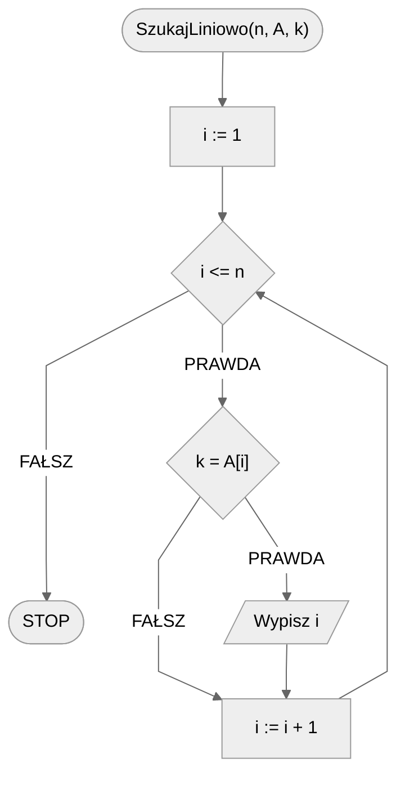

# Wyszukiwanie liniowe

Wyobraźmy sobie półkę z książkami. Książki na półce ułożone są w losowej kolejności, **nie zachowując żadnego sensownego porządku**. Innymi słowy: są nieuporządkowane. Naszym zadaniem jest znaleźć jedną konkretną książkę. Znamy jej tytuł, znamy autora. Jak się do tego zabrać?

Jeżeli nie chcemy poświęcać na to zadanie więcej czasu niż to konieczne i porządkować książek przed przystąpieniem do przeszukiwania, to rozwiązanie jest proste. Musimy sprawdzić każdą kolejną książkę. Możemy to robić w sposób losowy i liczyć na to, że nam się poszczęści, albo lepiej, w sposób uporządkowany. Sprawdzamy więc książki jedna po drugiej, od lewej do prawej (lub od prawej do lewej, jak kto woli) aż natrafimy na tą poszukiwaną. I to jest właśnie **wyszukiwanie liniowe**.

Oczywiście na komputerze nie będziemy przeszukiwać książek (chociaż czasem i to robimy), tylko zajmiemy się przeszukiwaniem tablicy elementów w poszukiwaniu konkretnej, zadanej wartości.

Istnieje oczywiście kilka wersji tego problemu. Zacznijmy od pierwszej z nich, być może najprostszej.

## Istnienie elementu

Jedną z najprostszych wersji problemu wyszukiwania jest sprawdzenie, czy dany element istnieje w zbiorze. Wyobraźmy sobie, że jesteśmy w sklepie i pytamy ekspedienta, czy jest mleko. Ekspedient przegląda dostępne produkty i odpowiada: **tak** lub **nie**. W takim przypadku interesuje nas tylko to, czy mleko w ogóle jest aktualnie w sprzedaży, nie to ile sztuk mleka jest dostępnych, czy też gdzie się ten produkt znajduje.

Naszym celem będzie więc sprawdzenie, czy w tablicy znajduje się poszukiwana wartość. Zacznijmy od tanecznego wyszukiwania, formalnej specyfikacji i kilku przykładów.

### Taneczne wyszukiwanie

[Taneczne wyszukiwanie liniowe](https://www.youtube.com/watch?v=-PuqKbu9K3U)

### Specyfikacja

#### Dane

* $n$ — liczba naturalna, liczba elementów w tablicy
* $A[1..n]$ — tablica n wartości całkowitych
* $k$ — liczba całkowita, szukana wartość

#### Wynik

* Wartość **PRAWDA**, jeżeli wartość $k$ znajduje się w tablicy $A$, lub **FAŁSZ** w przeciwnym przypadku

### Przykład 1

#### Dane

```
n := 5
A := [5, 2, 7, 9, 1]
k := 7 
```

**Wynik**: **PRAWDA**

!!! info
	**Wyjaśnienie**
	
	Poszukiwana wartość w tablicy to $7$. Jak widać, ta wartość znajduje się w tablicy, stąd też wynik to **PRAWDA**.

### Przykład 2

#### Dane

```
n := 5
A := [5, 2, 7, 9, 1]
k := 3
```

**Wynik**: **FAŁSZ**

!!! info
	**Wyjaśnienie**
	
	Poszukujemy wartości $3$, która nie występuje w tablicy. Dlatego wynik to **FAŁSZ**.

### Rozwiązanie

Znamy już problem, teraz pytanie brzmi, jak go rozwiązać? Jaki algorytm skonstruujemy? Wiemy, że chodzi o algorytm **przeszukiwania liniowego**, czyli sprawdzania elementów **jeden po drugim**. I dokładnie to musimy zrobić. Będziemy przeglądać elementy **od pierwszego do ostatniego**. Każdy kolejny element z tablicy będziemy **porównywać z poszukiwaną wartością**. 

Teraz pytanie brzmi: **co zrobimy, gdy natrafimy na poszukiwany element**? Odpowiedź jest stosunkowo prosta. Gdy stwierdzimy, że poszukiwany element znajduje się w tablicy (czyli gdy go znajdziemy), to należy **zwrócić** stosowny wynik, czyli wartość **PRAWDA**. I co robimy dalej? Cóż, w tym momencie możemy już **zakończyć obliczenia**, ponieważ stwierdziliśmy istnienie elementu w tablicy. Tak więc otrzepujemy ręce i kończymy, dobra robota!

Pozostaje nam jeszcze jednak do rozważenia sytuacja, w której poszukiwany element **nie występuje w tablicy**. Co zrobimy w takim przypadku? Oczywiście powinniśmy zwrócić wartość **FAŁSZ**, ale jak stwierdzić, że elementu nie ma w tablicy? Zastanówmy się nad tym chwilę. Gdy znajdziemy element w tablicy to zwracamy wartość **PRAWDA** i kończymy działanie. Gdy nie znajdziemy elementu w tablicy, to **nie zwrócimy** wartości **PRAWDA** i po prostu **sprawdzimy wszystkie elementy tablicy**. 

W takim razie, gdy sprawdzimy już wszystkie elementy tablicy i **nadal będziemy wykonywać kolejne operacje** (ponieważ nie zakończyliśmy wcześniej działania) będzie to oznaczało, że nie znaleźliśmy elementu w tablicy! W takim razie zwracamy **FAŁSZ** i kończymy działanie. 

!!! warning
	 Zwróć uwagę na to, że wartość **FAŁSZ** należy zwrócić **po** sprawdzeniu **wszystkich** elementów tablicy, czyli **po wyjściu z pętli**.

### Pseudokod

```
funkcja SzukajLiniowo(n, A, k)
    1. Od i := 1 do n, wykonuj:
        2. Jeżeli k = A[i], to:
            3. Zwróc PRAWDA
        
    4. Zwróć FAŁSZ
```

### Schemat blokowy



### Złożoność 

Głównym elementem algorytmu jest pętla przechodząca po kolei przez wszystkie wartości w tablicy. Ta pętla wykonuje dokładnie $n$ powtórzeń. Stąd też otrzymujemy złożoność liniową.

$O(n)$ — liniowa

## Pozycja elementu

Czasami nie wystarczy nam informacja, że element _gdzieś_ się znajduje. Czasem musimy dokładnie wiedzieć, w którym miejscu jest. Innymi słowy, chcemy poznać położenie, czy też indeks w tablicy, pod którym znajduje się poszukiwana wartość (jeżeli oczywiście w ogóle znajduje się w tablicy). Zacznijmy od formalnej specyfikacji i kilku przykładów.

!!! warning
	 Szukana wartość może występować w tablicy wielokrotnie. Nas jednak na początek interesuje jej **dowolne** położenie. 

### Specyfikacja

#### Dane

* $n$ — liczba naturalna, liczba elementów w tablicy
* $A[1..n]$ — tablica n wartości całkowitych
* $k$ — liczba całkowita, szukana wartość

#### Wynik

* Indeks dowolnego wystąpienia wartości $k$ w tablicy $A$, lub $-1$ jeżeli tej wartości nie ma w tablicy

### Przykład 1

#### Dane

```
n := 5
A := [5, 2, 7, 9, 1]
k := 7 
```

**Wynik**: $3$ 

!!! info
	**Wyjaśnienie**
	
	Poszukiwana wartość w tablicy to $7$. Jak widać, ta wartość znajduje się na trzecim miejscu w tablicy, stąd też wynik wynosi $3$.

### Przykład 2

#### Dane

```
n := 5
A := [5, 2, 7, 9, 1]
k := 3
```

**Wynik**: $-1$

!!! info
	**Wyjaśnienie**
	
	Poszukujemy wartości $3$, która nie występuje w tablicy. Dlatego wynik to $-1$.

### Rozwiązanie

Do skonstruowania rozwiązania tego problemu skorzystamy z poprzedniego rozwiązania. Zastanówmy się, jakie są różnice pomiędzy tymi dwoma problemami i co musimy zmienić.

Różnicę tak naprawdę stanowią jedynie wartości, jakie mamy zwrócić w wyniku. Poprzednio zwracaliśmy **PRAWDA**, gdy element istniał w tablicy. Teraz mamy zwrócić jego **indeks**. Oznacza to, że musimy zmienić instrukcję, w której zwracamy wynik **PRAWDA** (numer 3). Powinniśmy w tym miejscu zwrócić indeks elementu, jednak skąd wziąć tę wartość? Przyjrzyjmy się poprzedzającej instrukcji warunkowej. W niej sprawdzamy, czy szukana wartość występuje pod **aktualnie sprawdzanym indeksem** w tablicy. A jaki to jest indeks? Ten indeks określany jest przez zmienną, która stanowi **licznik naszej pętli**, czyli przez zmienną $i$. W takim razie zamiast **PRAWDA** zwracamy wartość zmiennej $i$. Gotowe!

Teraz skupmy się na drugim możliwym wyniku. Przedtem zwracaliśmy **FAŁSZ**. Co teraz powinniśmy zwrócić, gdy element nie występuje w tablicy? Wystarczy spojrzeć na specyfikację. Zastępujemy **FAŁSZ** wartością $-1$ i kończymy działanie.

### Pseudokod

```
funkcja SzukajLiniowo(n, A, k)
    1. Od i := 1 do n, wykonuj:
        2. Jeżeli k = A[i], to:
            3. Zwróć i
        
    4. Zwróć -1
```

### Schemat blokowy



### Złożoność 

$O(n)$ — liniowa

## Wszystkie pozycje elementu

Wiemy już jak sprawdzić, czy wartość występuje w tablicy, a także jak ją w tej tablicy namierzyć. Co jednak w przypadku, gdy chcemy poznać **wszystkie** wystąpienia poszukiwanego elementu w tablicy? Teraz zajmiemy się takim właśnie problemem.

### Specyfikacja

#### Dane

* $n$ — liczba naturalna, liczba elementów w tablicy
* $A[1..n]$ — tablica n wartości całkowitych
* $k$ — liczba całkowita, szukana wartość

#### Wynik

* Lista wszystkich indeksów, pod którymi znajduje się wartość $k$ w tablicy $A$

### Przykład 1

#### Dane

```
n := 5
A := [7, 2, 7, 9, 7]
k := 7 
```

**Wynik**: $[1, 3, 5]$ 

!!! info
	**Wyjaśnienie**
	
	Poszukiwana wartość w tablicy to $7$. Jak widać, ta wartość znajduje się na pierwszym, trzecim oraz ostatnim (piątym) miejscu w tablicy.

### Przykład 2

#### Dane:

```
n := 5
A := [7, 2, 7, 9, 7]
k := 3 
```

**Wynik**: $[\ ]$ 

!!! info
	**Wyjaśnienie**
	
	Poszukiwana wartość w tablicy to $3$. Jak widać, ta wartość nie występuje w tablicy, stąd też wynik jest pusty, ponieważ lista indeksów jest pusta.

### Rozwiązanie

W ogólności zwrócenie listy, czy też tablicy jako wynik działania bywa problematyczne, w zależności od języka programowania. Dlatego skupimy się na czymś podobnym, tzn. wypiszemy wszystkie wyniki na ekranie.

Zastanówmy się, jak zmodyfikować poprzednie rozwiązanie. Jakie są różnice pomiędzy tą wersją problemu, a poprzednią, w której jako wynik zwracaliśmy indeks tylko jednego, pierwszego wystąpienia wartości w tablicy. 

Po pierwsze, teraz chcemy wypisać **wszystkie** indeksy, pod którymi pojawia się szukana wartość. W takim razie **nie możemy kończyć działania po znalezieniu pierwszego wystąpienia**, musimy iść dalej. Mówiąc dokładniej, musimy przejrzeć **całą** tablicę. Dokonajmy więc dwóch zmian w instrukcji 3: zamiast _zwróć_ zrobimy _wypisz_ i usuniemy polecenie _zakończ_.

Potrzebujemy dokonać jeszcze jednej zmiany. Zauważmy, że teraz nie musimy się zastanawiać nad tym, co zrobić w przypadku, gdy poszukiwany element nie występuje w tablicy. W takim przypadku po prostu nic nie wypiszemy na ekran. Dlatego usuwamy ostatnią instrukcję (numer 4), w której zwracamy wynik -1.

### Pseudokod

```
procedura SzukajLiniowo(n, A, k):
    1. Od i := 1 do n, wykonuj:
        2. Jeżeli k = A[i], to:
            3. Wypisz i
```

### Schemat blokowy



### Złożoność

$O(n)$ — liniowa

## Implementacje — główne

### Pascal


[linear-search.md](../../programming/pascal/algorithms/searching/linear-search.md)


### C++


[linear-search.md](../../programming/c++/algorithms/searching/linear-search.md)


### Python


[linear-search.md](../../programming/python/algorithms/searching/linear-search.md)


### Blockly


[linear-search.md](../../programming/blockly/algorithms/searching/linear-search.md)


## Implementacje — pozostałe

### C


[linear-search.md](../../programming/c/algorithms/searching/linear-search.md)


### Dart


[linear-search.md](../../programming/dart/algorithms/searching/linear-search.md)


### Elixir


[linear-search.md](../../programming/elixir/algorithms/searching/linear-search.md)


### Go


[linear-search.md](../../programming/go/algorithms/searching/linear-search.md)


### Haskell


[linear-search.md](../../programming/haskell/algorithms/searching/linear-search.md)


### JavaScript


[linear-search.md](../../programming/javascript/algorithms/searching/linear-search.md)


### Julia


[linear-search.md](../../programming/julia/algorithms/searching/linear-search.md)


### Kotlin


[linear-search.md](../../programming/kotlin/algorithms/searching/linear-search.md)


### Lua


[linear-search.md](../../programming/lua/algorithms/searching/linear-search.md)


### Rust


[linear-search.md](../../programming/rust/algorithms/searching/linear-search.md)


### Scheme


[linear-search.md](../../programming/scheme/algorithms/searching/linear-search.md)


### Swift


[linear-search.md](../../programming/swift/algorithms/searching/linear-search.md)


### TypeScript


[linear-search.md](../../programming/typescript/algorithms/searching/linear-search.md)


### Visual Basic


[linear-search.md](../../programming/visual-basic/algorithms/searching/linear-search.md)
