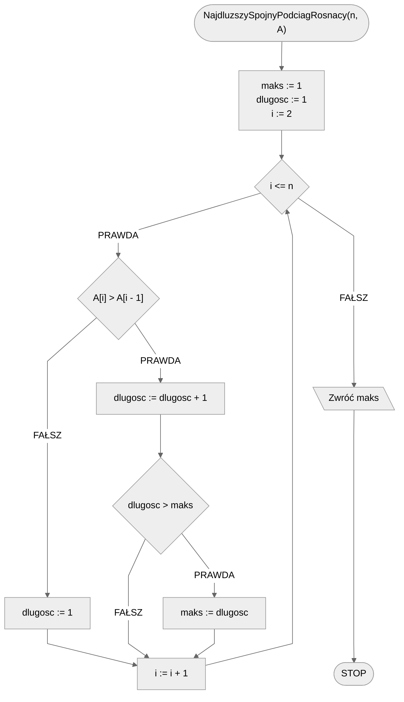

# Najdłuższy spójny podciąg rosnący

Spójny podciąg danego ciągu to taki, który składa się z elementów występujących **jeden obok drugiego**. To tak, jakbyśmy wzięli świąteczny łańcuch i wycieli jego kawałek. Ten wycięty, spójny kawałek łańcucha będzie właśnie **spójnym podciągiem**, czy też, w tym przypadku, **spójnym podłańcuchem**.

Spójny podciąg rosnący to taki spójny podciąg, w którym każdy kolejny element jest **większy od poprzedniego**.

Problem spójnego podciągu rosnącego rozważymy na przykładzie ciągu, czy też tablicy liczb całkowitych. Zacznijmy od formalnej specyfikacji problemu i prostego przykładu.

## Specyfikacja

### Dane

* $n$ - liczba naturalna, liczba elementów tablicy
* $tab[1..n]$ - tablica zawierająca $n$ liczb całkowitych

### Wynik

* Długość najdłuższego spójnego podciągu rosnącego w tablicy $tab$ 

## Przykład

### Dane

```
n := 10
tab := [4, 9, 7, 2, 4, 7, 9, 3, 8, 6]
```

### Wynik

$4$ 

!!! info
	**Wyjaśnienie**
	
	W podanej tablicy mamy kilka spójnych podciągów rosnących. Wypiszmy wszystkie **pełne** spójne podciągi rosnące (tzn. takie, których już nie można powiększyć):
	
	* $4, 9$
	* $7$
	* $2, 4, 7, 9$
	* $3, 8$
	* $6$
	
	Jak widać najdłuższy z nich ma długość równą $4$ i jest to podciąg: $2, 4, 7, 9$.

## Rozwiązanie

Zastanówmy się na początku, jak podeszlibyśmy do tego problemu na papierze. Mamy dany pewien ciąg liczb i chcemy odnaleźć najdłuższy spójny podciąg rosnący. To, co możemy zrobić, to wypisać wszystkie pełne spójne podciągi rosnące. Jak to zrobić? Pomysł jest prosty. Najpierw zapisujemy sobie pierwszą wartość z ciągu. Następnie idziemy od lewej do prawej, liczba po liczbie, zaczynając od drugiej w kolejności. Porównujemy ją z ostatnią zapisaną. Jeżeli jest większa, to dopisujemy ją obok (dopisując do podciągu). Jeżeli jest mniejsza lub równa, to zapisujemy ją poniżej (rozpoczynając nowy podciąg). Po wypisaniu wszystkich podciągów pozostanie nam znalezienie najdłuższego, policzenie jego długości i mamy wynik. Zadanie rozwiązane!

Zauważmy jednak, że nie musimy wcale wypisywać tych podciągów, ani nawet ich znać. Jako rozwiązanie mamy podać jedynie długość najdłuższego spójnego podciągu rosnącego. W takim razie wystarczy, że zapamiętamy długość obecnie sprawdzanego podciągu i długość dotychczas znalezionego najdłuższego podciągu. Postępować będziemy podobnie, jak opisaliśmy wyżej. Zaczynamy od zapamiętania obecnej długości, której wartość wynosi $1$, ponieważ wliczamy na razie tylko pierwszy element tablicy do naszego podciągu. Zapamiętujemy także długość najdłuższego dotąd znalezionego podciągu, która także wynosi $1$, ponieważ tylko taką długość do tej pory mamy. Teraz przechodzimy po kolejnych elementach tablicy, zaczynając od drugiego elementu. Porównujemy obecny element tablicy z poprzednim. Jeżeli jest od niego większy, to znaczy że dodajemy go do naszego podciągu rosnącego, więc zwiększamy pamiętaną długość obecnego ciągu o jeden. Porównujemy także obecną długość z dotychczasową maksymalną długością i, jeżeli nasza obecna jest większa, to zapamiętujemy ją jako maksymalną długość. Jeżeli jednak nasz obecny element nie jest większy od poprzedniego, to znaczy że musimy zacząć kolejny podciąg rosnący, więc zmieniamy długość obecnego podciągu na jeden. Na koniec, po przejściu przez wszystkie elementy tablicy, wystarczy zwrócić zapamiętaną maksymalną długość.

!!! info
	 Dla lepszego zrozumienia spróbuj wykonać opisaną procedurę na kilku przykładach.

### Pseudokod

```
funkcja NajdluzszySpojnyPodciagRosnacy(n, tab):
    1. maks := 1
    2. dlugosc := 1
    3. Od i := 2 do n, wykonuj:
        4. Jeżeli tab[i] > tab[i - 1], to:
            5. dlugosc := dlugosc + 1
            6. Jeżeli dlugosc > maks, to:
                7. maks := dlugosc
        8. W przeciwnym przypadku:
            9. dlugosc := 1
    10. Zwróć maks
```

#### Opis

Funkcja przyjmuje dwa parametry, zgodnie ze specyfikacją. Na początku zaczynamy od utworzenia dwóch zmiennych pomocniczych: maksymalnej długości dotąd znalezionych podciągów (**krok 1**) oraz długości obecnie sprawdzanego podciągu (**krok 2**). Następnie przechodzimy pętlą przez kolejne indeksy tablicy poczynając od drugiego elementu (**krok 3**). W pętli porównujemy element pod obecnie sprawdzanym indeksem z poprzednim elementem z tablicy (**krok 4**). Jeżeli obecny element jest większy od poprzedniego, to zwiększamy długość obecnie sprawdzanego podciągu o jeden (**krok 5**) oraz porównujemy ją z maksymalną długością dotąd znalezionych podciągów (**krok 6**). Jeżeli obecna długość jest większa od tej maksymalnej, to zapamiętujemy obecną długość jako maksymalną (**krok 7**).

Jeżeli obecny element nie jest większy od poprzedniego (**krok 8**), to resetujemy długość obecnie sprawdzanego podciągu ustawiając jej wartość $1$ (**krok 9**). Na końcu, po wyjściu z pętli, zwracamy jako wynik funkcji maksymalną długość spójnego podciągu rosnącego (**krok 9**).

### Schemat blokowy



### Złożoność

$O(n)$ - liniowa

Mamy jedną pętlę, która przechodzi przez kolejne elementy tablicy, której długość wynosi $n$. W związku z tym mamy złożoność liniową.

## Implementacja

### [C++](../../programming/c++/algorithms/searching/longest-growing-substring.md)

### [Python](../../programming/python/algorithms/searching/longest-growing-substring.md)

### [Kotlin](../../programming/kotlin/algorithms/searching/longest-growing-substring.md)

## Implementacje — pozostałe

### [C](../../programming/c/algorithms/searching/longest-growing-substring.md)

### [Julia](../../programming/julia/algorithms/searching/longest-growing-substring.md)
