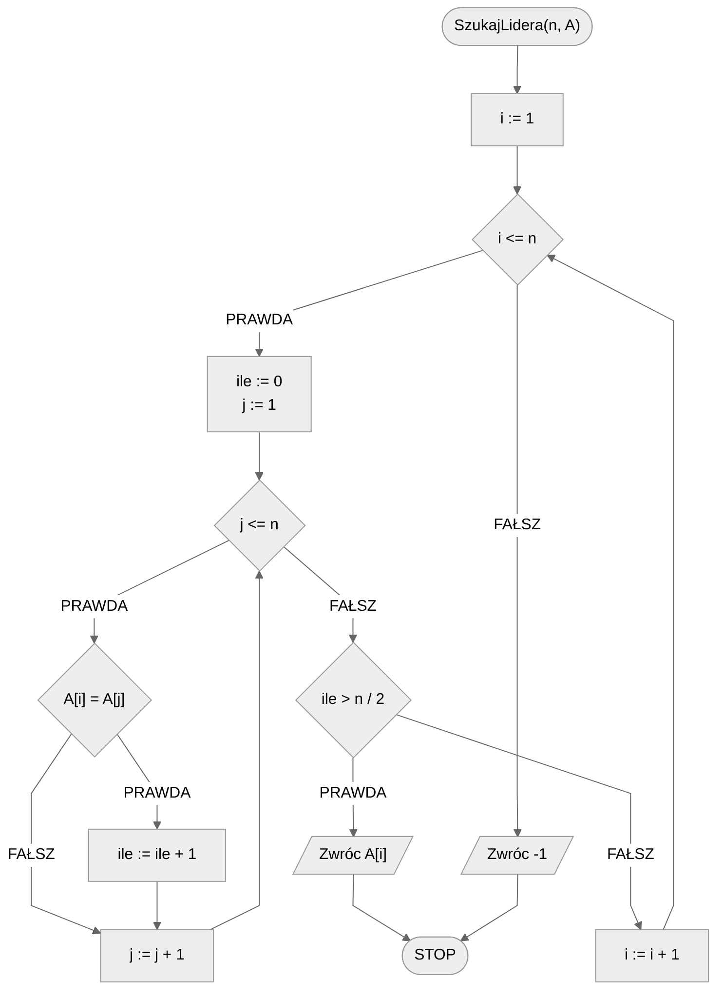
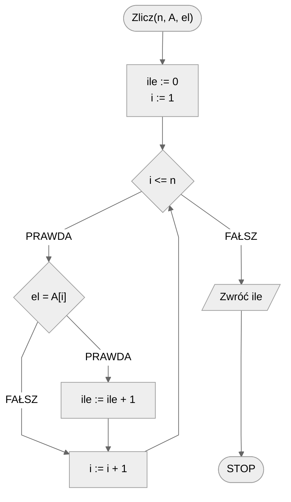
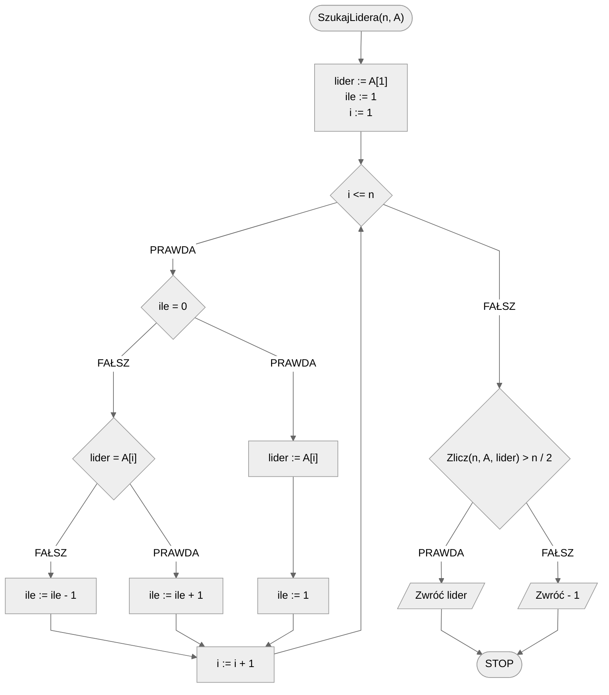

# Znajdowanie lidera w zbiorze

Wyobraźmy sobie spotkanie w lokalnym klubie miłośników książek, gdzie każdy uczestnik ma przedstawić swoją ulubioną powieść. Po prezentacji każdej książki, uczestnicy wrzucają do urny kartkę z tytułem wybranej przez siebie powieści. Po zakończonym spotkaniu chcemy dowiedzieć się, czy jest taka książka, która zdobyła serca większości uczestników.

Lider zbioru to element (w tym przypadku tytuł książki), który pojawia się w zbiorze więcej niż połowę razy. Innymi słowy, jeśli w klubie było $100$ uczestników, lider to taka książka, która została wybrana przez **co najmniej** $51$ osób.

Dlaczego jest to ważne? Znalezienie lidera w zbiorze może pomóc nam zrozumieć dominujące tendencje lub preferencje w danym środowisku. W kontekście klubu książki, dowiedzenie się, która książka jest najbardziej popularna, może sugerować, jakie tematy lub style literackie są obecnie na czasie. W innych kontekstach, takich jak analiza danych czy badania rynku, identyfikacja lidera może dostarczyć cennych informacji o zachowaniach konsumentów, trendach czy dominujących opiniach.

## Specyfikacja

### Dane:

* $n$ — liczba naturalna, liczebność zbioru
* $A[1..n]$ — $n-elementowy$ zbiór liczb całkowitych, indeksowany od jedynki

### Wynik:

* Lider podanego zbioru, lub -1, jeżeli lider nie istnieje.

!!! info
	**Lider zbioru**
	
	**Liderem** zbioru $n-elementowego$ nazywamy element, którego ilość wystąpień w zbiorze jest większa niż $\frac{n}{2}$.
	
	Jeżeli taki element nie istnieje, to zbiór nie ma lidera.

## Przykład 1

### Dane:

```
n := 10
A := [4, 1, 4, 4, 2, 3, 4, 3, 4, 4]
```

**Wynik**: 4

!!! info
	**Wyjaśnienie**
	
	Najczęściej występującym elementem w powyższym zbiorze jest wartość $4$, która występuje dokładnie $6$ razy, co **jest wartością większą** od $n/2=10/2=5$.

## Przykład 2

### Dane:

```
n := 10
A := [4, 1, 4, 4, 2, 3, 4, 3, 4, 1]
```

**Wynik**: $-1$ (brak lidera)

!!! info
	**Wyjaśnienie**
	
	Najczęściej występującym elementem w powyższym zbiorze jest wartość $4$, która występuje dokładnie $5$ razy, co **nie jest** **wartością większą** od $n/2=10/2=5$.

## Rozwiązanie naiwne

W celu stwierdzenia, że dany element jest liderem zbioru, potrzebujemy wiedzieć, ile razy w zbiorze występuje. Gdybyśmy więc policzyli dla każdego elementu zbioru jego liczebność (liczbę wystąpień) w zbiorze, to bylibyśmy w stanie stwierdzić, czy zbiór posiada lidera, a jeśli tak, to jaki element jest tym liderem. Przechodzimy więc przez kolejne elementy zbioru i zliczamy ich wystąpienia. Oczywiście w ten sposób niektóre elementy policzymy wielokrotnie, ale właśnie dlatego jest to naiwne rozwiązanie.

### Pseudokod

```
funkcja SzukajLidera(n, A):
    1. Od i := 1 do n, wykonuj:
        2. ile := 0
        3. Od j := 1 do n, wykonuj:
            4. Jeżeli A[i] = A[j], to:
                5. ile := ile + 1
        6. Jeżeli ile > n/2, to:
            7. Zwróc A[i], zakończ
    8. Zwróc -1
```

**Funkcja SzukajLidera** - ta funkcja próbuje znaleźć lidera w liście (`A`).
- Dla każdego elementu listy (`A`):
  - Zerujemy licznik `ile`.
  - Następnie dla każdego innego elementu w tej samej liście:
    - Jeśli dany element jest taki sam jak nasz wybrany element, dodajemy $1$ do licznika.
  - Po przejrzeniu wszystkich innych elementów sprawdzamy licznik:
    - Jeśli nasz wybrany element pojawia się więcej niż połowę razy w liście (czyli licznik `ile` jest większy niż `n/2`), to znaczy, że znaleźliśmy lidera i zwracamy go.
- Jeśli przeszliśmy przez całą listę i nie znaleźliśmy lidera, zwracamy $-1$, co oznacza, że nie ma lidera w liście.

W skrócie, ten pseudokod sprawdza każdy element listy, czy jest liderem, licząc ile razy pojawia się w całej liście. Jeśli którykolwiek element pojawia się więcej niż połowę razy, jest liderem. Jeśli żaden element nie spełnia tego kryterium, nie ma lidera.

### Schemat blokowy



### Złożoność

$O(n^2)$ — kwadratowa

## Rozwiązanie optymalne

W rozwiązaniu optymalnym należy zacząć od pewnego spostrzeżenia. Jeżeli weźmiemy jakiś zbiór i usuniemy z niego dwa **różne** elementy, to powstały w ten sposób zbiór będzie miał takiego samego lidera. Dzięki tej obserwacji możemy "skreślać" parami różne elementy, aż nie zostanie nam nic do skreślenia. Oczywiście nie będziemy fizycznie wykreślać elementów z tablicy. To "skreślanie" zrealizujemy za pomocą odpowiedniego zliczania i zapamiętywania tzw. *kandydata na lidera*. Zaczniemy od przyjęcia pierwszego elementu z tablicy jako kandydata na lidera. Zliczymy także jego liczbę dotychczasowych "nieskreślonych" powtórzeń. Następnie przejdziemy przez kolejne wartości z tablicy. Jeżeli w którymś momencie nasz licznik się wyzeruje, to przyjmiemy obecny element jako nowego kandydata i licznik ustawimy na jeden. Jeżeli natomiast licznik będzie większy od zera, należy porównać kandydata z obecnym elementem z tablicy. Jeżeli napotkamy wartość równą kandydatowi, to zwiększamy licznik wystąpień kandydata. Jeżeli natomiast napotkamy wartość różną od kandydata, to będziemy symulować "skreślanie" poprzez zmniejszenie licznika wystąpień obecnego kandydata o jeden.

Gdy już przejdziemy przez wszystkie elementy tablicy to na koniec zostaniemy z jakimś kandydatem na lidera. Jeżeli zbiór ma lidera, to będzie nim ten kandydat. Może być jednak tak, że zbiór nie ma lidera. Dlatego pozostaje nam zliczyć liczbę wystąpień naszego kandydata w zbiorze, co realizujemy przechodząc element po elemencie. Na koniec sprawdzamy, czy liczba wystąpień kandydata jest większa od połowy liczebności zbioru.

### Pseudokod

```text
funkcja Zlicz(n, A, el):
	1. ile := 0
	2. Od i := 1 do n, wykonuj:
		3. Jeżeli A[i] = el, to:
			4. ile := ile + 1
	5. Zwróć ile


funkcja SzukajLidera(n, A)
    1. lider := A[1]
    2. ile := 1
    3. Od i := 2 do n, wykonuj:
        4. Jeżeli ile = 0, to:
            5. lider := A[i]
            6. ile := 1
        
        7. w przeciwnym przypadku, jeżeli lider = A[i]:
            8. ile := ile + 1
        
        9. w przeciwnym przypadku:
            10. ile := ile - 1
        
    11. Jeżeli Zlicz(n, A, lider) > n/2, to:
        12. Zwróć lider, zakończ
    
    13. w przeciwnym przypadku:
        14. Zwróć -1, zakończ
```

1. **Funkcja Zlicz** - ta funkcja liczy, ile razy dany element (`el`) pojawia się w liście (`A`).
   * Zaczynamy z licznikiem `ile` na $0$.
   * Przechodzimy przez każdy element listy (`A`).
   * Jeśli element listy jest taki sam jak szukany element (`el`), dodajemy $1$ do licznika.
   * Na końcu zwracamy wartość licznika.

2. **Funkcja SzukajLidera** - ta funkcja szuka lidera w liście (`A`).
   * Zakładamy na początek, że pierwszy element listy to lider.
   * Ustawiamy licznik `ile` na $1$.
   * Przechodzimy przez resztę listy:
     * Jeśli licznik `ile` wynosi $0$, aktualny element staje się nowym liderem, a licznik jest resetowany do $1$.
     * Jeśli aktualny element jest taki sam jak nasz obecny lider, dodajemy $1$ do licznika.
     * W przeciwnym razie odejmujemy $1$ od licznika.
   * Po przejściu przez całą listę sprawdzamy, czy nasz lider występuje więcej niż połowę razy w liście. Używamy do tego funkcji **Zlicz**.
   * Jeśli tak, zwracamy go jako lidera.
   * W przeciwnym razie zwracamy $-1$, co oznacza, że nie ma lidera.

### Schemat blokowy





### Złożoność

$O(n)$ — liniowa

## Implementacja

### C++


[majority.md](../../programming/c++/algorithms/searching/majority.md)


### Python


[majority.md](../../programming/python/algorithms/searching/majority.md)


### Kotlin


[majority.md](../../programming/kotlin/algorithms/searching/majority.md)


## Implementacje — pozostałe

### C


[majority.md](../../programming/c/algorithms/searching/majority.md)


### Julia


[majority.md](../../programming/julia/algorithms/searching/majority.md)


## Powiązane zagadnienia

- Znajdowanie lidera w posortowanej tablicy.
- Znajdowanie lidera w dwuwymiarowej tablicy, gdzie każdy wiersz jest posortowany.
- Znajdowanie wszystkich elementów, które występują w tablicy więcej niż $n/k$ razy, gdzie $n$ to rozmiar tablicy, a $k$ to zadana liczba naturalna, $n\geq k>0$.