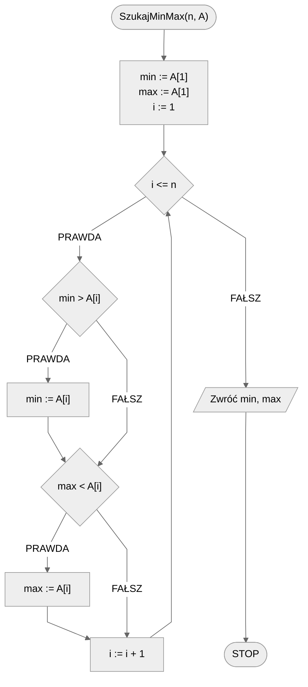
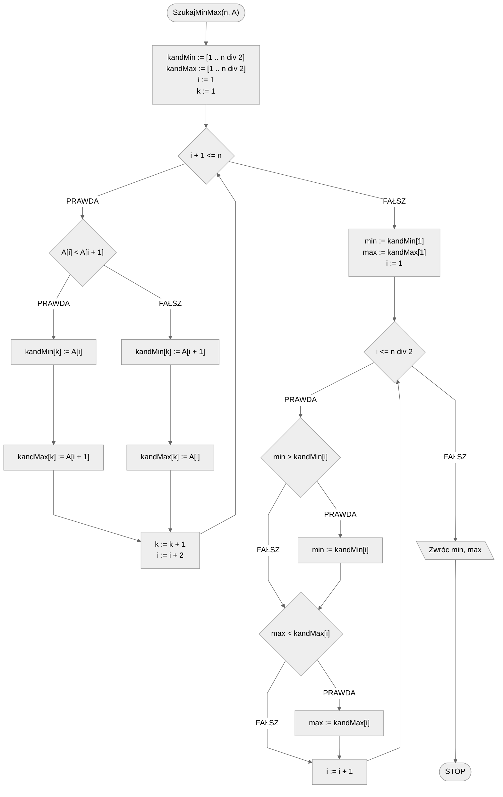

# Jednoczesne wyszukiwanie minimum i maksimum

Zdarza się i tak, że potrzebujemy znaleźć wartość minimalną i maksymalną jednocześnie, najlepiej za jednym razem. Możemy oczywiście osobno wyszukać minimum i maksimum korzystając ze standardowego algorytmu. Być może jednak da się to zrobić lepiej, wydajniej? Na to pytanie postaramy się odpowiedzieć. Zacznijmy od formalnej specyfikacji.

## Specyfikacja

### Dane

* $n$ — liczba naturalna, liczba elementów w tablicy
* $A[1..n]$ — tablica $n$ wartości całkowitych

### Wynik

* Największa oraz najmniejsza wartość z tablicy $A$

## Przykład

### Dane

```
n := 5
A := [6, 3, 1, 9, 2]
```

### Wynik

```
minimum := 1
maksimum := 9
```

## Rozwiązanie naiwne

Zacznijmy od rozwiązania naiwnego. Pomysł jest następujący: zastosujmy standardowy algorytm do znajdowania minimum i maksimum. Na początku jako tymczasowe minimum i maksimum przyjmiemy wartość pierwszego elementu z tablicy. Następnie przejdziemy pętlą przez kolejne elementy. Każdy element będziemy porównywać z dotychczasowymi wartościami minimum i maksimum, dokonując odpowiednich zamian w razie potrzeby.

### Pseudokod

```
funckja SzukajMinMax(n, A):
    1. min := A[1]
    2. max := A[1]
    3. Od i := 2 do n, wykonuj:
        4. Jeżeli min > A[i], to:
            5. min := A[i]
        6. Jeżeli max < A[i], to:
            7. max := A[i]
    8. Zwróć min, max
```

### Schemat blokowy



### Złożoność

$O(2n)$

Mamy jedną pętlę, ale dwa porównania wewnątrz niej. W takim razie dla każdego przebiegu pętli wykonujemy dwa porównania, łącznie wykonujemy ich więc w przybliżeniu $2n$, co w praktyce daje nam złożoność liniową.

## Rozwiązanie optymalne

Podejdźmy do problemu od innej strony. Zastanówmy się, jak możemy przygotować sobie dane, aby ułatwić sobie pracę? Mamy pewien zestaw liczb, wśród których chcemy znaleźć zarówno minimum jak i maksimum. W takim razie podzielmy wstępnie nasze liczby na kandydatów minimum oraz kandydatów maksimum. Zrobimy to przechodząc po kolei po parach sąsiednich liczb z tablicy i porównując je ze sobą. Mniejszą z wartości z pary wrzucimy do kandydatów na minimum, a większą umieścimy w kandydatach na maksimum. W ten sposób uzyskamy dwie tablice, z których każda będzie miała długość równą połowie długości pierwotnej tablicy. Teraz możemy przejść do wyszukiwania minimum i maksimum. Minimum będziemy szukać standardowym algorytmem w tablicy kandydatów na minimum. Podobnie zrobimy z maksimum, szukając go w kandydatach na maksimum.

!!! warning
	**Uwaga**
	
	Dla ułatwienia zakładamy, że długość tablicy (wartość $n$) jest liczbą **parzystą**. Jeżeli tak nie jest, możemy np. powielić ostatni element tablicy, albo rozważyć ten szczególny przypadek w algorytmie.

### Pseudokod

```
funkcja SzukajMinMax(n, A):
    1. kandMin := []
    2. kandMax := []
    3. i := 1
    4. k := 1
    5. Dopóki i + 1 <= n, wykonuj:
        6. Jeżeli A[i] < A[i+1], to:
            7. kandMin[k] := A[i]
            8. kandMax[k] := A[i+1]
        9. w przeciwnym przypadku:
            10. kandMin[k] := A[i+1]
            11. kandMax[k] := A[i]
        12. k := k + 1
        13. i := i + 2
    14. min := kandMin[1]
    15. max := kandMax[1]
    16. Od i := 2 do (n div 2), wykonuj:
        17. Jeżeli min > kandMin[i], to:
            18. min := kandMin[i]
        19. Jeżeli max < kandMax[i], to:
            20. max := kandMax[i]
    21. Zwróc min, max
```

### Schemat blokowy



### Złożoność

$O(3\frac{n}{2})$ 

Najpierw dokonujemy podziału na dwie tablice pomocnicze wykonując $\frac{n}{2}$ operacji. Następnie wyszukujemy minimum i maksimum w odpowiednich tablicach. Każda z nich ma długość $\frac{n}{2}$, więc łącznie na znalezienie minimum i maksimum potrzebujemy wykonać $2\frac{n}{2}=n$ porównań. Wszystko razem daje nam $3\frac{n}{2}$ porównań. W praktyce wciąż mamy złożoność liniową, wykonujemy jednak mniej operacji niż przy algorytmie naiwnym.

## Implementacja

### C++


[min-max-search.md](../../programming/c++/algorithms/searching/min-max-search.md)


### Python


[min-max-search.md](../../programming/python/algorithms/searching/min-max-search.md)


### Kotlin


[min-max-search.md](../../programming/kotlin/algorithms/searching/min-max-search.md)


## Implementacje — pozostałe

### C


[min-max-search.md](../../programming/c/algorithms/searching/min-max-search.md)


### Julia


[min-max-search.md](../../programming/julia/algorithms/searching/min-max-search.md)

