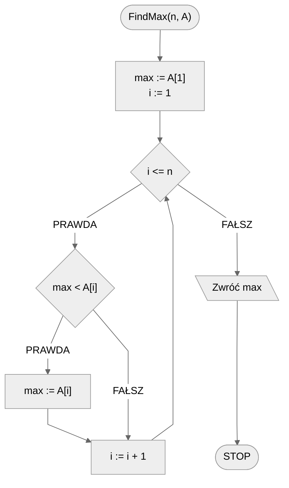
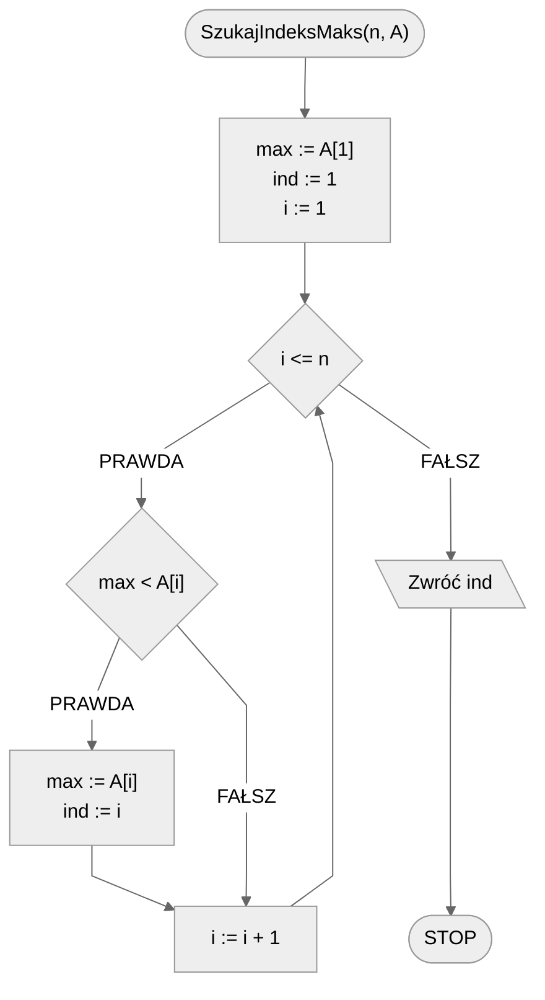

# Wyszukiwanie minimum i maksimum

Wyobraźmy sobie, że odwiedzamy pewien sklep internetowy, np. w poszukiwaniu nowego laptopa. Na początek chcemy sprawdzić, jaki jest najdroższy z dostępnych sprzętów. Co możemy w tym celu zrobić? Możemy oczywiście posortować produkty po cenie. Nie potrzebna nam jednak lista wszystkich produktów, a tylko jeden - ten najdroższy.

W tym temacie zajmiemy się właśnie takim problemem - **znajdowaniem elementu maksymalnego (albo minimalnego) w zadanym zbiorze**.

## Wyszukiwanie wartości maksymalnej w tablicy

Zacznijmy od standardowej wersji problemu.
Jak to zwykle w informatyce, będziemy rozważać pewien uporządkowany zbiór elementów, a dokładnie tablicę liczb całkowitych.
Oczywiście w ogólności nie ma znaczenia, jakie to będą wartości, pod warunkiem, że możemy je ze sobą porównywać i można wśród nich znaleźć wartość największą.

Interesuje nas znalezienie wartości maksymalnej w zadanej tablicy.
Jak zwykle, zaczynamy od bardziej formalnej specyfikacji naszego problemu.

### Specyfikacja

#### Dane

* $n$ - liczba naturalna, liczba elementów w tablicy
* $A[1..n]$ - tablica $n$ wartości całkowitych

#### Wynik

* Największa wartość z tablicy $A$

### Przykład

#### Dane

```
n := 8
A := [6, 5, 3, 1, 8, 7, 2, 4]
```

**Wynik**: $8$

### Animacja

[Wyszukiwanie maksimum](https://blackbat13.github.io/visul2/searching/find_max/#array=%5B6%2C5%2C3%2C1%2C8%2C7%2C2%2C4%5D)

### Rozwiązanie

Zanim przejdziemy do rozwiązywania problemu warto przyjrzeć się dokładnie powyższej animacji.
Pokazuje ona, krok po kroku, metodę, którą zastosujemy.

Idea jest prosta: na początku przyglądamy się **pierwszemu** elementowi z tablicy i stwierdzamy "tak, to może być nasz element maksymalny", więc **zapamiętujemy** jego wartość.
Innymi słowy: wartość pierwszego elementu tablicy zapamiętujemy jako **dotychczasowe** maksimum.

Teraz możemy przejść do sprawdzania kolejnych elementów tablicy, które będziemy przeglądać jeden po drugim, czyli liniowo, podobnie jak w algorytmie wyszukiwania liniowego.
Każdy kolejny element tablicy będziemy porównywać z naszym dotychczasowym maksimum.
Jeżeli znajdziemy element o wartości większej niż nasze dotychczasowe maksimum, to znaczy, że właśnie tę większą wartość należy zapamiętać jako nasze dotychczasowe maksimum.
Poprzednią wartość możemy zapomnieć, jako że interesuje nas tylko jedna wartość: maksymalna.

Na końcu, gdy już sprawdzimy wszystkie elementy tablicy, nasze dotychczasowe maksimum będzie już maksimum z **całej tablicy** i tę właśnie wartość zwrócimy jako wynik naszego algorytmu.

Zapiszmy teraz nasz algorytm w postaci pseudokodu.

### Pseudokod

```
funkcja SzukajMaks(n, A):
    1. max := A[1]
    2. Od i := 2 do n, wykonuj:
        3. Jeżeli max < A[i], to:
            4. max := A[i]

    5. Zwróć maks
```

### Schemat blokowy



### Złożoność

Podobnie jak w przypadku wyszukiwania liniowego przeglądamy elementy jeden po drugim w poszukiwaniu maksimum.
Dlatego i w tym przypadku mamy złożoność liniową.

$O(n)$ - liniowa

## Wyszukiwanie indeksu wartości maksymalnej w tablicy

W niektórych sytuacjach nie wystarczy nam znać wartość maksymalnego elementu, musimy także poznać jego **pozycję** w tablicy.
Zmodyfikujmy więc odpowiednio specyfikację naszego problemu.

### Specyfikacja

#### Dane

* $n$ - liczba naturalna, ilość elementów w tablicy
* $A[1..n]$ - tablica $n$ wartości całkowitych

#### Wynik

* Indeks największej wartości z tablicy $A$ 

### Przykład

#### Dane

```
n := 8
A := [6, 5, 3, 1, 8, 7, 2, 4]
```

**Wynik**: $5$ 

!!! info
	**Wyjaśnienie**
	
	Największa wartość w tablicy to $8$. Wartość ta znajduje się na pozycji piątej.

### Rozwiązanie

Nowy problem jest bardzo zbliżony do poprzedniego, więc aby go rozwiązać, rozszerzymy nasze poprzednie rozwiązanie.
Teraz, poza wartością maksymalnego elementu, potrzebujemy zapamiętać dodatkową informację: indeks elementu maksymalnego.
W tym celu dodajemy nową zmienną, w której zapamiętamy ten indeks. 
Na początku, gdy jako potencjalne maksimum przyjmujemy wartość pierwszego elementu tablicy, musimy także indeks ustawić na wartość $1$, czyli pozycję naszego dotychczasowego maksimum.

Jest jeszcze jedno miejsce, w którym powinniśmy pamiętać o zmianie zapamiętanego indeksu.
Za każdym razem, gdy znajdziemy większą wartość i zaktualizujemy nasze dotychczasowe maksimum, aktualizujemy także indeks tego maksimum.

Na końcu, po sprawdzeniu wszystkich elementów tablicy, wystarczy zwrócić jako wynik zapamiętany indeks.

Zapiszmy teraz nasz algorytm w postaci pseudokodu.

### Pseudokod

```
funkcja SzukajIndeksMaks(n, A):
    1. max := A[1]
    2. ind := 1
    3. Od i := 2 do n, wykonuj:
        4. Jeżeli max < A[i], to:
            5. max := A[i]
            6. ind := i
    
    7. Zwróć ind
```

### Schemat blokowy



### Złożoność

Dodanie nowej zmiennej, w której pamiętamy indeks wyszukiwanego elementu, nie wpływa na złożoność naszego rozwiązania. Struktura algorytmu pozostaje niezmieniona, więc złożoność cały czas jest liniowa.

$O(n)$ - liniowa

## Wyszukiwanie elementu minimalnego w tablicy

W przypadku poszukiwania elementu minimalnego, postępujemy praktycznie identycznie jak przy poszukiwaniu elementu maksymalnego. W zasadzie wystarczy zmienić **znak porównania**: z $<$ na $>$. Zaprojektowanie rozwiązania zostawiamy jako samodzielne ćwiczenie dla zainteresowanych.

## Implementacja

### [:simple-cplusplus: C++](../../programming/c++/algorithms/searching/min-or-max.md){ .md-button }

### [:simple-python: Python](../../programming/python/algorithms/searching/min-or-max.md){ .md-button }

### [Blockly](../../programming/blockly/algorithms/searching/min-or-max.md){ .md-button }

### [:simple-kotlin: Kotlin](../../programming/kotlin/algorithms/searching/min-or-max.md){ .md-button }

## Implementacje — pozostałe

### [:simple-c:](../../programming/c/algorithms/searching/min-or-max.md){ .md-button }

### [:simple-haskell: Haskell](../../programming/haskell/algorithms/searching/min-or-max.md){ .md-button }

### [:simple-julia: Julia](../../programming/julia/algorithms/searching/min-or-max.md){ .md-button }
