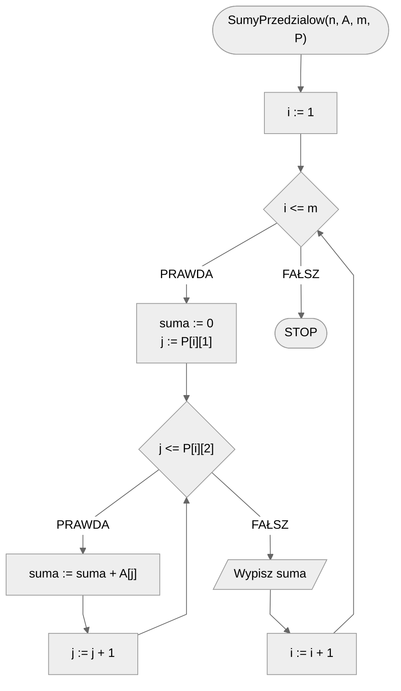
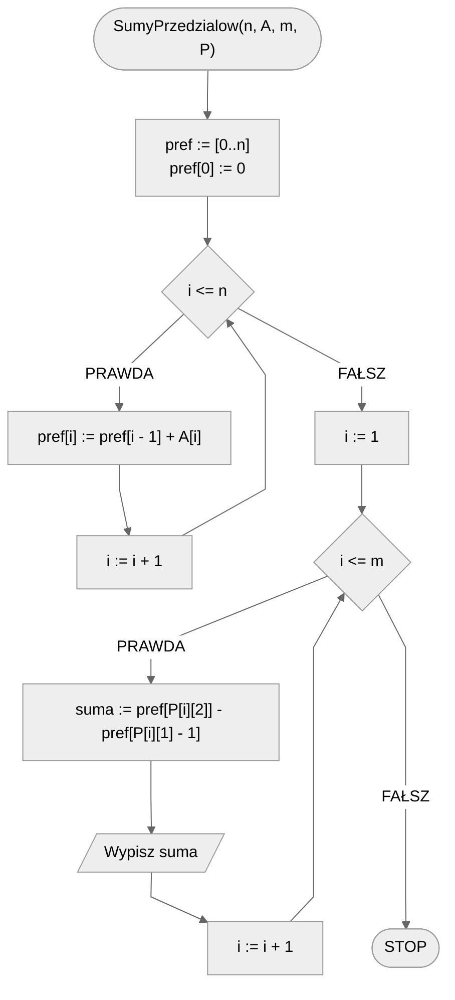

# Sumy prefiksowe

Czasami bywa tak, że musimy policzyć **sumę pewnego spójnego fragmentu tablicy**, a nawet kilku. Jak to zrobić w sposób efektywny? Jeżeli **zawartość tablicy nie będzie ulegała zmianom**, to z pomocą przyjdą nam **sumy prefiksowe**.

## Specyfikacja

### Dane

* $n$ — liczba naturalna, liczba elementów tablicy.
* $A[1..n]$ — $n-elementowa$ tablica liczb całkowitych, indeksowana od jedynki.
* $m$ — liczba naturalna, liczba zapytań.
* $P[1..m][1..2]$ - dwuwymiarowa tablica liczb naturalnych z zakresu $[1..n]$, zapytań o sumy przedziałów, gdzie $P[i][1]$ to początek $i$-tego przedziału, a $P[i][2]$ to jego koniec.

### Wynik

* $m$ liczb naturalnych, dla każdego zapytania $i$ suma wartości pod indeksami od $P[i][1]$ do $P[i][2]$, tzn. $A[P[i][1]] + A[P[i][1] + 1] + A[P[i][1] + 2] + ... + A[P[i][2]]$.

## Przykład

### Dane

```
n := 10
A[1..10] := [4, 8, 2, 6, 1, 0, 8, 4, 2, 3]
m := 3
P[1..3][1..2] := [[3, 5], [6, 7], [1, 1]]
```

### Wynik

```
9
8
4
```

!!! info
	**Wyjaśnienie**
	
	* $sum_1 = A[3] + A[4] + A[5] = 2 + 6 + 1 = 9$
	* $sum_2 = A[6] + A[7] = 0 + 8 = 8$
	* $sum_3 = A[1] = 4$

## Rozwiązanie naiwne

Rozwiązanie naiwne jest proste. Wystarczy dla każdego zapytania policzyć sumę przedziału przechodząc kolejno po elementach tablicy pod indeksami znajdującymi się w przedziale. Możemy to zrobić za pomocą zwykłej pętli iteracyjnej, dodając kolejne elementy tablicy do liczonej sumy.

### Pseudokod

```
funkcja SumyPrzedzialow(n, A, m, P):
    1. Od i := 1 do m, wykonuj:
        2. suma := 0
        3. Od j := P[i][1] do P[i][2], wykonuj:
            4. suma := suma + A[j]
        5. Wypisz suma
```

### Schemat blokowy



## Rozwiązanie optymalne

Innym sposobem jest przygotowanie sobie tablicy pomocniczej, która posłuży nam do szybkiego obliczania sumy zadanego przedziału. Pytanie brzmi, jak taka tablica powinna wyglądać? Najpierw przyjmijmy prostszą wersję problemu: będziemy podawać sumy jedynie dla przedziałów, które zaczynają się od początku tablicy. Przy takim założeniu, możemy łatwo przygotować tablicę pomocniczą. Wystarczy, że będziemy sumować kolejne elementy od lewej do prawej. W ten sposób, na i-tej pozycji naszej pomocniczej tablicy będzie znajdowała się suma elementów od pierwszego do i-tego.

Czy możemy jednak skorzystać z takiej tablicy, by obliczyć sumę dowolnego przedziału? Okazuje się, że tak. To jednak pozostawmy jako ćwiczenie.

### Pseudokod

```
funkcja SumyPrzedzialow(n, A, m, P):
    1. pref := [0..n]
    2. pref[0] := 0
    3. Od i := 1 do n, wykonuj:
        4. pref[i] := pref[i - 1] + A[i]
    5. Od i := 1 do m, wykonuj:
        6. suma := pref[P[i][2]] - pref[P[i][1] - 1]
        7. Wypisz suma
```

### Schemat blokowy



## Implementacja

### [C++](../../programming/c++/algorithms/searching/prefix-sum.md)

### [Python](../../programming/python/algorithms/searching/prefix-sum.md)

## Implementacje — pozostałe

### [C](../../programming/c/algorithms/searching/prefix-sum.md)
