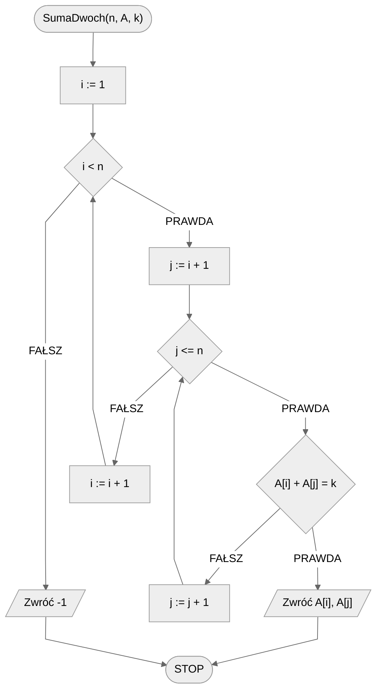
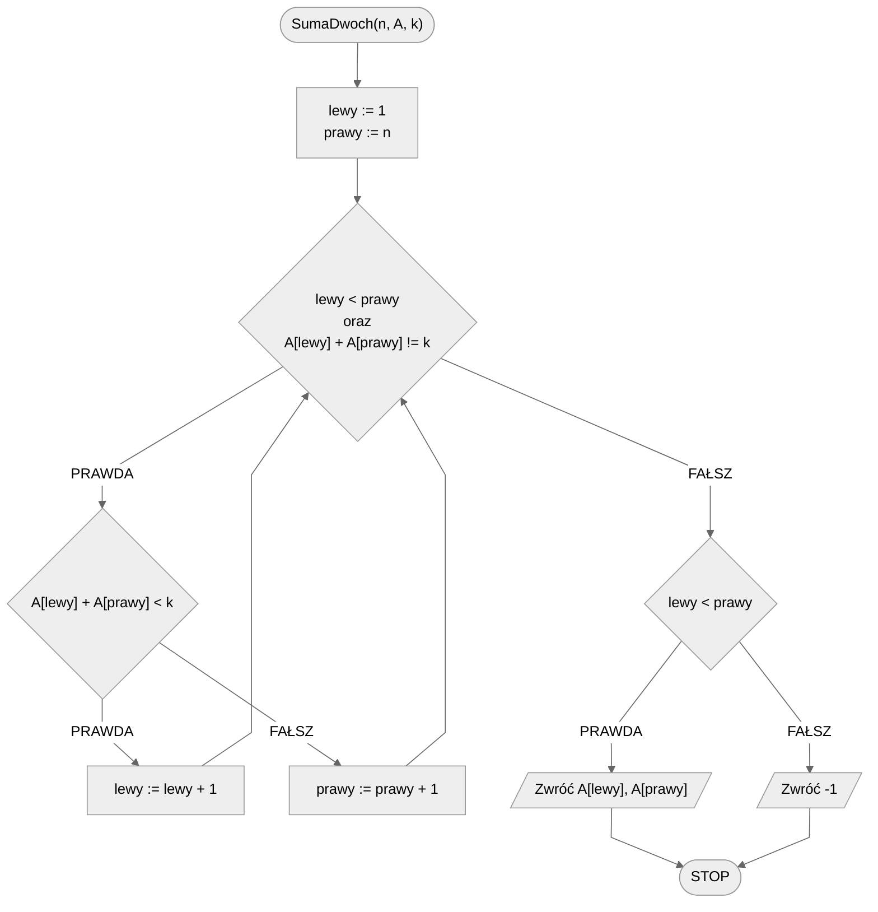

# Suma dwóch liczb

Mamy pewien posortowany zbiór różnych liczb. W tym zbiorze mamy odnaleźć dwie liczby, które po dodaniu do siebie dadzą pożądaną sumę. Oczywiście, takie liczby wcale nie muszą w tym zbiorze się znajdować.

Problem może wydawać się dość abstrakcyjny i słabo związany z rzeczywistością. Niemniej jest to świetny problem do zaprezentowania, jak pomocne czasem jest pracowanie z danymi posortowanymi i jak duży wpływ może mieć na złożoność obliczeniową rozwiązania.

Zacznijmy od formalnej specyfikacji problemu.

## Specyfikacja

### Dane

* $n$ - liczba naturalna, liczebność zbioru
* $A[1..n]$ - $n-elementowa$ tablica różnych liczb całkowitych, posortowana rosnąco, indeksowana od jedynki
* $k$ - liczba naturalna, szukana suma

### Wynik

* $a, b$ - dwie różne wartości ze zbioru $A$ takie, że ich suma wynosi $k$ ($a+b=k$), lub $-1$, jeżeli takich liczb nie ma w zbiorze (jeżeli takich par jest wiele, to dowolna z nich)

## Przykład

### Dane

```
n := 10
A[1..10] := [1, 2, 4, 6, 8, 9, 10, 12, 13, 15]
k := 18
```

**Wynik**: $6,\ 12$(lub $8,\ 10$)

## Rozwiązanie naiwne

Zacznijmy od pierwszego rozwiązania, jakie nam przychodzi do głowy. Naszym celem jest znalezienie **pary** liczb, które dają pożądaną sumę. W takim razie **sprawdźmy wszystkie pary** i zobaczmy, czy znajdziemy to czego szukamy.

Przechodzimy dwiema zagnieżdżonymi pętlami przez tablicę. Zewnętrzna pętla będzie wskazywać nam indeks pierwszego elementu z pary, a wewnętrzna pętla będzie wskazywać drugiego elementu z pary. W celu uniknięcia powtórzeń warto zadbać o odpowiednią konstrukcję wewnętrznej pętli. Zasada jest bardzo prosta: wewnętrzna pętla zaczyna poszukiwania zawsze od **kolejnego** elementu względem zewnętrznej pętli.

Spróbujmy przelać nasze rozumowania na pseudokod.

### Pseudokod

```
funkcja SumaDwoch(n, A, k):
    1. Dla i := 1 do n - 1, wykonuj:
        2. Dla j := i + 1 do n, wykonuj:
            3. Jeżeli A[i] + A[j] = k, to:
                4. Zwróć A[i], A[j]
    5. Zwróć -1
```

### Schemat blokowy



### Złożoność

$O(n^2)$ - kwadratowa

## Rozwiązanie optymalne

W poprzednim rozwiązaniu całkowicie pominęliśmy fakt, że nasza tablica jest posortowana. Zastanówmy się więc, jak możemy skorzystać z tego, że liczby są ułożone od najmniejszej do największej.

Spróbujmy do tego podejść w następujący sposób. Weźmy pierwszy i ostatni element z tablicy. Wiemy, że są to odpowiednio najmniejszy i największy element w tablicy. Obliczmy ich sumę. Co możemy stwierdzić na jej podstawie? Porównajmy ją z poszukiwaną wartością. Mamy trzy opcje:

- suma jest równa poszukiwanej wartości: klepiemy się po plecach i zwracamy wynik, praca zakończona,
- suma jest mniejsza od poszukiwanej wartości: musimy szukać większej sumy, w tym celu bierzemy kolejny element z lewej strony tablicy (czyli większy),
- suma jest większa od poszukiwanej wartości: musimy szukać mniejszej sumy, w tym celu bierzemy kolejny element z prawej strony tablicy (czyli mniejszy).

I tak postępujemy w pętli, aż znajdziemy (albo i nie) poszukiwaną sumę.

Spróbujmy to zapisać w pseudokodzie.

### Pseudokod

```
funkcja SumaDwoch(n, A, k):
    1. lewy := 1
    2. prawy := n
    3. Dopóki lewy < prawy oraz A[lewy] + A[prawy] != k, wykonuj:
        4. Jeżeli A[lewy] + A[prawy] < k, to:
            5. lewy := lewy + 1
        6. w przeciwnym przypadku:
            7. prawy := prawy + 1
    8. Jeżeli lewy < prawy, to:
        9. Zwróć A[lewy], A[prawy]
    10. w przeciwnym przypadku:
        11. Zwróć -1
```

### Schemat blokowy



### Złożoność

$O(n)$ - liniowa

## Implementacja

### [:simple-cplusplus: C++](../../programming/c++/algorithms/searching/sum-of-two.md){ .md-button }

### [:simple-python: Python](../../programming/python/algorithms/searching/sum-of-two.md){ .md-button }

### [:simple-kotlin: Kotlin](../../programming/kotlin/algorithms/searching/sum-of-two.md){ .md-button }

## Implementacje — pozostałe

### [:simple-c:](../../programming/c/algorithms/searching/sum-of-two.md){ .md-button }

### [:simple-haskell: Haskell](../../programming/haskell/algorithms/searching/sum-of-two.md){ .md-button }
