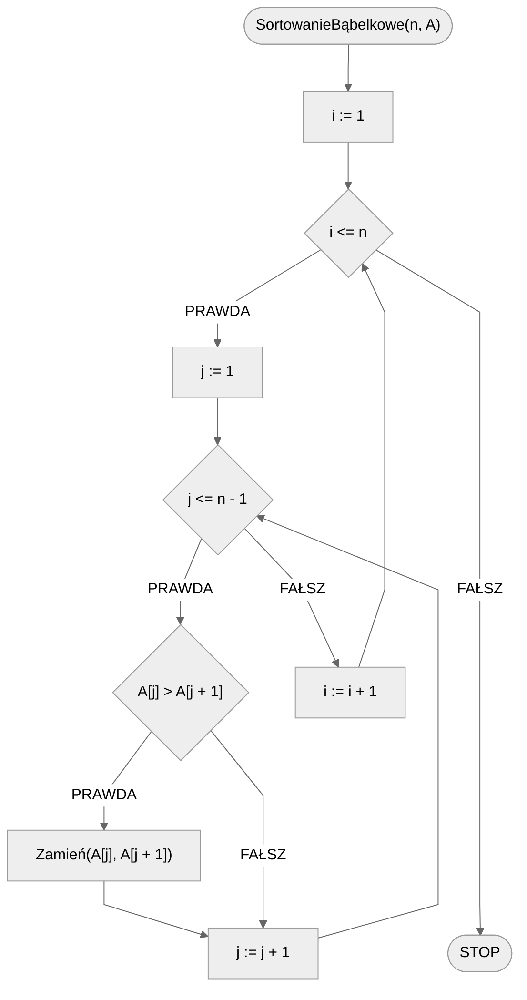
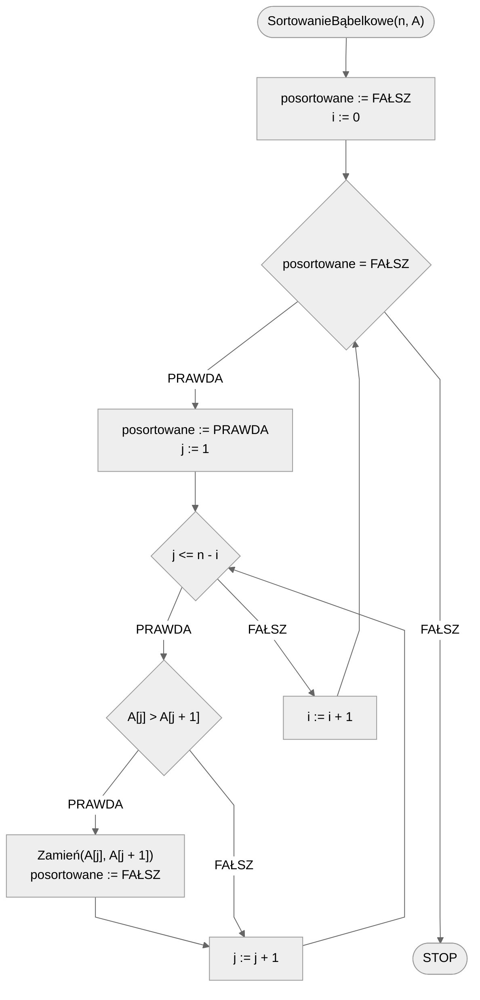

# Sortowanie bąbelkowe

Sortowanie bąbelkowe jest jednym z najprostszych w implementacji algorytmów sortowania. Sama metoda opiera się na prostej intuicji. Wyobraźmy sobie bąbelki powietrza, które przemieszczają się pod wodą. Cięższe bąbelki spadają na dół, a lżejsze lecą do góry. Podobnie możemy postąpić z liczbami: mniejsze (lżejsze) liczby przemieszczamy do góry, a większe (cięższe) przemieszczamy na dół. Oczywiście zamiast góra/dół możemy także mówić lewo/prawo co bardziej odpowiada liście liczb zapisanej w programie.

Poniżej znajdziesz animacje przedstawiające ideę omawianego algorytmu.

## Animacja 1


## Animacja 2

[https://blackbat13.github.io/visul2/sorting/bubble_sort/#array=%5B6%2C5%2C3%2C1%2C8%2C7%2C2%2C4%5D](https://blackbat13.github.io/visul2/sorting/bubble_sort/#array=%5B6%2C5%2C3%2C1%2C8%2C7%2C2%2C4%5D){ .md-button }

## Taneczne sortowanie

[:material-video: Taneczne sortowanie](https://www.youtube.com/watch?v=lyZQPjUT5B4){ .md-button }

## Rozwiązanie 1: naiwne

Istnieje kilka sposobów na implementację algorytmu sortowania bąbelkowego: mniej i bardziej wydajne. Zaczniemy od najprostszej, ale także najmniej efektywnej wersji algorytmu. Na początek zauważmy, co jest główną operacją w tej metodzie: porównywanie sąsiednich elementów i ewentualna zamiana ich miejscami. Tak, w tym sortowaniu wykorzystujemy tak naprawdę tylko jedną operację, powtarzaną wielokrotnie. Będziemy porównywać dwa sąsiednie elementy, by sprawdzić, czy są ułożone we właściwej kolejności. Gdy napotkamy wartości, które są w niewłaściwej kolejności, to zamieniamy je miejscami. I tak sprawdzamy **wszystkie** pary sąsiednich elementów, tzn. najpierw porównujemy dwa pierwsze, potem drugi z trzecim, trzeci z czwartym itd. W ten sposób przechodzimy od początku do końca naszej tablicy elementów. Oczywiście w trakcie naszego porównywania elementy mogą zmieniać swoje miejsce.

Zastanówmy się teraz, ile razy takie przejście przez całą tablicę, porównywanie sąsiednich elementów i ich ewentualną zamianę miejscami, musimy powtórzyć. Spróbujmy ponownie wyobrazić sobie bąbelki opadające na dno. Po pierwszym takim przejściu najcięższy bąbelek (czyli największa liczba) opadnie na samo dno (czyli przemieści się na koniec tablicy). Dlaczego? Skoro jest to największa wartość, to znaczy, że zawsze w porównaniu z innymi elementami tablicy będzie od nich większa. A skoro tak, to znaczy, że powinna znaleźć się po prawej stronie. Będziemy więc przemieszczać taki element w prawo przy kolejnych porównaniach i zamianach, aż znajdzie się na końcu tablicy. Podobnie stanie się z drugim największym elementem przy drugim przejściu itd. Oznacza to, że po każdym przejściu przez całą tablicę **co najmniej jeden element znajdzie się na właściwym miejscu na końcu tablicy**. Skoro tak, to wystarczy takich przejść wykonać tyle, ile mamy elementów w tablicy, czyli $n$.

### Pseudokod

```
procedura SortowanieBąbelkowe(n, A):
    1. Dla i := 1 do n, wykonuj:
        2. Dla j := 1 do n - 1, wykonuj:
            3. Jeżeli A[j] > A[j + 1], to:
                4. Zamień(A[j], A[j + 1])
```

### Schemat blokowy



## Rozwiązanie 2: optymalizacja I

Nasz algorytm możemy zoptymalizować. Zauważmy, że po każdym przejściu wewnętrznej pętli, tzn. po każdym pełnym przejściu przez tablicę, **co najmniej jeden element znajdzie się na właściwym miejscu na końcu tablicy**. Oznacza to, że przy kolejnym przejściu nie musimy już sprawdzać tego elementu, więc możemy zakończyć porównywanie par sąsiednich elementów o jedną parę wcześniej! To znaczy, że na początku przejdziemy przez wszystkie pary i całą tablicę, ale za drugim razem już możemy zatrzymać się na przedostatnim elemencie. Z kolei za trzecim razem możemy zatrzymać się na trzeciej od końca wartości, itd. aż posortujemy całą tablicę.

Ta obserwacja pozwala nam skrócić wewnętrzną pętlę i uzależnić jej liczbę powtórzeń od pierwszej, zewnętrznej pętli. Zamiast przechodzić zawsze od $1$ do $n-1$, będziemy przechodzić do $n-i$, tzn. za pierwszym razem przejdziemy do $n-1$, ale już za drugim do $n-2$, a za trzecim do $n-3$ itd.

### Pseudokod

```
procedura SortowanieBąbelkowe(n, A):
    1. Dla i := 1 do n, wykonuj:
        2. Dla j := 1 do n - i, wykonuj:
            3. Jeżeli A[j] > A[j+1], to:
                4. Zamień(A[j], A[j+1])
```

### Schemat blokowy


## Rozwiązanie 3: optymalizacja II

Kolejna optymalizacja polega na zaobserwowaniu, że może udać nam się posortować całą tablicę szybciej niż zakładaliśmy. Będzie to oczywiście zależało od konkretnego ułożenia elementów w tablicy. Kto wie, może nawet nam się poszczęści i dostaniemy do posortowania już posortowaną tablicę? W każdym razie, gdy tylko stwierdzimy, że tablica jest posortowana, możemy zakończyć działanie algorytmu. Tylko jak stwierdzić, że tablica jest posortowana? To proste. Gdy przechodzimy przez kolejne pary sąsiednich elementów należy zwrócić uwagę na to, czy dokonujemy jakiejś zamiany. Jeżeli w jednym przejściu nie dokonamy już żadnej zamiany, oznacza to, że tablica jest już posortowana i mamy fajrant! 

Zrealizujemy to poprzez dodanie nowej zmiennej ``posortowane``, w której zapamiętamy, czy w danym przejściu dokonaliśmy jakiejś zamiany. Ponadto, zmienimy zewnętrzną pętlę na warunkową i będziemy powtarzać operacje tak długo, aż tablica zostanie posortowana.

### Pseudokod

```
procedura SortowanieBabelkowe(n, A):
    1. posortowane := FAŁSZ
    2. i := 0
    3. Dopóki posortowane = FAŁSZ, wykonuj:
        4. posortowane := PRAWDA
        5. Dla j := 1 do n - i, wykonuj:
            6. Jeżeli A[j] > A[j + 1], to:
                7. Zamień(A[j], A[j + 1])
                8. posortowane := Fałsz
        9. i := i + 1
```

### Schemat blokowy



## Złożoność

$O(n^2)$ — kwadratowa

Bez względu na zastosowane optymalizacje, złożoność algorytmu sortowania bąbelkowego jest kwadratowa w pesymistycznym przypadku. Oczywiście optymalizacje pozwalają nam zaoszczędzić na dokładnej liczbie operacji.

Najłatwiej jest policzyć złożoność na najprostszej, naiwnej wersji algorytmu. Mamy dwie zagnieżdżone pętle, z których pierwsza wykonuje $n$ a druga $n-1$ przejść. Przemnażamy te wartości przez siebie i otrzymujemy w przybliżeniu $n^2$.

## Implementacja

### [:simple-cplusplus: C++](../../programming/c++/algorithms/sorting/bubble-sort.md){ .md-button }

### [:simple-python: Python](../../programming/python/algorithms/sorting/bubble-sort.md){ .md-button }

### [:simple-kotlin: Kotlin](../../programming/kotlin/algorithms/sorting/bubble-sort.md){ .md-button }

### [:simple-julia: Julia](../../programming/julia/algorithms/sorting/bubble-sort.md){ .md-button }
