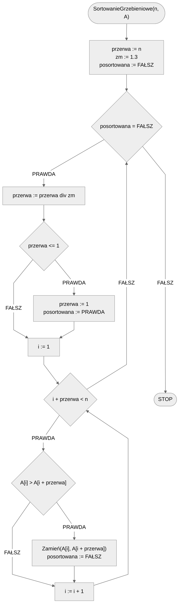

# Sortowanie grzebieniowe

Sortowanie grzebieniowe (ang. *Comb Sort*) to algorytm sortujący, który jest ulepszoną wersją sortowania bąbelkowego. Podczas gdy sortowanie bąbelkowe zawsze porównuje sąsiednie elementy, sortowanie grzebieniowe eliminuje narastające *żółwie*, czyli małe wartości końca listy, które muszą być przesunięte na początek listy. Działa on poprzez porównywanie elementów oddzielonych przez określony "rozstęp", który jest na początku duży, a następnie maleje.

Algorytm sortowania grzebieniowego działa poprzez porównywanie elementów oddzielonych przez określony "rozstęp". W początkowych fazach sortowania, "rozstęp" jest dość duży i maleje w każdej iteracji. W końcu "rozstęp" wynosi $$1$$, co czyni algorytm podobnym do sortowania bąbelkowego. Oto podstawowe kroki algorytmu:

- Ustal "rozstęp": na początku "rozstęp" jest ustalany na dużą wartość, zwykle równą długości listy. Zwykle jest on skracany o około $$1.3$$ w każdej iteracji, aż osiągnie wartość $$1$$.
- Porównaj elementy i zamień je miejscami: porównuj elementy oddzielone "rozstępem" i zamieniaj je miejscami, jeśli są w niewłaściwej kolejności.
- Zmniejsz "rozstęp" i powtórz: zmniejsz "rozstęp" o określony współczynnik (zazwyczaj o $$1.3$$) i powtórz krok drugi. Proces ten kontynuowany jest aż "rozstęp" osiągnie wartość $$1$$ i lista zostanie posortowana.

Poniżej znajdziesz animację przedstawiającą ideę omawianego algorytmu.

## Animacja 1

{% embed url="https://blackbat13.github.io/visul2/sorting/comb_sort/#array=%5B6%2C5%2C3%2C1%2C8%2C7%2C2%2C4%5D" %}
Sortowanie grzebieniowe


## Animacja 2


[Animacja sortowania grzebieniowego](https://www.youtube.com/watch?v=ob49RukGnAw)


## Rozwiązanie

### Pseudokod

```
procedura SortowanieGrzebieniowe(n, A):
    1. przerwa := n
    2. zm := 1.3
    3. posortowana := FAŁSZ
    4. Dopóki posortowana = FAŁSZ, wykonuj:
        5. przerwa := przerwa div zm
        6. Jeżeli przerwa <= 1, to:
            7. przerwa := 1
            8. posortowana := PRAWDA
        9. i := 1
        10. Dopóki i + przerwa < n, wykonuj:
            11. Jeżeli A[i] > A[i + przerwa], to:
                12. Zamień(A[i], A[i + przerwa])
                13. posortowana := FAŁSZ
            14. i := i + 1
```

### Schemat blokowy



### Złożoność

Sortowanie grzebieniowe ma średnią i najgorszą złożoność obliczeniową $$O(n^2)$$, ale dla list prawie posortowanych złożoność ta może zbliżać się do $$O(n\log{n})$$.

## Implementacja

### C++


[comb-sort.md](../../programming/c++/algorithms/sorting/comb-sort.md)


### Python


[comb-sort.md](../../programming/python/algorithms/sorting/comb-sort.md)


### Kotlin


[comb-sort.md](../../programming/kotlin/algorithms/sorting/comb-sort.md)
