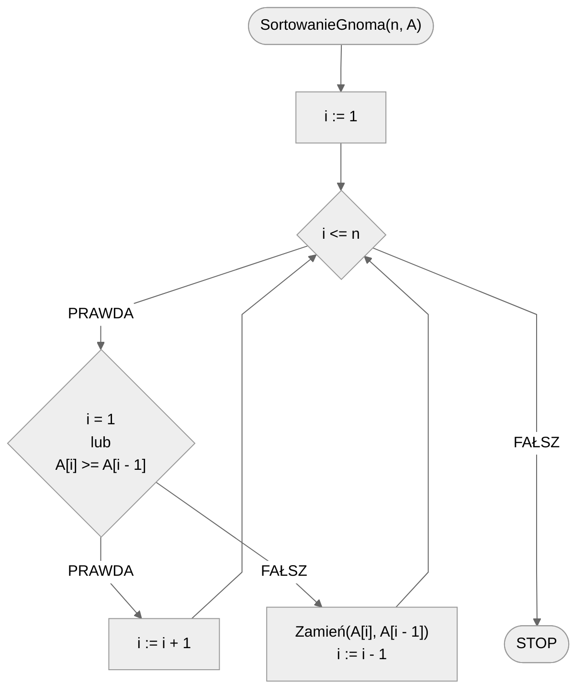

# Sortowanie gnoma

Wyobraźmy sobie gnoma, który zarządza swoim ogródkiem, a konkretnie ustawia doniczki we właściwej kolejności. Doniczki ułożone są w rządku od lewej do prawej. Gnom przechodzi od lewej do prawej wzdłuż rzędu doniczek, uważnie je obserwując. Gdy tylko zauważy, że dwie sąsiednie doniczki są niewłaściwie ułożone, zamienia je miejscami i cofa się do poprzedniej doniczki. Gdy natomiast z doniczkami jest wszystko tak, jak należy, to przechodzi do kolejnej doniczki. Gdy gnom dotrze do końca doniczek może spokojnie stwierdzić, że wszystkie są ułożone we właściwym porządku.

Poniżej znajdziesz animację przedstawiającą ideę omawianego algorytmu.

## Animacja 1

{% embed url="https://blackbat13.github.io/visul2/sorting/gnome_sort/#array=%5B6%2C5%2C3%2C1%2C8%2C7%2C2%2C4%5D" %}

## Animacja 2


[Animacja sortowania gnoma](https://www.youtube.com/watch?v=EdcWAw4Hcu0)


## Rozwiązanie

Zauważmy, że gnom ma do dyspozycji następujące operacje: 

- porównaj dwie sąsiednie doniczki: obecną z poprzednią,
- zamień dwie sąsiednie doniczki: obecną z poprzednią,
- idź o jedną doniczkę w prawo,
- idź o jedną doniczkę w lewo.

Gnom zaczyna swoją podróż od lewej strony, czyli od pierwszej doniczki, czy też od pierwszego elementu. Ponieważ może wyłącznie porównywać obecny element z poprzednim, to gdy znajduje się na samym początku nie ma wielkiego wyboru i musi pójść w prawo. Podobnie postępuje, gdy zauważy, że dwie sąsiednie doniczki są ułożone we właściwym porządku: przemieszcza się w prawo. Kiedy w takim razie gnom powinien pójść w lewo? Gdy napotka dwie sąsiednie doniczki, które są ułożone w złej kolejności. Wówczas zamienia je miejscami i idzie w lewo. I to wszystko powtarzamy tak długo, aż gnom wyjdzie poza rząd doniczek, czyli aż jego pozycja będzie większa od liczby elementów ($$n$$).

### Pseudokod

```
procedura SortowanieGnoma(n, A):
    1. i := 1
    2. Dopóki i <= n, wykonuj:
        3. Jeżeli i = 1 lub A[i] >= A[i - 1], to:
            4. i := i + 1
        5. W przeciwnym przypadku:
            6. Zamień(A[i], A[i - 1])
            7. i := i - 1
```

### Schemat blokowy



### Złożoność

$$O(n^2)$$ — kwadratowa

Prześledzenie złożoności algorytmu sortowania gnoma może wydawać się nietrywialne, zauważmy jednak, że algorytm ten jest bardzo podobny do algorytmu sortowania przez wstawianie. Tak właściwie od wspomnianego algorytmu różni się jedynie dodatkowym "poruszaniem się w prawo", nie może mieć więc złożoności lepszej, niż tamten algorytm.

## Implementacja

### C++


[gnome-sort.md](../../programming/c++/algorithms/sorting/gnome-sort.md)


### Python


[gnome-sort.md](../../programming/python/algorithms/sorting/gnome-sort.md)


### Kotlin


[gnome-sort.md](../../programming/kotlin/algorithms/sorting/gnome-sort.md)
