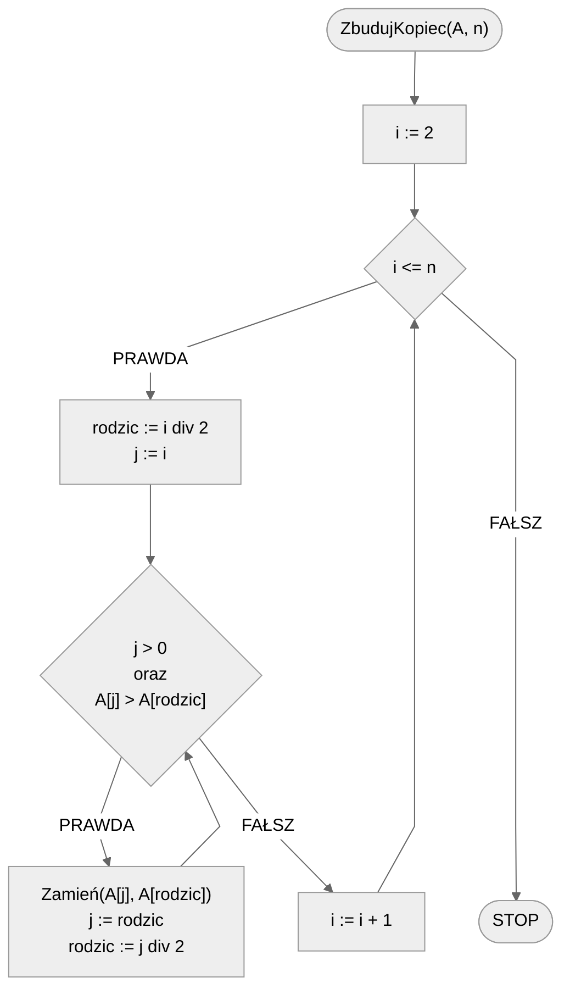
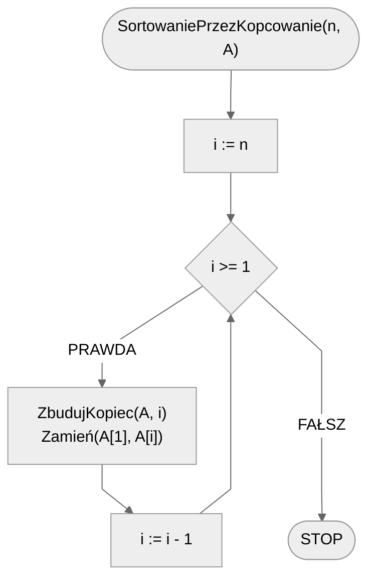

# Sortowanie przez kopcowanie

Sortowanie przez kopcowanie (ang. *Heap Sort*), to skuteczny algorytm sortujący, który używa struktury danych zwanej kopcem binarnym. Algorytm ten wykorzystuje własność kopca binarnego, która mówi, że wartość w każdym węźle jest większa (lub mniejsza, w zależności od typu kopca) od wartości w jego węzłach-dzieciach.

Algorytm sortowania przez kopcowanie składa się z dwóch głównych etapów:

- Budowanie kopca: najpierw przekształcamy listę nieposortowanych elementów w kopiec binarny. Może to być kopiec maksymalny, gdzie klucz każdego rodzica jest większy lub równy kluczom jego dzieci, lub kopiec minimalny, gdzie klucz każdego rodzica jest mniejszy lub równy kluczom jego dzieci.
- Usuwanie elementów z kopca: następnie usuwamy jeden po drugim elementy z kopca, a po usunięciu każdego elementu przywracamy własność kopca. Proces ten jest powtarzany, aż kopiec będzie pusty. Usunięte elementy tworzą posortowaną listę.

Poniżej znajdziesz animację przedstawiającą ideę omawianego algorytmu

## Animacja


## Taneczne sortowanie

[:material-video: Taneczne sortowanie](https://www.youtube.com/watch?v=Xw2D9aJRBY4){ .md-button }

## Rozwiązanie

Nasza implementacja algorytmu sortowania przez scalanie składa się z dwóch części:

- procedura ZbudujKopiec: buduje kopiec binarny bazując na podanej liczbie początkowych elementów $A$;
- procedura SortowaniePrzezKopcowanie: rekurencyjnie wywołuje budowanie kopca i odkłada posortowane elementy.

### Pseudokod

```
procedura ZbudujKopiec(A, n):
    1. Od i := 2 do n, wykonuj:
        2. rodzic := i div 2
        3. j := i
        
        4. Dopóki j > 0 oraz A[j] > A[rodzic]:
            5. Zamień(A[j], A[rodzic])
            6. j := rodzic
            7. rodzic := j div 2
```
            
```
procedura SortowaniePrzezKopcowanie(n, A):
    1. Dla i := n w dół do 1, wykonuj:
        2. ZbudujKopiec(A, i)
        3. Zamień(A[1], A[i])
```

### Schemat blokowy





### Złożoność

Sortowanie przez kopcowanie ma złożoność obliczeniową $O(n\log{n})$ w przypadku najgorszym, średnim i najlepszym, co czyni go bardzo efektywnym algorytmem sortowania, zwłaszcza dla dużych zestawów danych.

## Implementacja

### [:simple-cplusplus: C++](../../programming/c++/algorithms/sorting/heap-sort.md){ .md-button }

### [:simple-python: Python](../../programming/python/algorithms/sorting/heap-sort.md){ .md-button }

### [:simple-kotlin: Kotlin](../../programming/kotlin/algorithms/sorting/heap-sort.md){ .md-button }
