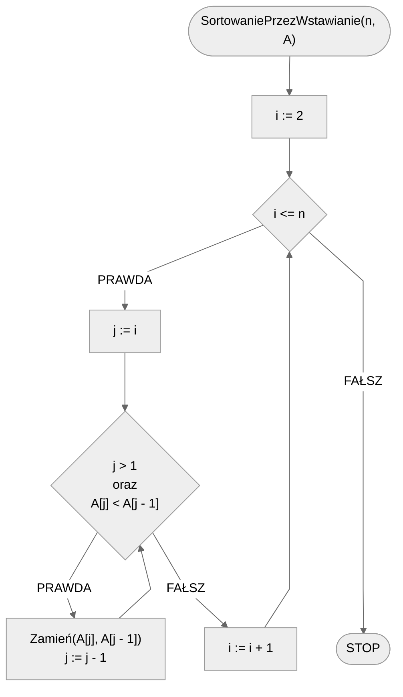

# Sortowanie przez wstawianie

Siedzisz przy stole, karty już rozdane. Spoglądasz na karty trzymane w ręce i stwierdzasz, że jak ich nie ułożysz w sensownej kolejności to się nie połapiesz. Zaczynasz więc od drugiej karty i przesuwasz ją w lewo, by trafiła na swoje miejsce. Teraz bierzesz trzecią i ponownie przesuwasz ją w lewo, aż będzie poprawnie ułożona. Podobnie postępujesz z czwartą i kolejnymi kartami: każdą kolejną bierzesz do ręki i przesuwasz w lewo, aż **wstawisz** ją na właściwe miejsce na ręce. Tym o to sposobem zrealizowałeś algorytm **sortowania przez wstawianie**.

Poniżej znajdziesz animacje przedstawiające ideę omawianego algorytmu.

## Animacja 1


## Animacja 2

{% embed url="https://blackbat13.github.io/visul2/sorting/insertion_sort/#array=%5B6%2C5%2C3%2C1%2C8%2C7%2C2%2C4%5D" %}

## Taneczne sortowanie


[Taneczne sortowanie](https://www.youtube.com/watch?v=ROalU379l3U)


## Rozwiązanie

Zaczynamy od drugiego elementu tablicy. Będziemy go przesuwać w lewo tak długo, aż nie trafi na swoje miejsce. Innymi słowy będziemy przesuwać go w lewo, dopóki nie trafi na początek tablicy i dopóki element po jego lewej stronie będzie większy. I tak postępujemy z każdym kolejnym elementem tablicy.

### Pseudokod

```
procedura SortowaniePrzezWstawianie(n, A):
    1. Od i := 2 do n, wykonuj:
        2. j := i
        3. Dopóki j > 1 oraz A[j] < A[j - 1], to:
            4. Zamień(A[j], A[j - 1])
            5. j := j - 1
```

### Schemat blokowy



### Złożoność

$$O(n^2)$$ — kwadratowa

Dwie zagnieżdżone pętle. Chociaż warunkowa pętla wewnętrzna wykonuje zawsze co najwyżej tyle obrotów, ile wynosi indeks obecnie przesuwanego elementu, to i tak otrzymujemy złożoność kwadratową, co można dość łatwo samodzielnie policzyć.

## Implementacja

### C++


[insertion-sort.md](../../programming/c++/algorithms/sorting/insertion-sort.md)


### Python


[insertion-sort.md](../../programming/python/algorithms/sorting/insertion-sort.md)


### Kotlin


[insertion-sort.md](../../programming/kotlin/algorithms/sorting/insertion-sort.md)
