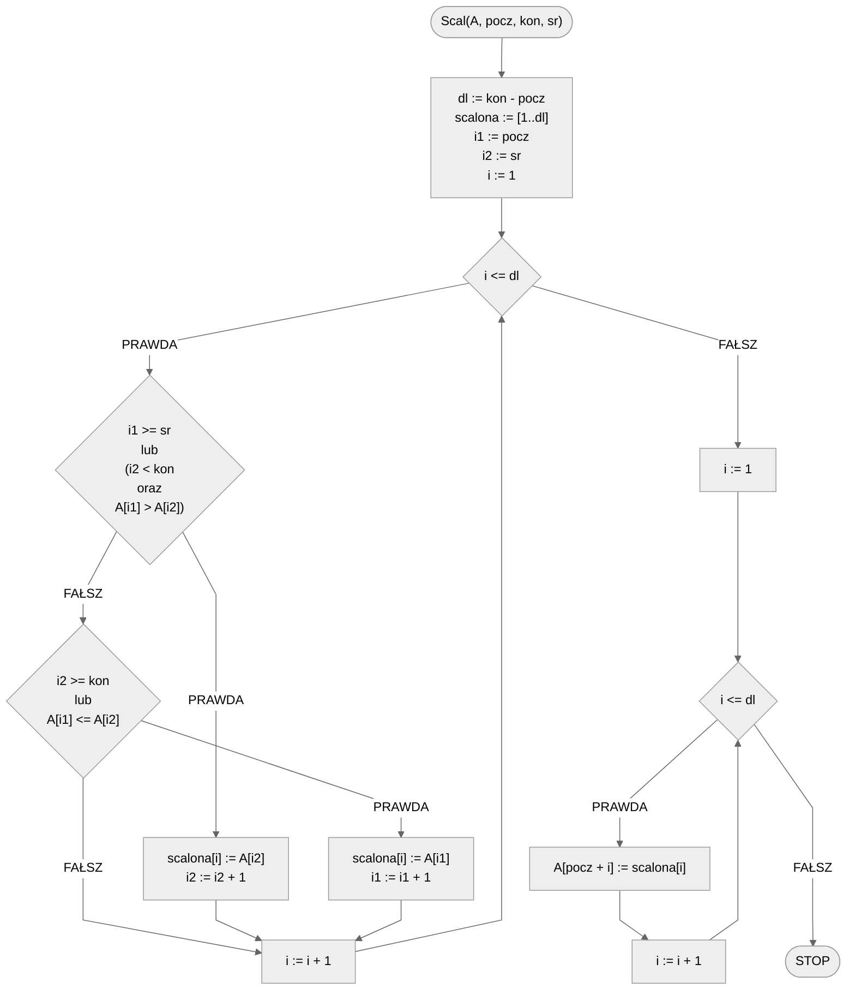
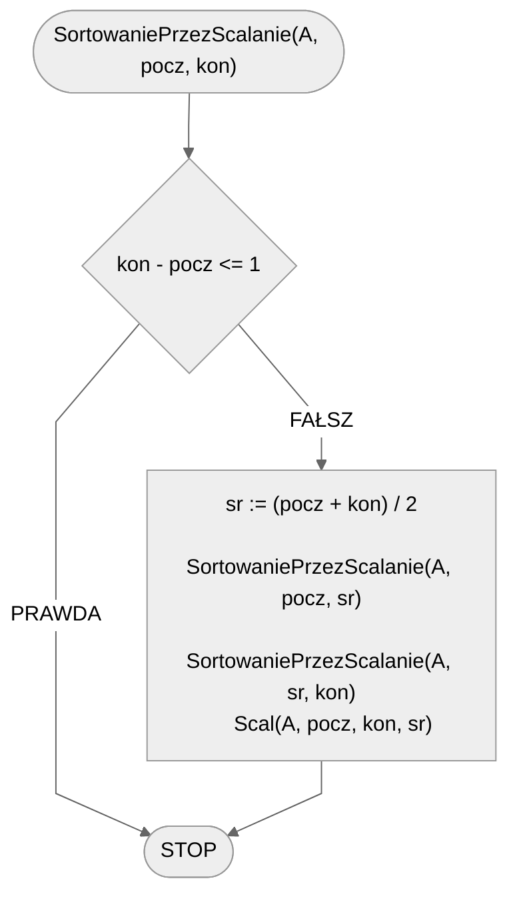

# Sortowanie przez scalanie

Sortowanie przez scalanie (ang. *Merge Sort*) jest jednym z klasycznych, ale wydajnych algorytmów sortowania danych. Jest oparty na metodzie **dziel i zwyciężaj**, co oznacza, że problem jest dzielony na mniejsze podproblemy, które są łatwiejsze do rozwiązania, a następnie te rozwiązania mniejszych problemów są łączone, aby uzyskać ostateczne rozwiązanie pełnego problemu.

Algorytm sortowania przez scalanie działa poprzez **podział** nieposortowanego zestawu danych na $n$ mniejszych podzbiorów, aż do momentu, kiedy każdy podzbiór będzie zawierał tylko **jeden** element (jeden element jest z definicji posortowany). Następnie, te pojedyncze elementy są łączone ze sobą (**scalane**) w sposób, który zapewnia, że są one ułożone w odpowiedniej kolejności (posortowane).

Główne etapy tego algorytmu to:

- **Podział**: lista do posortowania jest dzielona na pół, tworząc dwa mniejsze podzbiory. Proces ten jest powtarzany rekurencyjnie, aż do momentu, kiedy każdy podzbiór będzie zawierał tylko jeden element.
- **Scalanie**: pojedyncze podzbiory są łączone ze sobą w pary w taki sposób, aby były posortowane. Następnie pary są łączone w grupy po cztery, następnie grupy po cztery są łączone w grupy po osiem, itd., aż do momentu, kiedy wszystkie elementy zostaną połączone w jedną posortowaną listę.

Poniżej znajdziesz animację przedstawiającą ideę omawianego algorytmu, a także prezentację, na której poszczególne kroki algorytmu są wyjaśnione w jak najprostszy sposób.

## Animacja 1


## Animacja 2

[Animacja sortowania przez scalanie](https://www.youtube.com/watch?v=ZRPoEKHXTJg){ .md-button }

## Prezentacja

[:fontawesome-solid-file-pdf: Sortowanie przez scalanie - prezentacja](../../assets/Sortowanie przez scalanie.pdf){ .md-button }

## Taneczne sortowanie

[:material-video: Taneczne sortowanie](https://www.youtube.com/watch?v=XaqR3G_NVoo){ .md-button }

## Rozwiązanie

Nasza implementacja algorytmu sortowania przez scalanie składa się z dwóch części:

- procedura **Scal**: scala ze sobą dwie podtablice zdefiniowane poprzez zakres elementów z tablicy $A$;
- procedura **SortowaniePrzezScalanie**: rekurencyjnie dzieli tablicę na dwie mniejsze podtablice, które są na końcu scalane.

Idea działania procedury *Scal* jest prosta. Tworzymy pomocniczą tablicę, do której będziemy wrzucać posortowane wartości. Następnie przechodzimy przez kolejne elementy zdefiniowanych podtablic, porównujemy je ze sobą i mniejszy element umieszczamy na kolejnym miejscu w pomocniczej tablicy. Podczas tej operacji trzeba uważać, żeby nie wyjść poza zakres podtablic. Jeżeli elementy jednej z podtablic nam się "skończą" (a tak zawsze nastąpi), to bierzemy już elementy tylko z drugiej podtablicy.

Po wypełnieniu tablicy pomocniczej posortowanymi wartościami, przepisujemy ją do naszej głównej, sortowanej tablicy $A$.

Procedura SortowaniePrzezScalanie jest procedurą rekurencyjną, która poza tablicą do posortowania przyjmuje także początek i koniec sortowanego zakresu (w formie indeksów tablicy). Na początku zaczynamy od warunku stopu, tzn. sprawdzamy, czy podany przedział zawiera co najmniej jeden element. Jeżeli tak nie jest, to kończymy obecne wywołanie. Gdy w przedziale mamy co sortować, to wyznaczamy środek przedziału, który posłuży nam do podziału tablicy na dwie podtablice. Następnie wywołujemy rekurencyjnie naszą sortującą procedurę, odpowiednio zmieniając sortowane zakresy (od początku do środka, od środka do końca). Na koniec, gdy nasze dwie podtablice są już posortowane (co wynika m.in. z rekurencyjnej struktury funkcji), scalamy je ze sobą za pomocą procedury Scal.

### Pseudokod

```
procedura Scal(A, pocz, kon, sr):
    1. dl := kon - pocz
    2. scalona := [1..dl]
    3. i1 := pocz
    4. i2 := sr

    5. Dla i := 1 do dl, wykonuj:
        6. Jeżeli i1 >= sr lub (i2 < kon oraz A[i1] > A[i2]), to:
            7. scalona[i] := A[i2]
            8. i2 := i2 + 1
        10. w przeciwnym przypadku, jeżeli i2 >= kon lub A[i1] <= A[i2], to:
            11. scalona[i] := A[i1]
            12. i1 := i1 + 1

    13. Dla i := 1 do dl, wykonuj:
        14. A[pocz + i] := scalona[i]
```

```
procedura SortowaniePrzezScalanie(A, pocz, kon):
    1. Jeżeli kon - pocz <= 1, to:
        2. Zakończ

    3. sr := (pocz + kon) div 2
    
    4. SortowaniePrezScalanie(A, pocz, sr)
    5. SortowaniePrezScalanie(A, sr, kon)
    
    6. Scal(A, pocz, kon, sr)
```

### Schemat blokowy





### Złożoność

Sortowanie przez scalanie ma złożoność obliczeniową $O(n\log{n})$ zarówno w przypadku najgorszym, jak i średnim, co czyni go efektywnym algorytmem sortowania dla dużych zestawów danych.

## Implementacja

### [:simple-cplusplus: C++](../../programming/c++/algorithms/sorting/merge-sort.md){ .md-button }

### [:simple-python: Python](../../programming/python/algorithms/sorting/merge-sort.md){ .md-button }

### [:simple-kotlin: Kotlin](../../programming/kotlin/algorithms/sorting/merge-sort.md){ .md-button }

## Implementacja - pozostałe

### [:simple-julia: Julia](../../programming/julia/algorithms/sorting/merge-sort.md){ .md-button }
