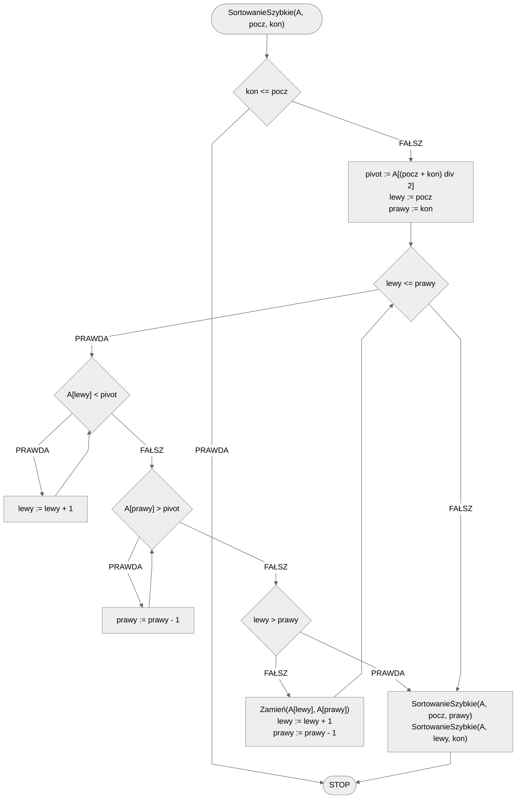

# Sortowanie szybkie

Sortowanie szybkie (ang. *Quicksort*) to jeden z najważniejszych algorytmów sortujących w informatyce, dzięki swojej wydajności i prostocie implementacji. Algorytm ten opiera się na strategii *dziel i zwyciężaj*, gdzie problem dzielony jest na mniejsze podproblemy, które są rozwiązywane niezależnie, a potem ich wyniki są łączone w celu uzyskania rozwiązania problemu pierwotnego.

Quicksort opiera się na następujących krokach:

- Wybór elementu dzielącego (pivot): wybieramy jeden z elementów listy, który będzie służył jako "pivot". Wybór odpowiedniego pivotu może znacznie wpływać na wydajność algorytmu, ale w praktyce często wybiera się pierwszy, ostatni lub środkowy element listy.
- Podział listy: następnie lista dzielona jest na dwa podzbiory: jeden zawierający elementy mniejsze od pivotu, a drugi zawierający elementy większe lub równe pivotowi.
- Rekurencja: powyższe kroki są powtarzane rekurencyjnie na obu podzbiorach, aż do momentu, gdy podzbiór będzie zawierał tylko jeden element (jest już posortowany).

Poniżej znajdziesz prezentację, na której poszczególne kroki algorytmu są wyjaśnione w jak najprostszy sposób.

## Prezentacja

[:fontawesome-solid-file-pdf: Sortowanie szybkie - prezentacja](../../assets/Sortowanie Szybkie.pdf)

## Taneczne sortowanie

[Taneczne sortowanie](https://www.youtube.com/watch?v=ywWBy6J5gz8)

## Rozwiązanie

### Pseudokod

```
procedura SortowanieSzybkie(A, pocz, kon):
    1. Jeżeli kon <= pocz, to:
        2. Zakończ

    3. pivot := A[(pocz + kon) div 2]
    4. lewy := pocz
    5. prawy := kon
    
    6. Dopóki lewy <= prawy, wykonuj:
        7. Dopóki A[lewy] < pivot, wykonuj:
            8. lewy := lewy + 1

        9. Dopóki A[prawy] > pivot, wykonuj:
            10. prawy := prawy - 1

        11. Jeżeli lewy > prawy, to:
            12. Przerwij pętlę

        13. Zamień(A[lewy], A[prawy])

        14. lewy := lewy + 1
        15. prawy := prawy - 1

    16. SortowanieSzybkie(A, pocz, prawy)
    17. SortowanieSzybkie(A, lewy, kon)
```

### Schemat blokowy



### Złożoność

Algorytm Quicksort ma złożoność obliczeniową $O(n\log{n})$ w przypadku średnim, co czyni go jednym z najbardziej efektywnych algorytmów sortujących. Jednakże, w najgorszym przypadku, gdy podział listy jest zawsze najbardziej nierównomierny (na przykład, gdy lista jest już posortowana), złożoność obliczeniowa może wzrosnąć do $O(n^2)$.

## Implementacja

### C++


[quick-sort.md](../../programming/c++/algorithms/sorting/quick-sort.md)


### Python


[quick-sort.md](../../programming/python/algorithms/sorting/quick-sort.md)


### Kotlin


[quick-sort.md](../../programming/kotlin/algorithms/sorting/quick-sort.md)


## Implementacja - pozostałe

### Julia


[quick-sort.md](../../programming/julia/algorithms/sorting/quick-sort.md)

