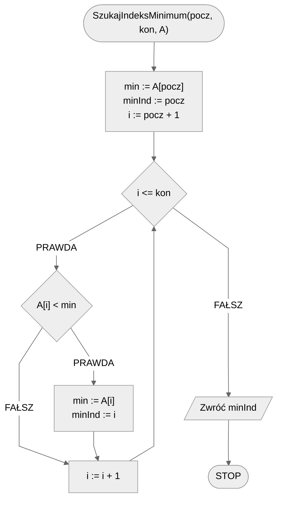
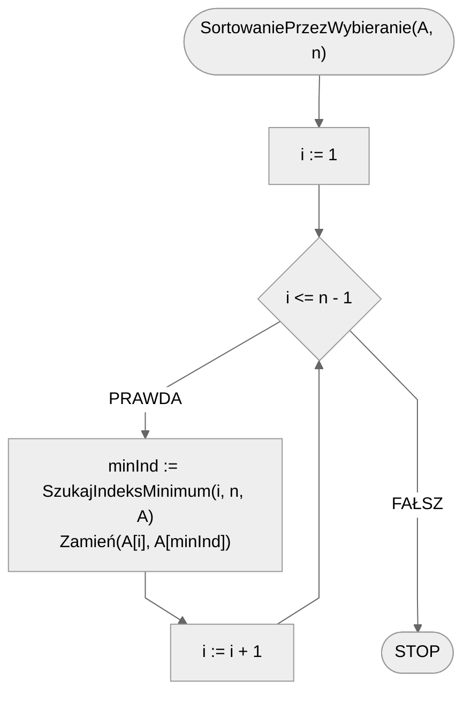

# Sortowanie przez wybieranie

Wyobraź sobie, że przed tobą leżą książki, ułożone tak, że widzisz tytuł i autora każdej z nich. Twoje zadanie polega na uporządkowaniu tych książek na półce w kolejności alfabetycznej po nazwiskach autorów. Najpierw przeglądasz dostępne książki szukając autora z nazwiskiem pierwszym w kolejności alfabetycznej. Znajdujesz, bierzesz książkę do ręki i umieszczasz na półce. Teraz patrzysz na pozostałe książki i ponownie szukasz pierwszego (w kolejności alfabetycznej) nazwiska z tych, które pozostały. Znajdujesz i odkładasz na półkę, jako drugą książkę. Postępujesz podobnie, powtarzając te czynności tak długo, aż ułożysz wszystkie książki na półce, posortowane po nazwiskach autorów. Brawo, właśnie zastosowałeś algorytm sortowania przez wybieranie!

Poniżej znajdziesz animacje przedstawiające ideę omawianego algorytmu.

## Animacja 1


## Animacja 2

[https://blackbat13.github.io/visul2/sorting/selection_sort/#array=%5B8%2C5%2C2%2C6%2C9%2C3%2C1%2C4%2C0%2C7%5D](https://blackbat13.github.io/visul2/sorting/selection_sort/#array=%5B8%2C5%2C2%2C6%2C9%2C3%2C1%2C4%2C0%2C7%5D)

## Taneczne sortowanie

[Taneczne sortowanie](https://www.youtube.com/watch?v=Ns4TPTC8whw)

## Rozwiązanie

Sortowanie przez wybieranie składa się tak właściwie z dwóch części: znajdowania minimum i samego sortowania. Opis algorytmu znajdowania minimum można znaleźć tutaj: [Wyszukiwanie minimum i maksimum](../searching/min-or-max.md).

Sam algorytm wyszukiwania minimum musimy zmodyfikować tak, by działał na określonym przedziale w tablicy, tzn. chcemy wyszukać minimum nie w całej tablicy, a w jej konkretnym przedziale $[p..k]$. Co więcej, potrzebujemy nie tyle znać wartość minimalną, co jej **pozycję** w tablicy. Gdy to już mamy, samo sortowanie jest bardzo proste. Przechodzimy przez kolejne indeksy w naszej tablicy i wyszukujemy pozycję minimum od obecnego indeksu do końca tablicy, a następnie zamieniamy z elementem na obecnie sprawdzanej pozycji.

### Pseudokod

```
funkcja SzukajIndeksMinimum(pocz, kon, A):
    1. min := A[pocz]
    2. minInd := pocz
    3. Od i := pocz + 1 do kon, wykonuj:
        4. Jeżeli A[i] < min, to:
            5. min := A[i]
            6. minInd := i
    7. Zwróć minInd

procedura SortowaniePrzezWybieranie(A, n):
    1. Od i := 1 do n - 1, wykonuj:
        2. minInd := SzukajIndeksMinimum(i, n, A)
        3. Zamień(A[i], A[minInd])
```

### Schemat blokowy





### Złożoność

$O(n^2)$ — kwadratowa

Wyszukiwanie minimum ma złożoność liniową. Wywołujemy ten algorytm $n-1$ razy, więc w efekcie otrzymujemy złożoność kwadratową algorytmu sortowania przez wybieranie.

## Implementacja

### C++


[selection-sort.md](../../programming/c++/algorithms/sorting/selection-sort.md)


### Python


[selection-sort.md](../../programming/python/algorithms/sorting/selection-sort.md)


### Blockly


[selection-sort.md](../../programming/blockly/algorithms/sorting/selection-sort.md)


### Kotlin


[selection-sort.md](../../programming/kotlin/algorithms/sorting/selection-sort.md)
