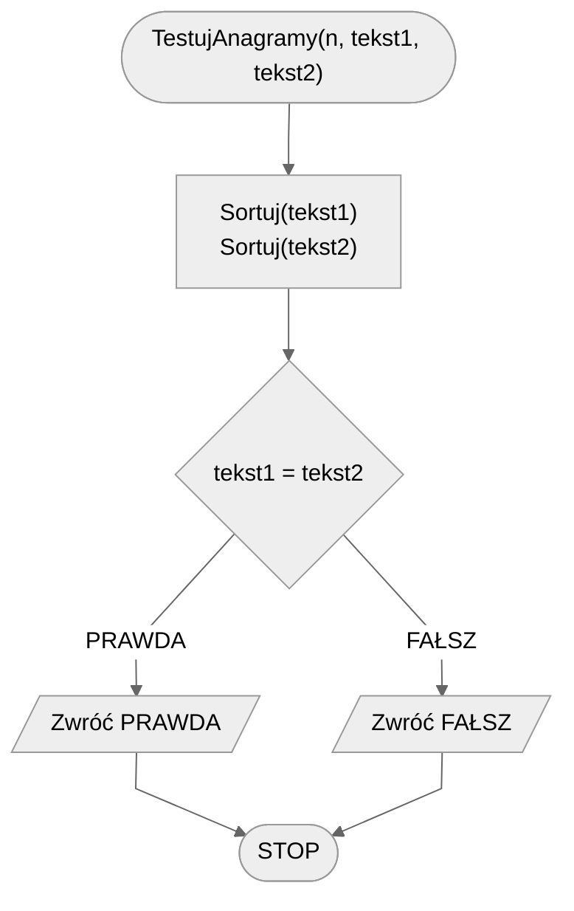

# Anagramy

Istnieje wiele metod na sprawdzanie i tworzenie relacji pomiędzy wyrazami.
W tym temacie zajmiemy się pojęciem **anagramu**, które może być znane szczególnie osobom przejawiającym zamiłowanie do różnego rodzaju krzyżówek i zagadek słownych.
Zacznijmy od krótkiej definicji.

## Definicja

!!! info
	 Dwa wyrazy nazywamy **anagramami**, jeżeli składają się dokładnie z takich samych znaków, ale ułożonych w innej kolejności.

### Link do Wikipedii

[Anagram — Wikipedia](https://pl.wikipedia.org/wiki/Anagram)

## Przykład

Wyrazy **rży** i **ryż** są anagramami.
Podobnie wyrazy **algorytm** i **logarytm**.

Nie tylko wyrazy mogą być anagramami, ale także wyrażenia czy całe zdania.

## Specyfikacja

### Dane

* $n$ — liczba naturalna, długość tekstu.
* $tekst1[1..n]$ — ciąg $n$ znaków, numerowanych od jedynki, składający się wyłącznie z małych liter alfabetu angielskiego.
* $tekst2[1..n]$ — ciąg $n$ znaków, numerowanych od jedynki, składający się wyłącznie z małych liter alfabetu angielskiego.

!!! info
	W ogólnym problemie moglibyśmy sprawdzać własność anagramu dla dowolnych ciągów znaków, w szczególności zawierających także wielkie litery alfabetu.
	Skupimy się jednak na uproszczonej wersji tego problemu, by przedstawić ideę rozwiązania, a technikalia zostawiamy osobom zainteresowanym.

### Wynik

* $PRAWDA$ — jeżeli $tekst1$ i $tekst2$ są anagramami.
* $FAŁSZ$ — w przeciwnym przypadku.

## Przykład

### Dane

```
n := 8
tekst1 := "markotny"
tekst2 := "romantyk"
```

**Wynik**: **PRAWDA**

## Rozwiązanie 1

### Opis

Aby dwa wyrazy były anagramami, muszą składać się dokładnie z takich samych liter. 
Oznacza to także, że każda litera z pierwszego wyrazu musi pojawić się w drugim wyrazie dokładnie tyle samo razy i tak samo w drugą stronę. 
W związku z tym pierwsze rozwiązanie jest proste: policzmy, ile razy każda litera występuje w pierwszym wyrazie, następnie zróbmy to samo dla drugiego wyrazu i porównajmy wyniki. 
Jeżeli będą takie same, to dwa wyrazy są anagramami.

Jak jednak policzyć, ile razy dana litera występuje w wyrazie? 
Zauważmy, że nasze wyrazy składają się jedynie z małych liter alfabetu angielskiego. 
Oznacza to, że mamy dokładnie 26 znaków. 
Możemy więc przygotować tablicę przechowującą 26 liczników — po jednym dla każdej litery. 
Litery natomiast ponumerujemy od 1, startując od $a$. 
Liczbę wystąpień litery $a$ zapiszemy w pierwszym liczniku, liczbę wystąpień litery $b$ zapiszemy w drugim liczniku itd.

### Przykład

Przyjmijmy takie same dane jak we wcześniejszym przykładzie, tzn.:

```
n := 8
tekst1 := "markotny"
tekst2 := "romantyk"
```

Zaczynamy od policzenia tablic liczników dla pierwszego i drugiego wyrazu.
Dla czytelności zapiszemy je w zmodyfikowanej formie, do każdego licznika dopisując odpowiadającą mu literę.
Tak oto otrzymujemy tablice liczników odpowiednio dla pierwszego i drugiego wyrazu:

```
liczniki1 = [a:1, b:0, c:0, d:0, e:0, f:0, g:0, h:0, i:0, j:0, k:1, l:0, m:1, n:1, o:1, p:0, q:0, r:1, s:0, t:1, u:0, v:0, w:0, x:0, y:1, z:0]
liczniki2 = [a:1, b:0, c:0, d:0, e:0, f:0, g:0, h:0, i:0, j:0, k:1, l:0, m:1, n:1, o:1, p:0, q:0, r:1, s:0, t:1, u:0, v:0, w:0, x:0, y:1, z:0]
```

Gdy je porównamy zobaczymy, że są sobie równe.
Oznacza to, że nasze wyrazy są anagramami.

### Pseudokod

Spróbujmy teraz zapisać nasze rozwiązanie w bardziej formalny sposób.
Zaprojektujemy funkcję **TestujAnagramy**, która będzie przyjmować trzy parametry, zgodnie ze specyfikacją.

Najpierw tworzymy dwie tablice liczników, po jednej dla każdego wyrazu.
Początkowo wypełniamy je wartościami 0, gdyż jeszcze nie przystąpiliśmy do zliczania liter w wyrazach.

Gdy tablice są gotowe, możemy przejść do zliczania.
Przechodzimy przez oba wyrazy znak po znaku i zwiększamy właściwe liczniki w odpowiadających wyrazom tablicach.

Ostatnim krokiem jest porównanie naszych liczników i zwrócenie odpowiedniego wyniku.

```
funkcja TestujAnagramy(n, tekst1, tekst2):
    1. liczniki1 := tablica [1..26] wypełniona wartościami 0
    2. liczniki2 := tablica [1..26] wypełniona wartościami 0
    3. Od i := 1 do n, wykonuj:
        4. indeks1 := numer znaku tekst1[i]
        5. liczniki1[indeks] := liczniki1[indeks] + 1
        6. indeks2 := numer znaku tekst2[i]
        7. liczniki2[indeks] := liczniki2[indeks] + 1
    8. Jeżeli liczniki1 = liczniki2, to:
        9. Zwróć PRAWDA
    10. w przeciwnym przypadku:
        11. Zwróć FAŁSZ
```

### Złożoność

Najbardziej czasochłonną operacją w naszym algorytmie jest pętla przechodząca przez każdy znak obu wyrazów.
Znaków mamy $n$, więc nasza pętla wykona dokładnie $n$ obrotów, co daje nam złożoność:

$O(n)$ — liniowa

## Rozwiązanie 2

Innym rozwiązaniem jest posortowanie obu wyrazów i porównanie ich.

### Pseudokod

```
funkcja TestujAnagramy(n, tekst1, tekst2):
    1. Sortuj(tekst1)
    2. Sortuj(tekst2)
    3. Jeżeli tekst1 = tekst2, to:
        4. Zwróć PRAWDA
    5. w przeciwnym przypadku:
        6. Zwróć FAŁSZ 
```

### Schemat blokowy



### Złożoność

$O(n)$ — liniowa, jeżeli wykorzystamy optymalny algorytm sortowania (np. sortowanie przez zliczanie).

$O(n\log{n})$ — liniowo logarytmiczna, jeżeli użyjemy standardowej metody sortowania (np. sortowanie szybkie).

## Implementacja

### C++


[anagrams.md](../../programming/c++/algorithms/text/anagrams.md)


### Python


[anagrams.md](../../programming/python/algorithms/text/anagrams.md)

