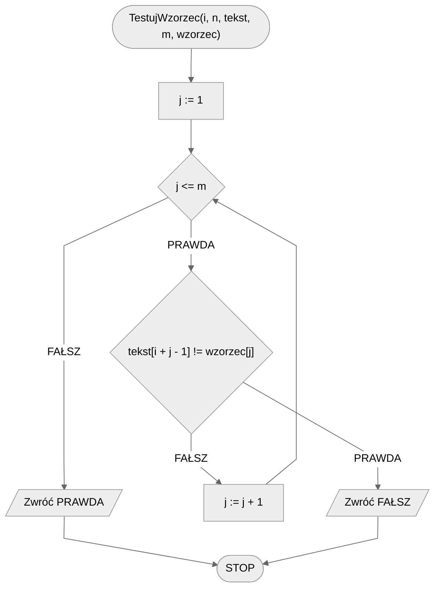
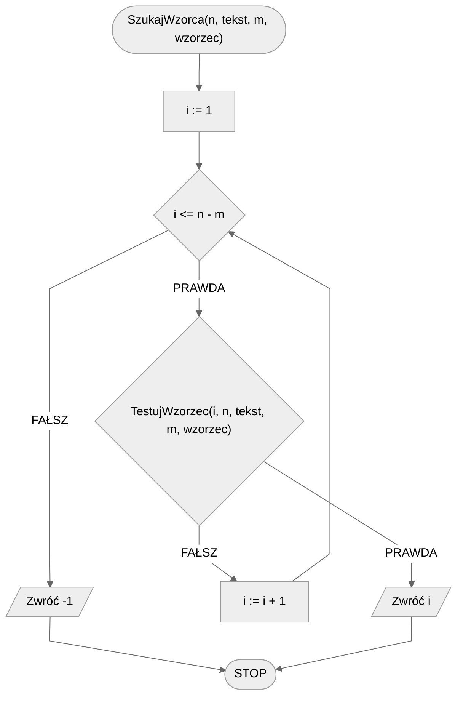

# Naiwne wyszukiwanie wzorca w tekście

## Opis problemu

Problem znalezienia jednego tekstu w drugim to problem, z którym mamy do czynienia praktycznie na co dzień, być może nawet nie zdając sobie z tego sprawy. Gdy jesteśmy na jakiejś stronie internetowej, albo mamy otwarty dokument tekstowy i wciskamy znany skrót CTRL+F, to wtedy właśnie wykonujemy przeszukiwanie tekstu w celu znalezienia wystąpień jakiegoś zadanego ciągu znaków.

Jak niemalże każdy problem (informatyczny), także ten możne zostać rozwiązany w sposób naiwny i takim właśnie rozwiązaniem początkowo się zajmiemy.

Problem wygląda następująco: dostajemy dwa teksty, nazwijmy je _tekst_ oraz _wzorzec_, a naszym (algorytmu) zadaniem jest sprawdzenie, czy _wzorzec_ zawiera się w _tekście_.&#x20;

### Specyfikacja

#### Dane:

* $$n$$ - długość tekstu, $$n\in\mathbb{N}, n\geq1$$&#x20;
* $$tekst[1..n]$$ - ciąg znaków o długości $$n$$, numerowanych od jedynki&#x20;
* $$m$$ - długość wzorca,  $$m\in\mathbb{N}, 1\leq m\leq n$$
* $$wzorzec[1..m]$$ - ciąg znaków o długości $$m$$, numerowanych od jedynki&#x20;

#### Wynik:

* Indeks pierwszego wystąpienia wzorca w tekście, lub $$-1$$ jeżeli wzorzec nie występuje w tekście

### Przykład 1

#### Dane

```
tekst := "alamakota"
wzorzec := "kot"
```

**Wynik**: $$6$$.

### Przykład 2

#### Dane

```
tekst := "alamakota"
wzorzec := "koty"
```

**Wynik**: $$-1$$.

## Rozwiązanie

Pomocnicza funkcja `TestujWzorzec`sprawdza, czy wzorzec znajduje się w tekście pod indeksem `i`.

### Pseudokod

```
funkcja TestujWzorzec(i, n, tekst, m, wzorzec)
    1. Dla j := 1 do m, wykonuj:
        2. Jeżeli tekst[i + j - 1] != wzorzec[j], to:
            3. Zwróć FAŁSZ
        
    4. Zwróć PRAWDA
```

```
funkcja SzukajWzorca(n, tekst, m, wzorzec)
    1. Dla i := 1 do n - m, wykonuj:
        2. Jeżeli TestujWzorzec(i, n, tekst, m, wzorzec), to:
            3. Zwróć i
        
    4. Zwróć -1
```

### Schemat blokowy





### Złożoność

$$O(n*m)\to O(n^2)$$ - kwadratowa

## Implementacja

### C++


[naive-substring-search.md](../../programming/c++/algorithms/text/naive-substring-search.md)


### Python


[naive-substring-search.md](../../programming/python/algorithms/text/naive-substring-search.md)

