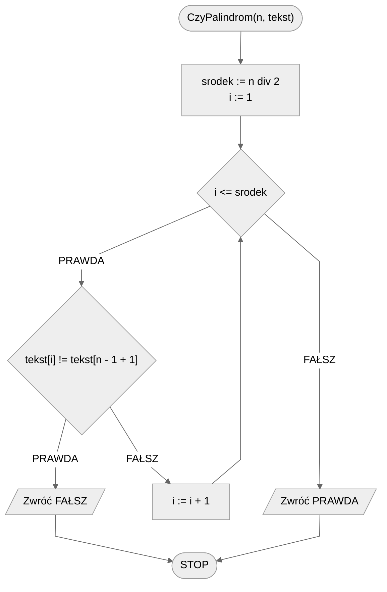

# Palindrom

**Palindrom** to wyraz, który czytany od lewej do prawej i od prawej do lewej jest taki sam.

## Specyfikacja

### Dane

* $n$ — liczba naturalna, długość tekstu, $n > 0$
* $tekst[1..n]$ — ciąg znaków o długości $n$, numerowanych od jedynki

### Wynik

* $PRAWDA$ — jeżeli *tekst* jest palindromem
* $FAŁSZ$ — w przeciwnym przypadku

## Przykład 1

### Dane

```
n := 5
tekst := "kajak"
```

### Wynik: ***PRAWDA***

!!! info
	**Wyjaśnienie**
	
	Wyraz **kajak** czytany od tyłu to **kajak**, jest on więc palindromem.

## Przykład 2

### Dane

```
n := 4
tekst := "tama"
```

**Wynik**: ***FAŁSZ***

!!! info
	**Wyjaśnienie**
	
	Wyraz **tama** czytany od tyłu to **amat**, nie jest on więc palindromem.

## Rozwiązanie

Jednym ze sposobów na sprawdzenie, czy wyraz jest palindromem, jest przejście znak po znaku od lewej aż do środka i porównywanie ze znakami od prawej strony. Można to zrealizować za pomocą jednej pętli i odpowiedniego obliczania indeksu znaku "od końca". Dla przykładu, jeżeli mamy wyraz o długości $6$ znaków, to będziemy ze sobą porównywali parami znaki na pozycjach: $(1, 6), (2, 5), (3, 4)$. W momencie gdy tylko stwierdzimy, że znaki na odpowiadających sobie pozycjach się różnią, możemy zwrócić jako wynik *fałsz*, ponieważ oznacza to, że wyraz nie jest palindromem. Jeżeli natomiast przejdziemy tak przez wszystkie pary znaków i nie stwierdzimy sprzeczności, to po wyjściu z pętli wiemy, że wyraz jest palindromem, zwracamy więc wartość *prawda*.

### Pseudokod

```
funkcja CzyPalindrom(n, tekst):
    1. srodek := n div 2
    2. Od i := 1 do srodek, wykonuj:
        3. Jeżeli tekst[i] != tekst[n - i + 1], to:
            4. Zwróć FAŁSZ
    5. Zwróć PRAWDA
```

### Schemat blokowy



### Złożoność

$O(n/2)\to O(n)$ — liniowa

Przechodzimy pętlą od $1$ do połowy długości wyrazu (czyli do $\lfloor\frac{n}{2}\rfloor$) porównując ze sobą odpowiednie pary znaków, stąd złożoność liniowa.

## Implementacja

### [:simple-cplusplus: C++](../../programming/c++/algorithms/text/palindrome.md){ .md-button }

### [:simple-python: Python](../../programming/python/algorithms/text/palindrome.md){ .md-button }
