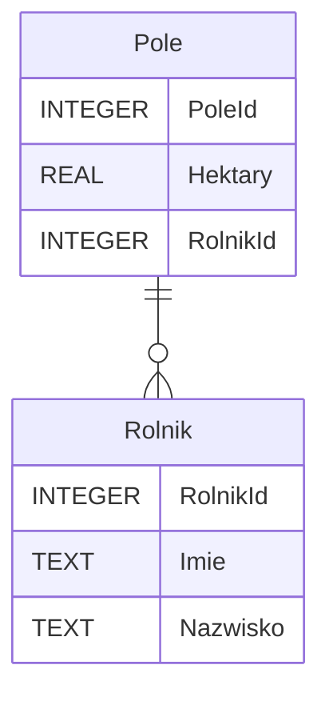

# Relacje

Gdy mówimy o bazie danych często myślimy o **relacyjnej bazie danych**, chociaż nie jest to jedyny typ baz danych, ale na takim się teraz skupimy. W relacyjnej bazie danych, jak sama nazwa wskazuje, pomiędzy danymi istnieją relacje, tzn. dane są ze sobą w jakiś sposób powiązane. Co to jednak dokładnie oznacza? Wyobraźmy sobie sklep internetowy, w którym mamy założone konto i dodany produkt do koszyka. W takiej sytuacji istnieje pewna **relacja** pomiędzy naszym kontem, a tym produktem.

Przyjrzyjmy się różnym typom relacji.

## Jeden do wielu oraz wiele do jednego

Jest to jeden z najpowszechniej występujących rodzajów relacji w bazach danych. Spójrzmy na poniższą strukturę bazy danych, by lepiej zrozumieć tę relację.

W naszej przykładowej strukturze mamy dwie tabele: *Rolnik* oraz *Pole*. Tabela *Rolnik* przechowuje informacje na temat rolników: unikalny identyfikator rolnika, imię oraz nazwisko. Tabela *Pole* zawiera informacje o polach: unikalny identyfikator pola, pole powierzchni wyrażone w hektarach oraz identyfikator rolnika, to którego należy dane pole.

Co możemy stwierdzić na podstawie tego schematu? Jakie **relacje** tutaj występują? Możemy zauważyć, że mamy jedno powiązanie pomiędzy tabelami *Rolnik* oraz *Pole*. Spróbujmy je opisać.

**Jeden** rolnik może mieć **wiele** pól. Jest to więc relacja typu **jeden do wielu**. 

Z drugiej strony **wiele** pól może należeć do **jednego** rolnika. Jest to więc relacja **wiele do jednego**.

Jak widać te dwie relacje są do siebie symetryczne.