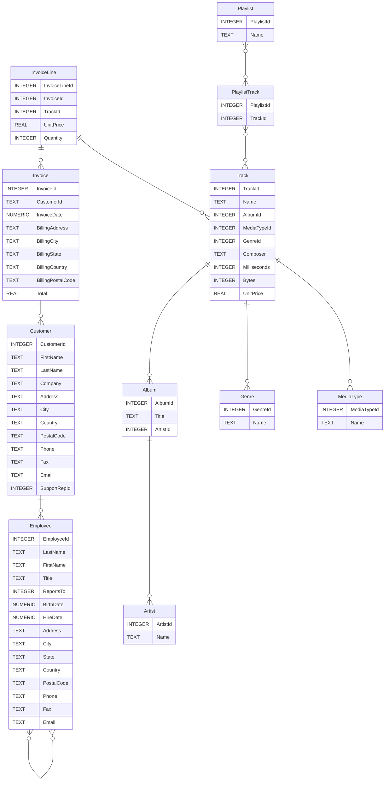

# Ćwiczenia

Przed przystąpieniem do rozwiązywania zadań zapoznaj się z poniższym opisem.

Poświęć czas na rozwiązanie każdego zadania. Zastanów się nad różnymi sposobami podejścia i rozwiązania problemu.

Zadania podzielone są ze względu na tematy. Tematy ułożone są w sugerowanej kolejności poznawania zagadnień. Każdy temat zawiera od kilku do kilkunastu zadań. Po rozwinięciu tematu pojawią się przykładowe rozwiązania poszczególnych zadań, każde na osobnej stronie. Pamiętaj, że każde zadanie można rozwiązać na kilka sposobów. 


**Zajrzyj do przykładowego rozwiązania dopiero, jak samodzielnie wykonasz zadanie.**


## Przygotowanie

W ramach ćwiczeń będziemy pracować z plikową bazą danych **SQLite**. Zanim przystąpisz do ćwiczeń przygotuj sobie środowisko pracy i zapoznaj się z bazą danych, na której będziesz pracować.

### Narzędzie

Narzędzie, z którym będziemy pracować to poniższa aplikacja webowa: 


SQLite Online



Możesz oczywiście skorzystać z innego narzędzia, pod warunkiem, że wiesz jak je samodzielnie skonfigurować.


### Baza danych

Do ćwiczeń wykorzystamy bazę danych *Chinook*. Jest to przykładowa baza danych, jaką mógłby posiadać sklep online sprzedający utwory muzyczne. 

W celu załadowania bazy *Chinook* w narzędziu *SQLite Online* wystarczy w okienku po lewej stronie (z napisem *syntax*) znaleźć linijkę "Example: Chinook | NorthWind | cnf.db | BasketBall | Sakila" i kliknąć na nazwę **Chinook**. Wówczas baza danych będzie już załadowana, po lewej zobaczymy spis tabel, a po środku będziemy mogli pisać i wykonywać zapytania.

Bazę *Chinook* można także pobrać z poniższego linku:


Baza Chinook


Pobrany plik należy rozpakować. Jeżeli chcemy załadować bazę do naszego narzędzia online to wybieramy z menu **File->Open DB** i wybieramy wypakowany plik *chinook.sqlite*.

### Struktura bazy danych

Baza składa się z 11 tabel:

- **Employee** - tabela przechowująca informacje o pracownikach, takie jak:
  - id pracownika (*EmployeeId*), 
  - nazwisko (*LastName*), 
  - imię (*FirstName*),
  - itp.
- **Customer** - tabela przechowująca informacje o klientach.
- **Invoice** oraz **InvoiceLine**: dwie tabele przechowujące informacje o fakturach. Pierwsza przechowuje nagłówki faktur, a druga zakupione utwory.
- **Artist** - tabela przechowująca informacje o zespołach. Zawiera jedynie nazwę zespołu oraz jego identyfikator.
- **Album** - tabela przechowująca informacje o albumach, czyli listach utworów. Każdy album należy do jednego artysty, ale jeden artysta może mieć wiele albumów.
- **MediaType** - tabela przechowująca informacje o typach plików audio, takie jak MPEG czy AAC.
- **Genre** - tabele przechowująca informacje o gatunkach, np. rock, jazz, metal.
- **Track** - tabela przechowująca informacje o utworach. Każdy utwór należy do jednego albumu.
- **Playlist** oraz **PlaylistTrack** - tabele przechowujące informacje o playlistach. Każda playlista zawiera listę utworów, a każdy utwór może należeć do kilku playlist. Relacja pomiędzy tabelami *playlists* oraz tracks to relacja typu **wiele-do-wielu**, która zrealizowana jest za pomocą tabeli *playlist_track*.

Struktura bazy przedstawiona jest na poniższej grafice:

