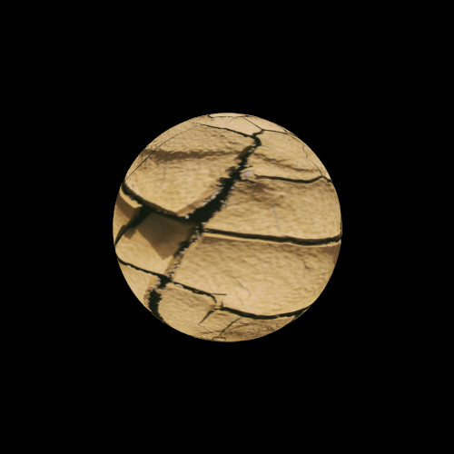
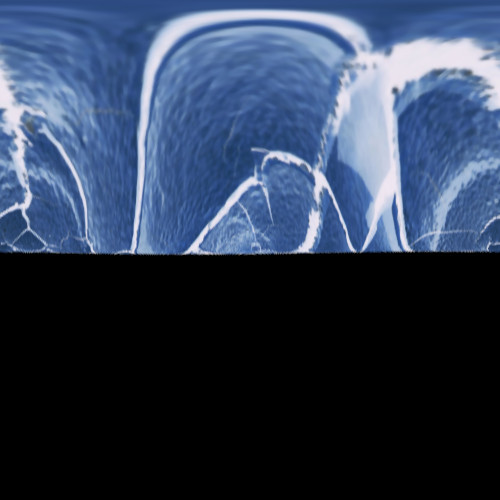
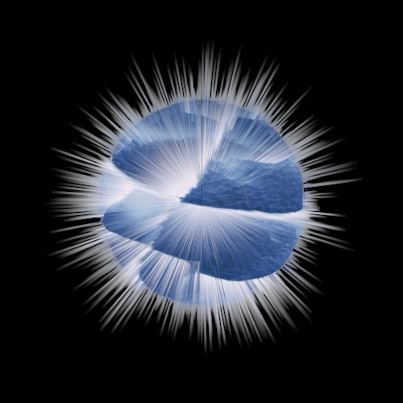
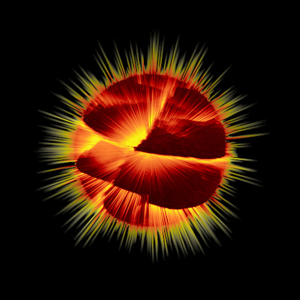

# Eksplodująca planeta

Opracowano na podstawie: [https://www.gimpusers.com/tutorials/exploding-planet.html](https://www.gimpusers.com/tutorials/exploding-planet.html)

## Wstęp

W tym tutorialu stworzymy efekt eksplodującej planety. Efekt ten polega na rozerwaniu planety na kawałki, które wydają się unosić w powietrzu. Jest to ciekawy i dynamiczny efekt, który może być wykorzystany w wielu różnych projektach graficznych, takich jak plakaty, okładki albumów, czy ilustracje.

Na początek będziemy potrzebowali grafiki przedstawiającej popękaną ziemię. W tutorialu skorzystamy z następującego zdjęcia:

## Tworzymy planetę

Na początek zaczniemy od przekształcenia naszej grafiki w coś bardziej przypominającego planetę.

### Przycinamy zdjęcie

Zaczniemy od przycięcia zdjęcia do kwadratu, aby uzyskać bardziej symetryczny kształt planety. 
W tym celu wybieramy narzędzie **kadrowanie** (++shift+c++).
W opcjach narzędzia ustawiamy **stałe proporcje** i wybieramy proporcje $1:1$.
Następnie rysujemy kwadrat zawierający interesujący nas obszar i zatwierdzamy przyciskiem enter.

Po tej operacji należy dostosować wymiary warstwy do wymiarów obrazu. W tym celu wybieramy menu **Warstwa->Dopasuj warstwę do wymiarów obrazu**.

### Skalujemy zdjęcie

Aby uzyskać lepszy efekt, warto przeskalować zdjęcie do mniejszego rozmiaru.
W tym celu wybieramy menu **Obraz->Skaluj obraz...**.
W polu *Szerokość* i *Wysokość* wpisujemy np. $500$ pikseli.
Zatwierdzamy przyciskiem **Skaluj**.

### Przekształcenie w planetę

Teraz przekształcimy nasze zdjęcie w planetę.
W tym celu wybieramy menu **Filtry->Odwzorowanie->Odwzorowanie obiektu...**.
Jako obiekt docelowy wybieramy **Sfera**. Zaznaczmy opcję **Przezroczyste tło**.
W zakładce *Światło* ustawiamy *Typ źródła światła* na **Bez światła**.
Zatwierdzamy przyciskiem **OK**.

Powinniśmy otrzymać nową warstwę z naszą planetą.

### Tworzymy czarne tło

Na początek ustawmy aktywny kolor pierwszoplanowy na czarny.
Teraz tworzymy nową warstwę, którą nazwiemy *Tło*.
Ustawiamy jej wypełnienie na kolor pierwszoplanowy i przesuwamy ją pod warstwę z planetą.

Na tym etapie powinniśmy mieć coś takiego:

## Tworzymy efekt wybuchu

Mamy już naszą planetę. Czas sprawić, by wyglądała, jakby eksplodowała.

### Odwracamy kolory

Na początek odwróćmy kolory naszej planety, tak by czarne przerwy między fragmentami ziemi stały się białe.
W tym celu wybieramy menu **Kolory->Odwróć**.

### Spłaszczamy

W celu uzyskania efektu eksplozji, musimy przygotować nasz obrazek.
Wybieramy menu **Filtry->Zniekształcenia->Współrzędne polarne**.
Odznaczamy opcję **to polar** i zatwierdzamy przyciskiem **OK**.

Powinniśmy otrzymać coś takiego:

### Dodajemy efekt wiatru

W celu uzyskania efektu unoszenia się fragmentów planety, dodamy efekt wiatru.
Wybieramy menu **Filtry->Zniekształcenia->Wiatr...**.
Ustawiamy *Teshold* na $5$ i *Strength* na odpowiednio dużą wartość, np. $40$.
Styl efektu (*Style*) ustawiamy na *Wind*.
Kierunek wiatru (*Direction*) ustawiamy na *Bottom*.
Opcję *Edge Affected* ustawiamy na *Leading*.
Zatwierdzamy przyciskiem **OK**.

Stosujemy efekt ponownie używając skrótu ++ctrl+f++.

### Przywracamy wygląd planety

Teraz przyszła pora na użycie efektu odwrotnego do tego, który zastosowaliśmy wcześniej.
Wybieramy menu **Filtry->Zniekształcenia->Współrzędne polarne**.
Tym razem zaznaczamy opcję **to polar** i zatwierdzamy przyciskiem **OK**.

Powinniśmy na tym etapie otrzymać coś takiego:

### Zmieniamy kolory

Czas na ostatni etap, czyli nadanie odpowiednich kolorów.
Wybieramy narzędzie *Gradient* (++g++).
W opcjach narzędzia szukamy czarno-czerwono-żółtego gradientu o nazwie *Incandescent*.
Ustawiamy go tak, aby czarny kolor był z prawej strony (przycisk *Odwrócenie*).

Teraz wybieramy menu **Kolory->Odwzorowania->Odwzorowanie gradientu**.

## Efekt końcowy

